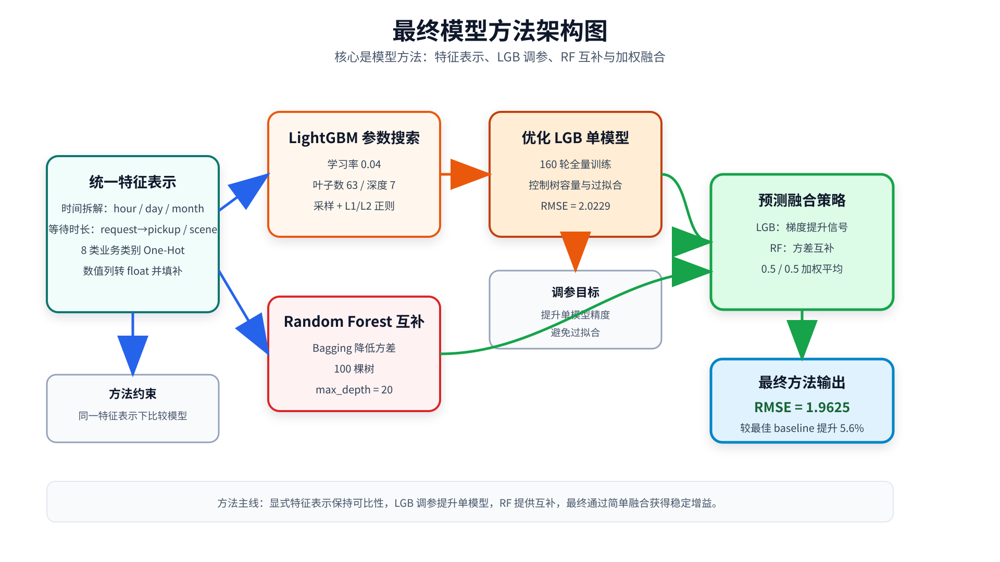
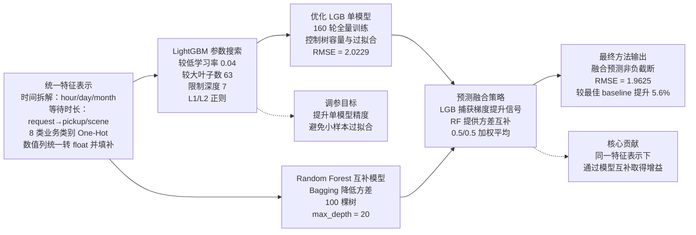

# 最终模型方法报告

> 本版报告基于新代码 `src/generate_final.py` 和新结果 `results/final_100k/comprehensive_comparison.json`。报告重点放在最终方法本身：统一特征表示、LightGBM 调参、Random Forest 互补建模，以及二者的预测融合。

## 1. 系统流程图（generate_final）

PPT 展示图改为方法导向：输入、清洗和评估只作为隐含前置条件，不作为核心节点；图中重点展示特征表示、单模型优化、互补模型和融合策略。

Mermaid 源码如下：

## 2. Baseline 与最终方法对比

| 对比维度 | Baseline 方法 | generate_final 最终方法 |
| --- | --- | --- |
| 特征表示 | 时间字段拆分、时间差、类别 One-Hot、数值化填补 | 沿用同一套显式特征表示，确保模型改进可比较 |
| 主要模型 | Simple Linear、XGBoost、LightGBM、Random Forest | Optimized LightGBM + Random Forest |
| 训练策略 | 各模型独立训练 | LGB 调参后全量训练，RF 作为互补模型 |
| 融合策略 | 无 | 50% LGB + 50% RF 简单平均 |
| 统一评估 | 与 sample submission 计算 RMSE | 同一评估口径，输出完整 JSON 排名 |
| 最优结果 | Random Forest RMSE = 2.0778 | LGB+RF Blend RMSE = 1.9625 |

## 3. 核心创新点

1. **显式、可比较的特征表示**  
   最终方法没有用一句缩写省略特征处理，而是明确使用四类输入表示：时间字段拆分为 hour、dayofweek、day、month；构造 request 到 pickup、request 到 on-scene 的等待时长；对 8 个业务类别列做 One-Hot；对其余可转数值列统一数值化并填补缺失。这样可以把性能变化主要归因到模型与融合策略，而不是隐含的特征口径变化。

2. **重新调优 LightGBM**  
   新的 LGB 配置采用 `learning_rate=0.04`、`num_leaves=63`、`max_depth=7`、`subsample=0.85`、`colsample_bytree=0.85`、`reg_alpha=0.5`、`reg_lambda=0.2`、`num_boost_round=160`。相比原始 core model 的 RMSE 2.5068，优化后单模型降至 2.0229。

3. **利用 RF 与 LGB 的误差互补**  
   结果中最佳 baseline 是 Random Forest，RMSE 为 2.0778；优化 LGB 单模型 RMSE 为 2.0229。二者 50/50 融合后进一步降到 1.9625，说明两类树模型在测试集上的误差存在互补性。

4. **自动化最终结果汇总**  
   `generate_final.py` 会同时生成最优单模型提交、融合模型提交，并读取 baseline 与原 core model 的预测文件，统一计算 RMSE、MAE、R²，保存为 `comprehensive_comparison.json`，便于报告和答辩直接引用。

## 4. 定量对比表格

| 排名 | 方法 | RMSE ↓ | MAE ↓ | R² ↑ | 相对最佳 baseline |
| --- | --- | ---: | ---: | ---: | ---: |
| 1 | **Core Model - LGB+RF Blend** | **1.9625** | **1.1169** | **0.9942** | **+5.6%** |
| 2 | Core Model - LGB Optimized | 2.0229 | 1.1378 | 0.9938 | +2.6% |
| 3 | Baseline - Random Forest | 2.0778 | 1.1671 | 0.9935 | baseline |
| 4 | Baseline - LightGBM | 2.0798 | 1.1596 | 0.9935 | -0.1% |
| 5 | Core Model - Original | 2.5068 | 1.1586 | 0.9905 | -20.6% |
| 6 | Baseline - Simple Linear | 2.6077 | 1.5344 | 0.9897 | -25.5% |
| 7 | Baseline - XGBoost | 3.9751 | 1.3879 | 0.9762 | -91.3% |

最佳 baseline 是 Random Forest，RMSE 为 2.077842。最终融合模型 RMSE 为 1.962506，绝对下降 0.115336，相对提升约 5.6%。

## 5. 消融实验

本次消融按照已生成结果组织：先比较 baseline 中相同方法，再加入原始 core model、优化 LGB 单模型和最终融合模型。

| 消融项 | 方法 | 关键变化 | RMSE ↓ | 结论 |
| --- | --- | --- | ---: | --- |
| A0 | Baseline - XGBoost | baseline 特征 + XGBoost | 3.9751 | 当前配置在该数据上表现最弱 |
| A1 | Baseline - Simple Linear | baseline 特征 + 线性模型 | 2.6077 | 线性表达能力不足 |
| A2 | Core Model - Original | 原 core model 配置 | 2.5068 | 原配置不适合当前训练口径 |
| A3 | Baseline - LightGBM | baseline 特征 + 默认 LGB | 2.0798 | 接近最佳 baseline |
| A4 | Baseline - Random Forest | baseline 特征 + RF | 2.0778 | 最佳 baseline |
| A5 | Core Model - LGB Optimized | 调优 LGB 参数与轮次 | 2.0229 | 相对最佳 baseline 提升 2.6% |
| A6 | Core Model - LGB+RF Blend | LGB 与 RF 50/50 融合 | **1.9625** | 最佳结果，相对最佳 baseline 提升 5.6% |

消融结论：

- **调优有效**：原始 core model 的 RMSE 为 2.5068，优化后的 LGB 单模型降至 2.0229。
- **融合有效**：LGB 单模型已优于最佳 baseline，加入 RF 后进一步从 2.0229 降至 1.9625。
- **最佳 baseline**：Random Forest 略优于 baseline LightGBM，二者 RMSE 分别为 2.0778 和 2.0798。
- **最终推荐提交**：`results/final_100k/submission_core_model_blended.csv`。

## 6. 文件与来源

| 内容 | 文件 |
| --- | --- |
| 最终生成代码 | `src/generate_final.py` |
| 最优单模型提交 | `results/final_100k/submission_core_model_optimized.csv` |
| 最优融合提交 | `results/final_100k/submission_core_model_blended.csv` |
| 综合结果 JSON | `results/final_100k/comprehensive_comparison.json` |
| 实验说明 | `results/final_100k/README.md` |
