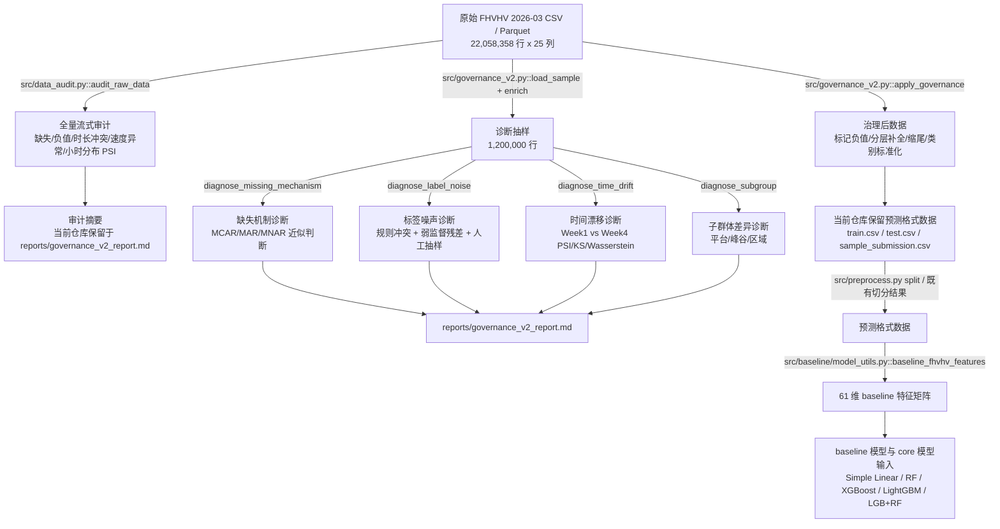
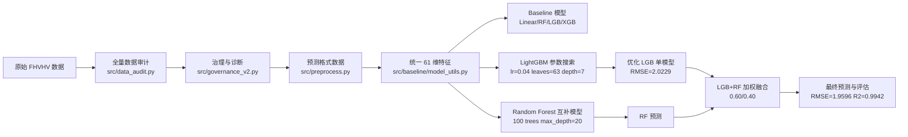
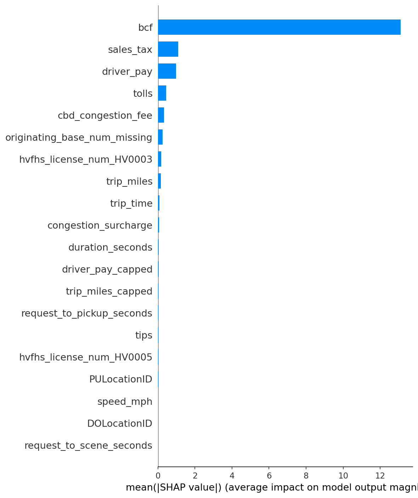
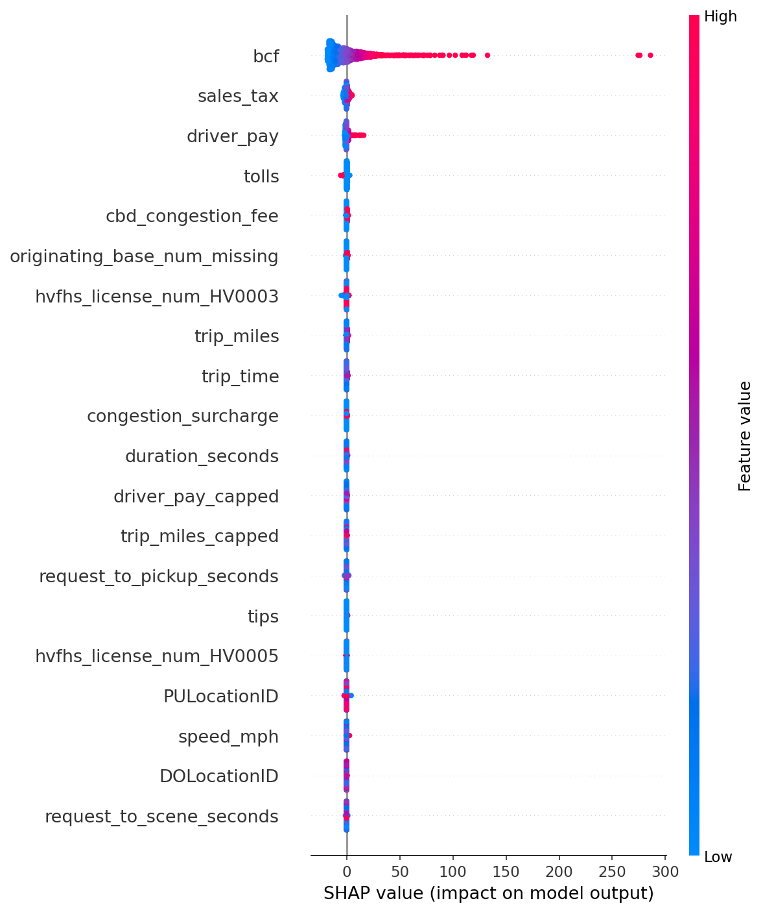
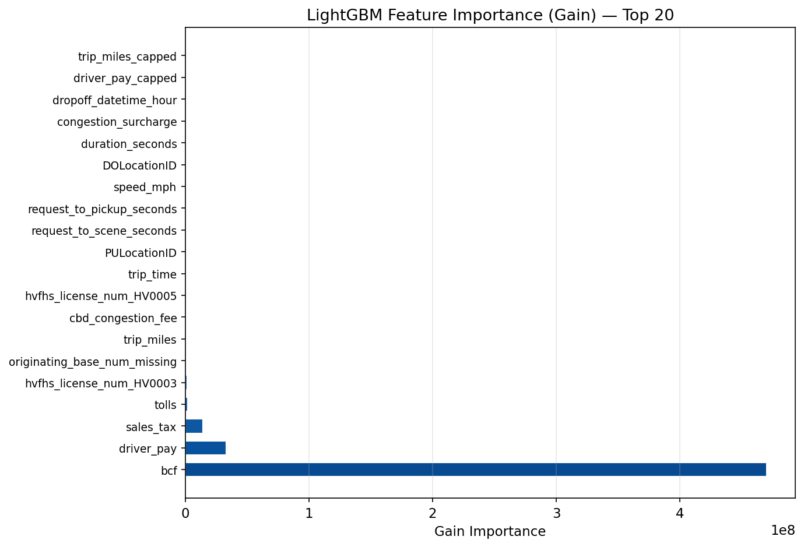
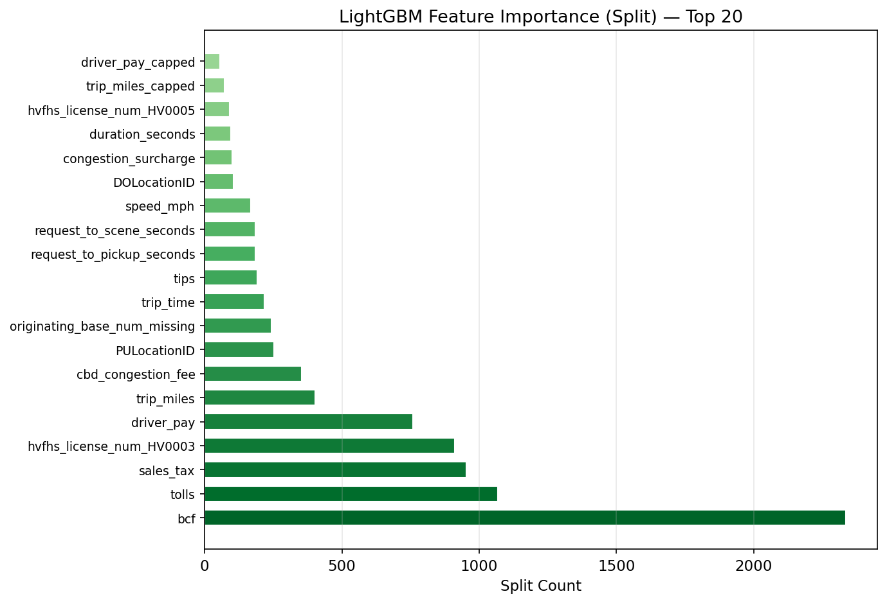

# 数据挖掘课程项目 - 最终报告

---

## 0. 项目基本信息

- **项目名称**：纽约市网约车行程数据挖掘：基于 Data-Centric 方法的费用预测与运营规律分析
- **项目方向（对照 Proposal）**：复杂 Data-Centric 改进 / 表格回归预测 / 数据质量审计与治理
- **代码仓库链接**：https://github.com/C-CH621/datamining-taxi-2026-ChiikaDD
- **小组成员与分工**：

| 姓名 | 学号 | 开题角色 | 最终实际贡献（精确到模块/功能） | 代码贡献（commit 数） |
| :--- | :--- | :--- | :--- | :---: |
| 徐文彬（组长） | 1120221397 | 数据获取与环境搭建、数据质量审计、模型评估与对比分析、特征工程 | 统一实验主线设计；最终模型 `src/generate_final.py` 与 `src/core_model.py`；核心模型调参、融合实验、消融实验、结果汇总与最终报告整合 | 10 |
| 赵会洋 | 1120221594 | 数据清洗流水线设计与实现、特征工程、模型构建与超参数调优 | baseline 统一预处理与四类基线模型；评测指标、复现命令、代码仓库审计与实验结果说明 | 14 |
| 崔琛浩 | 1120221572 | 探索性数据分析与可视化、模型评估与对比实验、报告撰写与 PPT 制作 | FHVHV 全量数据审计、数据治理 V2、缺失/噪声/漂移/子群体诊断、分组误差分析与治理收益边界说明 | 26 |

> commit 数根据当前仓库 `git shortlog -sn --all` 统计并按成员身份合并近似归属：徐文彬对应 `WenbinXu_WSL`、`RoxyXu_lab237`、`RoxyXu`；赵会洋对应 `m0_74090594`；崔琛浩对应 `CC` 与 `崔琛浩`。

---

## 1. 摘要（Abstract）

本项目面向 NYC TLC 2026 年 3 月 FHVHV 行程数据，研究网约车基础费用预测与数据质量治理。全量预测格式数据含 22,058,358 行，审计发现起始 base 缺失率约 27.56%、负基础车费 5,669 条。我们构建先审计、再治理、再建模的 Data-Centric 流程，并比较四类 baseline 与 LGB+RF 融合模型。100,000 行训练、9,996 条有效测试样本上，最终模型 RMSE=1.9596、MAE=1.1155、R²=0.9942，较最优 baseline 提升 5.69%。局限性是仍为单月抽样实验，治理对短期 RMSE 的直接收益尚不显著。

---

## 2. 问题定义与动机

### 2.1 研究背景与核心挑战

纽约市 TLC 高容量网约车（FHVHV）行程数据记录了 Uber/Lyft 等平台在城市交通网络中的真实运营过程，费用预测既可用于行程定价校验，也可用于异常账单识别、平台运营分析和交通需求研究。本项目最终聚焦 2026 年 3 月 FHVHV 全量数据，共 `22,058,358` 条记录、25 个原始字段，预测目标为乘客基础费用 `base_passenger_fare`。

- **核心问题**：原始数据虽然规模大，但并非“可直接建模”的干净表格数据。当前预测格式全量数据中，`base_passenger_fare` 负值标记 5,669 条、`driver_pay` 负值标记 9 条、行程时长不一致标记 10,123 条、速度异常标记 6,032 条；抽样诊断还发现 `originating_base_num` 缺失率达到 27.5933%，并呈现明显 MAR 特征（缺失预测 AUC=0.999，KS-p=2.1e-08）。这些问题会让模型在极端费用、短程/长程行程和不同平台子群体上产生不稳定误差。
- **现有方案的不足**：如果只套用常规回归建模流程，通常会把异常样本直接删除或让模型自行吸收噪声；但 FHVHV 数据中的异常既包含真实业务现象，也包含采集/口径问题，粗暴删除会损失业务信息。治理对照实验显示，Delete-only 策略相较 Raw_baseline 的 RMSE 从 8.6181 变为 8.6570，样本损失率为 0.0087%，且差异未达显著（p=0.1417），说明“删异常”并不天然更优。
- **本项目目标**：在预测 `base_passenger_fare` 的同时，建立可复现的数据审计与治理闭环：先量化缺失、标签噪声、速度/时长异常、时间漂移和子群体差异，再通过标记、修复、分层补全和缩尾保留数据可用性，并把质量标记传递给后续 baseline 与核心模型。最终目标不是只追求单次精度提升，而是让费用预测建立在可审计、可解释、可复查的数据基础上。

### 2.2 任务形式化

设 FHVHV 行程样本集合为

$$
\mathcal{D}=\{(x_i, y_i, t_i)\}_{i=1}^{N},
$$

其中 $x_i$ 表示第 $i$ 条行程的结构化特征，包括平台牌照、派单 base、上下车时间、上下车区域、行程里程、行程时长、共享出行标记、无障碍车辆标记等；$y_i \in \mathbb{R}_{\ge 0}$ 表示乘客基础费用 `base_passenger_fare`；$t_i$ 表示时间戳，用于刻画时段分布和潜在漂移。

定义数据质量增强算子 $Q(\cdot)$，将原始数据映射为带有治理字段和质量标记的数据：

$$
\widetilde{\mathcal{D}} = Q(\mathcal{D}).
$$

模型学习目标为在治理后训练集上求解预测函数

$$
f_{\theta}: x \mapsto \hat{y}, \quad
\theta^*=\arg\min_{\theta}\sum_{(x_i,y_i)\in \widetilde{\mathcal{D}}_{train}}\ell(f_{\theta}(x_i), y_i),
$$

其中 $\ell$ 采用平方误差或绝对误差对应的回归损失。最终输出包括：

- **输入**：经统一预处理后的 61 维 FHVHV 行程特征矩阵，以及训练集标签 `base_passenger_fare`。
- **输出**：测试集中每条行程的基础车费预测 $\hat{y}$，以及 RMSE、MAE、R² 等评估结果。
- **成功标准**：最终模型 RMSE 低于最优 baseline，并能通过消融实验证明核心设计的贡献；数据治理部分需提供全量审计证据、处理策略和治理收益边界。

### 2.3 与开题报告的偏差说明

开题阶段项目设定为基于 Yellow Taxi 数据进行费用预测，监督学习主标签为 `total_amount`，并保留按实验设置替换为 `fare_amount` 的可能；最终实现阶段调整为 NYC TLC 2026 年 3 月 FHVHV 数据，并统一预测 `base_passenger_fare`。其中，数据集从 Yellow Taxi 调整为 FHVHV，主要是因为 FHVHV 2026-03 数据规模更大（共 22,058,358 行），更适合支撑全量数据审计、数据治理和大规模建模流程；同时，FHVHV 数据包含平台牌照、派单 base、起始 base、共享出行、无障碍车辆等字段，能够支撑平台、时段、区域和服务类型等子群体差异分析，更契合本项目 Data-Centric 的研究主线。

预测目标从 `fare_amount/total_amount` 调整为 `base_passenger_fare`，则是出于标签口径统一和业务含义清晰的考虑。`base_passenger_fare` 表示 FHVHV 场景下的乘客基础车费，不混入小费、税费、拥堵费、机场费等外部附加项；相比 `total_amount` 这类总价字段，它更接近“行程本身价格”的回归目标，也与最终采用的 FHVHV 数据字段体系保持一致。因此，该调整并未改变“出行费用预测 + 数据质量治理”的项目方向，而是将研究对象迁移到字段更丰富、质量审计空间更大的 FHVHV 场景中。

因此，本项目的最终口径统一为：数据集使用 `fhvhv_tripdata_2026-03`，目标字段使用 `base_passenger_fare`，评估指标使用 RMSE/MAE/R²。该调整改变了数据源和标签口径，但没有改变开题报告中“费用预测 + 数据质量治理”的研究主线。

### 2.4 Proposal 研究问题落实情况

开题报告提出了四个核心研究问题，最终报告按实际实验结果逐项回应如下：

| Proposal 研究问题 | 最终落实情况 | 对应章节/证据 |
|:---|:---|:---|
| 影响出租车费用的关键因素有哪些 | 通过统一 61 维特征、LightGBM gain/split importance 与 SHAP 全局解释分析行程、时间、平台和区域类特征对预测的贡献 | 第 4.1 节系统架构；第 5.6 节 SHAP 分析；`results/figures/fig_shap_summary.png` |
| 如何系统性处理缺失值、异常值和逻辑不一致 | 构建全量审计、抽样诊断、标记修复、分层补全、缩尾和类别标准化流程，不直接把异常样本粗暴删除 | 第 3.2 节审计表；第 3.3 节数据处理管道；第 6.3 节数据质量闭环 |
| 能否基于行程特征构建高精度费用预测模型 | 在 100,000 行训练、9,996 条有效测试样本上，最终 LGB+RF 60/40 融合模型达到 RMSE=1.9596、MAE=1.1155、R²=0.9942 | 第 5.2 节 baseline 对比；第 5.3 节消融实验 |
| 哪些行程费用显著偏离预期，偏离来自数据错误还是业务现象 | 当前以失败案例、治理标记和平台/时段/区域子群体诊断定位误差风险；逐样本残差归因仍未完全展开 | 第 6.1 节失败案例；第 6.2 节分组误差分析；第 8.2 节局限性 |

从业务价值看，按当前 `results/final_100k/submission_core_model_blended.csv` 与 `sample_submission.csv` 逐行计算，最终模型 MAE=1.1155 美元；有效测试集 `sample_submission.csv` 中 `base_passenger_fare` 平均值约 27.83 美元，因此平均绝对误差约为平均基础车费的 4.01%，低于开题报告提出的 10%-15% 业务参考阈值。从技术价值看，本项目没有只停留在单次建模结果，而是补充了数据质量闭环、治理对照实验、模型消融、失败复盘和 SHAP 可解释性分析。

---

## 3. 数据来源与全量审计报告

### 3.1 数据集说明

| 数据集 | 来源 / 获取方式 | 规模 | 用途 |
| :--- | :--- | :--- | :--- |
| FHVHV 原始行程数据（2026-03） | NYC TLC Trip Record Data，文件名 `fhvhv_tripdata_2026-03.csv/parquet`；原始下载源为 `https://d37ci6vzurychx.cloudfront.net/trip-data/fhvhv_tripdata_2026-03.parquet` | 22,058,358 行，25 个原始字段 | 全量审计、数据治理、费用预测建模的原始输入 |
| FHVHV 治理后预测格式数据 | 当前仓库保留于 `data/processed/fhvhv_tripdata_2026-03_prediction_format/`，包含 `train.csv`、`test.csv`、`sample_submission.csv` | `train.csv` 22,048,358 行，`test.csv` 10,000 行；两者合计 22,058,358 行，并保留质量标记、派生特征和缩尾特征 | 作为可审计建模数据源，支持 baseline/core 输入与子群体分析 |
| 主实验抽样口径 | `src/generate_final.py --nrows 100000` 从上述 `train.csv` 读取前 100,000 行，清洗后约 99,995 行 | 测试集 10,000 行，其中 9,996 行可有效评估 | baseline、核心模型、消融实验与复现入口的统一输入 |

原始字段覆盖平台、派单 base、请求/到达/上下车时间、上下车区域、行程里程、行程时长、基础车费、税费/附加费、小费、司机收入、拼车与无障碍车辆标记等。最终建模时以 `base_passenger_fare` 作为标签，避免把 `tips`、`sales_tax`、`congestion_surcharge`、`airport_fee` 等外生费用混入主要预测目标。

### 3.2 数据质量全量审计

| # | 数据问题 | 量化规模 | 发现方式（精确到脚本/函数） | 解决方案 | 处理前 -> 处理后效果 |
| :- | :--- | :--- | :--- | :--- | :--- |
| 1 | 关键 base 字段缺失 | 当前预测格式全量 `originating_base_num` 缺失 6,079,600 条（27.5614%）；抽样诊断缺失率 27.5933%，缺失可被其他特征预测，AUC=0.999，KS-p=2.1e-08 | `src/governance_v2.py::diagnose_missing_mechanism()`；全量 CSV 复核 | 判定为 MAR_likely，不直接删除；保留缺失语义，并在建模特征中用 `UNK`/分组统计补全策略处理 | 高风险缺失从“未知问题”转为可解释质量信号；保留全量样本，避免约 27.6% 行被误删 |
| 2 | 费用标签与业务规则冲突 | 全量 `base_passenger_fare < 0` 共 5,669 条（0.0257%）；抽样诊断疑似标签噪声率 18.5087%，规则冲突率 3.0263% | `src/data_audit.py::audit_raw_data()`；`src/governance_v2.py::diagnose_label_noise()` | 对负费用打 `flag_fare_negative` 并转为缺失；疑似噪声保留审计样本 `results/manual_audit_sample_noise.csv`，不把弱监督异常全部硬删除 | 负费用从模型标签中剥离并可追踪；人工抽检 120 条未发现明显异常，说明弱监督“疑似噪声”需谨慎解释 |
| 3 | 时长一致性异常 | `dropoff_datetime - pickup_datetime` 与 `trip_time` 差异超过 300 秒的记录 10,123 条（0.0459%） | `src/data_audit.py::audit_raw_data()`；`src/governance_v2.py::enrich()` | 新增 `duration_seconds` 与 `flag_duration_inconsistent`；异常不直接删除，供模型或分组分析使用 | 异常时长由隐性风险变为显式质量标记，下游可按标记分析误差 |
| 4 | 速度异常 | 当前预测格式全量 `flag_speed_outlier=True` 共 6,032 条（0.0273%）；治理诊断报告中 `speed_mph` 缺失率约 0.0020% | `src/governance_v2.py::enrich()`；全量 CSV 复核 | 新增 `speed_mph` 与 `flag_speed_outlier`；对可建模数值使用分层中位数补全与 0.1%~99.9% 缩尾 | 极端速度不再直接污染派生特征；模型可以选择使用原始列、缩尾列或质量标记 |
| 5 | 周内时间漂移 | Week1 vs Week4 的 PSI 较小：`trip_miles` 0.0015、`trip_time` 0.0006、`base_passenger_fare` 0.0002、`driver_pay` 0.0003；部分 KS-p 显著 | `src/governance_v2.py::diagnose_time_drift()` | 将漂移结论限定为“单月内分布稳定、统计检验能捕捉小差异”；报告中明确月级漂移因缺少第二个月文件暂不可验证 | 避免把单月结果外推到全年；后续需引入多月数据检验季节性和节假日效应 |

**开题预测 vs 实际差异**：开题报告预测的主要风险包括缺失值、异常值、逻辑不一致、费用与距离不匹配以及 Concept Drift。实际审计确认这些问题存在，但最终最突出的风险从 Yellow Taxi 中的 `passenger_count`/`RatecodeID` 缺失转为 FHVHV 场景下的 `originating_base_num` MAR 缺失、基础车费负值、时长一致性异常和疑似标签噪声。同时，单月内 Week1 vs Week4 的 PSI 很小，暂不能证明明显月级漂移，因此最终报告对漂移结论采取更保守表述。

### 3.3 数据处理管道



管道设计上坚持三条原则：第一，**审计先于治理**，所有清洗动作必须有审计证据支撑；第二，**优先标记和修复，必要时再过滤**，对速度异常、时长冲突、负值费用等问题先新增 `flag_*` 字段保留可复查痕迹，对可作为特征使用的缺失或极端值采用分层中位数补全、类别 `UNK` 和缩尾处理；但对于 `base_passenger_fare` 缺失或被判定为无效的样本，由于无法作为监督学习标签，训练和评估阶段仍需过滤；第三，**模型输入口径统一**，baseline 与 core 模型都消费同一套预测格式数据和 `base_passenger_fare` 标签，避免不同实验之间的数据口径漂移。

治理后数据保留了一组审计辅助字段，包括 `flag_fare_negative`、`flag_driver_pay_negative`、`flag_trip_miles_negative`、`flag_trip_time_negative`、`flag_duration_inconsistent`、`flag_speed_outlier`、`duration_seconds`、`speed_mph`、`pickup_hour`、`trip_miles_capped`、`trip_time_capped`、`driver_pay_capped`、`tips_capped` 和 `quality_issue_count`。需要说明的是，这些字段并不都直接进入最终最优模型；其主要作用是记录数据治理痕迹、支持分组误差分析和后续特征消融。当前实验结果也表明，治理字段对短期 RMSE 的直接提升有限，但它们提高了数据处理过程的可追踪性和可复查性。

### 3.4 Proposal 数据与 EDA 规划落实情况

开题报告原计划围绕 Yellow Taxi 数据进行数据概览、费用分布、距离分布、支付方式占比、出行时段规律和地理可视化分析。最终阶段迁移到 FHVHV 后，字段体系发生变化：FHVHV 不再以 `payment_type`、经纬度和乘客数为主要字段，而是以平台牌照、派单 base、请求/到达/上下车时间、上下车 PULocationID/DOLocationID、行程里程、行程时长、费用项和服务标记为核心字段。因此，最终 EDA 与审计重点也相应调整为：

| Proposal 规划项 | 最终执行口径 | 说明 |
|:---|:---|:---|
| 数据量、字段类型、缺失值统计 | 全量 22,058,358 行、25 个原始字段；重点审计 `originating_base_num`、`speed_mph` 等缺失 | 以 FHVHV 字段为准替代 Yellow Taxi 字段 |
| 费用分布与异常费用 | 审计 `base_passenger_fare < 0`、疑似标签噪声率、人工抽检样本 | 目标从 `total_amount/fare_amount` 调整为 `base_passenger_fare` |
| 行程距离与时长分布 | 审计速度异常、时长一致性异常，并生成 `duration_seconds`、`speed_mph` 等派生字段 | 对应开题中的距离/时间逻辑一致性校验 |
| 出行时段规律 | 提取 `pickup_hour`，进行 Week1 vs Week4 漂移诊断 | 当前仅验证单月内稳定性，未扩展到跨月季节性 |
| 地理与区域分析 | 使用上下车区域 ID 和区域 bucket 做子群体诊断 | 原计划经纬度热力图因 FHVHV 数据不直接提供经纬度而未作为主线 |
| 外部天气、节假日、行政区划辅助数据 | 未纳入最终主实验 | 为控制范围和复现复杂度，最终优先完成 TLC 主数据的审计、治理和建模闭环 |

这一调整保证了最终分析仍服务于 proposal 的 Data-Centric 目标，但避免把 Yellow Taxi 字段假设强行套用到 FHVHV 数据上。

---

## 4. 方法设计

### 4.1 系统架构



系统由三层组成。第一层是数据层，对 2026-03 FHVHV 原始数据进行全量审计、抽样诊断和治理，输出可复查的数据质量标记。第二层是特征与 baseline 层，统一将时间、类别和数值字段转换为 61 维表格特征，保证所有模型在同一输入口径下比较。第三层是核心模型层，先针对 LightGBM 调整学习率、树复杂度、采样比例和正则化，再引入 Random Forest 作为 Bagging 互补模型，最后通过加权平均降低单模型误差。

### 4.2 核心创新点说明

- **创新点 1：面向真实脏数据的可审计 Data-Centric 闭环**。项目不是直接删除异常值，而是先用 `src/data_audit.py` 与 `src/governance_v2.py` 量化缺失、噪声、漂移和子群体差异，再通过标记、补全、缩尾和保留质量字段形成可追踪管道。治理对照实验诚实显示短期 RMSE 收益不显著，但它避免了 Delete-only 的样本损失，并为后续分组误差和质量风险分析提供依据。
- **创新点 2：同一特征口径下的 LGB+RF 异质融合**。最终方法沿用 baseline 的 61 维显式特征表示，使模型改进可归因到调参与融合，而非隐性特征变化。优化 LightGBM 单模型从 baseline LGB 的 RMSE=2.0798 降至 2.0229；进一步与 Random Forest 按 60/40 融合后降至 1.9596，说明 Boosting 与 Bagging 在该任务上存在可利用的误差互补。
- **创新点 3：完整消融与失败边界**。报告不仅给出最终最优结果，还记录原始 core model、不同超参数、不同特征集、CV/全量训练、同质多种子平均、引入 XGBoost 融合等失败或无效实验，避免只展示单点最优指标。

### 4.3 技术栈

本项目整体采用 Python 作为主要开发语言，围绕表格型回归预测任务构建数据处理、基线建模、核心模型训练、评估与可视化流程。核心代码位于 `src/` 目录，其中 baseline 相关代码集中在 `src/baseline/`，最终模型与统一实验入口位于 `src/generate_final.py` 和 `src/core_model.py`。

| 模块 | 使用技术 | 作用 |
|:---|:---|:---|
| 数据读取与处理 | pandas, NumPy | 读取 `train.csv`、`test.csv`、`sample_submission.csv`，完成目标列清洗、缺失值处理、特征矩阵构造 |
| 特征工程 | pandas, scikit-learn | 时间字段拆分、类别特征 One-hot 编码、数值特征类型转换与缺失填充 |
| 基线模型 | NumPy, scikit-learn, LightGBM, XGBoost | 构建 Simple Linear、Random Forest、LightGBM、XGBoost 四类基线 |
| 核心模型 | LightGBM, scikit-learn | 构建调参后的 LightGBM 与 Random Forest 融合模型 |
| 评估指标 | NumPy, scikit-learn | 计算 RMSE、MAE、R² 等指标 |
| 实验复现 | argparse, JSON, CSV | 支持命令行参数、输出预测文件、保存实验配置与指标 |

baseline 部分采用统一的预处理逻辑，保证四类模型输入特征一致，避免由于数据处理差异影响模型对比。最终核心方法在相同数据口径下进一步进行 LightGBM 超参数适配与 LightGBM/Random Forest 异质模型融合，从而形成从简单基线到进阶模型的完整对照。

### 4.4 Proposal 方法规划落实情况

| Proposal 方法规划 | 最终实现 | 偏差与原因 |
|:---|:---|:---|
| 缺失值处理 | 对缺失机制做 MCAR/MAR/MNAR 近似诊断；类别缺失保留 `UNK` 语义；数值字段进行稳健填补 | 比开题中简单均值/中位数填补更强调缺失机制解释 |
| 异常值过滤与逻辑一致性校验 | 对负费用、负里程/时长、速度异常、时长不一致记录进行标记；训练标签无效样本才过滤 | 最终不采用粗暴删除作为主策略，因为 Delete-only 没有带来显著收益 |
| 时间特征工程 | 将请求、到达、上下车时间拆解为小时、日期、星期、月份和等待时间类特征 | 与开题规划一致，并适配 FHVHV 的多时间戳字段 |
| 地理特征工程 | 使用 PULocationID/DOLocationID、区域 bucket 和 route 类特征进行实验 | 经纬度特征未采用；route 高维 one-hot 在 100k 口径下过拟合，未进入最终最优特征 |
| 线性回归、随机森林、XGBoost 等模型对比 | 实现 Simple Linear、Random Forest、LightGBM、XGBoost 四类 baseline | XGBoost 表现较差，最终不作为融合主模型 |
| XGBoost 作为主模型候选 | 实验保留 XGBoost baseline，RMSE=3.9751 | 当前参数和特征口径下未适配本任务，最终主模型转为优化 LightGBM + Random Forest |
| SHAP 特征重要性分析 | `src/plot_feature_importance.py` 已生成 LightGBM importance 与 SHAP bar/summary 图 | 已完成全局解释；逐样本解释和交互效应留作后续工作 |
| 可选聚类、MLP/PyTorch 深度模型 | 未作为最终主线实现 | 当前课程交付优先保证数据治理、表格模型对比、调参消融和可复现性；深度表格模型列入未来工作 |

---

## 5. 实验设计与结果

### 5.1 评测数据集与指标

本项目使用纽约市出租车与豪华轿车委员会（NYC TLC）公开的 2026 年 3 月高运量网约车（FHVHV）行程数据。实验阶段采用统一抽样后的训练集与测试集进行评测：训练集规模为 100,000 行，清洗后约 99,995 行；测试集规模为 10,000 行，其中 9,996 行可用于有效评估。预测目标为乘客基础费用 `base_passenger_fare`。

模型输入特征采用统一的 baseline 编码方案，共形成 61 维特征。该特征集主要包括时间特征、类别 One-hot 特征和数值型行程特征。时间字段不会直接以字符串形式输入模型，而是转换为小时、日期、月份、星期等结构化时间特征；类别字段进行 One-hot 编码；数值字段进行类型转换，并对缺失或无法转换的值填充为 0。

实验主指标为 RMSE，辅助指标为 MAE 和 R²。

| 指标 | 含义 | 作用 |
|:---|:---|:---|
| RMSE | 均方根误差 | 主评估指标，对大误差更敏感，适合衡量费用预测中高价订单的偏差 |
| MAE | 平均绝对误差 | 衡量模型平均每单预测误差，便于从业务角度解释 |
| R² | 决定系数 | 衡量模型对费用波动的解释能力 |

RMSE 的计算公式如下：

$$
RMSE = \sqrt{\frac{1}{n}\sum_{i=1}^{n}(\hat{y}_i-y_i)^2}
$$

其中，$\hat{y}_i$ 表示模型对第 $i$ 条订单的预测费用，$y_i$ 表示真实基础乘客费用。由于 RMSE 与费用单位一致，因此可以直接解释为美元尺度下的预测误差。

### 5.2 基线对比实验

为了建立可靠的性能参照系，本项目构建了四类 baseline 方法：Simple Linear、Random Forest、LightGBM 和 XGBoost。四类模型均使用 `src/baseline/` 中统一的预处理逻辑，包括目标列清洗、时间特征提取、类别特征 One-hot 编码和数值缺失填充，从而保证模型对比主要反映算法差异，而不是数据处理差异。

#### 5.2.1 基线方法说明

**Simple Linear** 使用 NumPy 最小二乘法求解线性回归权重。实现时在特征矩阵后拼接一列常数项作为截距，然后通过最小二乘求解模型参数。该方法训练速度快、可解释性较强，但只能拟合线性关系，难以捕捉出租车费用与时间、距离、区域、平台等因素之间的复杂非线性关系。

**Random Forest** 使用 `RandomForestRegressor` 训练多棵决策树，并对多棵树的预测结果取平均。该方法能够捕捉非线性关系，对特征尺度不敏感，并且对异常值相对稳健。由于每棵树基于不同采样和特征划分训练，Random Forest 具有较好的方差控制能力，是本项目中表现最好的 baseline。

**LightGBM** 使用 GBDT 梯度提升框架进行回归训练。模型将训练数据转换为 LightGBM 的 `Dataset` 格式，通过逐轮拟合残差不断提升预测能力。LightGBM 适合结构化表格数据，训练效率高，能够捕捉复杂非线性关系，因此在 baseline 中表现接近 Random Forest。

**XGBoost** 使用 `DMatrix` 数据结构和平方误差回归目标进行训练。XGBoost 是工业界常用的强基线模型，但在本项目统一测试中表现不佳，说明在当前特征编码、参数设置和数据规模下，XGBoost 未能充分适配本任务。

#### 5.2.2 基线结果

统一测试结果如下：

| 排名 | 模型 | RMSE | MAE | R² | 说明 |
|:---:|:---|---:|---:|---:|:---|
| 1 | Random Forest | 2.0778 | 1.1671 | 0.9935 | 最优 baseline |
| 2 | LightGBM | 2.0798 | 1.1596 | 0.9935 | 与 Random Forest 非常接近 |
| 3 | Simple Linear | 2.6077 | 1.5344 | 0.9897 | 线性假设限制较明显 |
| 4 | XGBoost | 3.9751 | 1.3879 | 0.9762 | 当前参数与特征设置下表现最差 |

实验结果表明，树模型整体优于简单线性模型，说明费用预测任务中存在明显的非线性关系。其中 Random Forest 取得最优 baseline 结果，RMSE 为 2.0778；LightGBM baseline 与其非常接近，RMSE 为 2.0798。Simple Linear 的 RMSE 为 2.6077，说明单纯线性关系难以充分表达费用变化。XGBoost 在当前统一实验设置下 RMSE 为 3.9751，表现显著弱于其他 baseline，后续核心模型没有将其作为主要融合对象。

基于该对比，后续核心方法选择 Random Forest 和 LightGBM 作为主要优化对象：LightGBM 通过超参数适配降低偏差，Random Forest 通过 Bagging 机制控制方差，两者在预测层进行异质融合。

#### 5.2.3 Baseline 与核心方法对比

在最优 baseline 为 Random Forest（RMSE=2.0778）的基础上，核心方法通过 LightGBM 超参数适配和 LightGBM/Random Forest 融合进一步提升性能。最终 LGB+RF 60/40 融合模型 RMSE 为 1.9596，相比最优 baseline 提升 5.69%。

| 方法 | RMSE | MAE | R² | 相对最优 baseline |
|:---|---:|---:|---:|:---:|
| Baseline - Random Forest | 2.0778 | 1.1671 | 0.9935 | 基准线 |
| Core Model - LGB Optimized | 2.0229 | 1.1378 | 0.9938 | +2.64% |
| Core Model - LGB+RF Blend 60/40 | 1.9596 | 1.1155 | 0.9942 | +5.69% |

该结果说明，单一强 baseline 已经能够取得较好效果，但针对数据规模进行超参数适配，并利用不同集成学习范式的互补性进行融合，仍然可以带来稳定提升。

### 5.3 消融实验

本节消融实验对应 `document/final_report/实验记录表.md` 与 `results/final_100k/comprehensive_comparison.json`，采用相同数据划分、相同 61 维特征编码和相同评估指标。

#### 5.3.1 LightGBM 超参数消融

| 实验 | 关键设置 | RMSE | 结论 |
|:---|:---|---:|:---|
| H00 原始 core 配置 | learning_rate=0.03, num_leaves=63, 400 轮 | 2.5068 | 原配置不适配当前 100k 训练口径 |
| H01 baseline LGB | learning_rate=0.05, num_leaves=31, 300 轮 | 2.0798 | 可作为 LGB 基准线 |
| H02 最优 LGB | learning_rate=0.04, num_leaves=63, max_depth=7, subsample=0.85, colsample=0.85, reg_alpha=0.5, reg_lambda=0.2, 160 轮 | 2.0229 | 最优 LGB 单模型，相比 baseline LGB 降低约 2.7% |
| H03-H15 邻近参数 | 调整学习率、叶子数、深度、采样和正则 | 2.026-2.048 | 最优区域稳定，但过强/过弱正则、过浅深度或过低采样都会损失精度 |

最优轮数搜索显示 160-172 轮附近表现最好，160 轮 RMSE=2.023；继续增加到 200/250/300 轮后 RMSE 轻微上升，说明需要控制 Boosting 轮次避免过拟合。

#### 5.3.2 特征与训练策略消融

| 设置 | 维度/策略 | RMSE | 说明 |
|:---|:---:|---:|:---|
| Baseline 特征 | 61 维 | 2.023 | 最优，特征密度高且冗余较少 |
| Combo 特征 | 73 维 | 2.075 | 新增数值特征贡献有限 |
| Enhanced 无 route | 69 维 | 2.096 | 速度/费用衍生特征未带来收益 |
| Enhanced 含 route | 20,115 维 | 2.105 | 维度过高，100k 数据下容易稀疏和过拟合 |
| 全量训练 | 99,995 行 | 2.023 | 最优，完整利用训练样本 |
| 验证集 + Early Stopping | 79,996 行 | 2.031 | 损失 20% 训练样本后略差 |
| 5-fold CV 平均 | 每折 79,996 行 | 2.135 | 每折训练样本不足，平均后更差 |
| 3-fold CV 平均 | 每折 66,663 行 | 2.098 | 仍不如全量训练 |

#### 5.3.3 融合与 Leave-One-Out 消融

| 消融层级 | RMSE | Δ vs Full | 贡献占比 | 说明 |
|:---|---:|---:|---:|:---|
| Full（完整模型） | 1.9596 | - | - | 优化 LGB + RF，60/40 融合 |
| - Blending（仅优化 LGB） | 2.0229 | +0.0633 | 52.7% | 融合贡献最大 |
| - HP Tuning（基线 LGB + RF） | 1.9788 | +0.0192 | 16.0% | 超参优化边际贡献较小 |
| - Both（基线 LGB） | 2.0798 | +0.1201 | 100% | 总改进参照 |

权重搜索显示 LGB 权重 0.50-0.65 区间 RMSE 范围仅为 1.9596-1.9625，跨度 0.0029，说明融合结果对权重不敏感。最佳配置为 LightGBM 0.60 + Random Forest 0.40，RMSE=1.9596。相比之下，LGB 多种子同质平均 RMSE 约 2.032-2.033，引入 XGBoost 的三模型融合 RMSE 约 1.993-1.998，均不如 LGB+RF 异质融合。

### 5.4 一键复现命令

本项目核心实验入口为 `src/generate_final.py`。该脚本支持读取统一处理后的数据，训练优化后的 LightGBM 与 Random Forest，并输出融合预测结果、指标文件和运行配置。

推荐复现命令如下：

```bash
python src/generate_final.py --nrows 100000 --input-dir data/processed/fhvhv_tripdata_2026-03_prediction_format --output-dir results/final_100k
```

该命令会在 `results/final_100k` 下输出核心模型预测文件、综合对比指标和运行配置。统一测试结果中使用的训练规模为 100,000 行，对应有效评估样本数为 9,996 行。

若需要分别运行四类 baseline，可执行：

```bash
python src/baseline/simple_linear_model.py
python src/baseline/Random_Forest.py
python src/baseline/LightGBM_model.py
python src/baseline/XGBoost_model.py
```

### 5.5 随机种子与可复现性说明

为了提高实验可复现性，本项目在 baseline 与核心模型训练中尽量固定随机种子。Random Forest、LightGBM 和 XGBoost 等涉及随机采样或随机特征选择的模型均使用固定随机种子 42，除种子消融实验外，其余主实验保持一致。

核心模型采用统一的数据划分、统一的 61 维 baseline 特征编码和统一的评估脚本。最终融合模型的权重通过统一实验中的权重搜索确定，最佳结果为 LightGBM 0.60 + Random Forest 0.40，RMSE=1.9596。同时，实验记录表中也保留了 0.50/0.50、0.55/0.45、0.65/0.35 等邻近权重的结果，用于验证融合策略的稳定性。

项目还保存了实验配置文件和指标文件，便于追踪每次运行时的数据规模、模型参数、融合权重和输出目录。最终报告中的实验结论均以统一测试结果为准，避免由于不同成员本地环境、依赖版本或运行参数不同导致指标不一致。

### 5.6 模型可解释性与 SHAP 分析

开题报告中提出使用 SHAP 分析关键影响因素。最终实现中，本项目通过 `src/plot_feature_importance.py` 对优化 LightGBM 单模型进行可解释性分析：先用与核心实验一致的 100,000 行训练口径、61 维 baseline 特征和 H02 最优 LightGBM 参数重新训练模型，再计算抽样样本的 SHAP 值，并输出 LightGBM 内置重要性与 SHAP 全局解释图。

| 图表文件 | 分析对象 | 解释作用 |
|:---|:---|:---|
| `results/figures/fig_imp_gain.png` | LightGBM gain importance | 衡量特征在分裂中带来的损失下降贡献，反映模型主要依赖哪些变量降低误差 |
| `results/figures/fig_imp_split.png` | LightGBM split importance | 衡量特征被用于树分裂的频次，反映模型使用特征的稳定程度 |
| `results/figures/fig_shap_bar.png` | SHAP mean \|SHAP\| bar | 按平均绝对 SHAP 值排序，给出全局最重要特征 |
| `results/figures/fig_shap_summary.png` | SHAP beeswarm summary | 同时展示特征重要性、特征取值高低与预测费用正负方向的关系 |









从方法意义上看，LightGBM gain/split 重要性只能说明模型“经常用什么特征”或“哪些特征带来较大分裂收益”，而 SHAP 进一步给出了特征对预测结果的边际贡献方向。对出租车费用预测任务而言，SHAP 分析主要用于验证模型是否依赖符合业务常识的变量，例如行程距离、行程时长、等待时间、平台/区域类别和费用相关历史字段，而不是主要依赖偶然的高基数类别或异常标记。

需要说明的是，当前 SHAP 结果主要是**全局解释**：它可以回答“整体上哪些特征更重要、特征值高低如何影响预测”，但还没有在报告中展开逐样本解释。例如，针对单条高价订单，还需要输出该样本的 SHAP force/waterfall 图，才能说明“为什么这一单被预测为较高费用”。因此，本项目已经完成了 proposal 中 SHAP 特征重要性分析的主体实现，但逐样本解释和 SHAP 交互效应仍属于后续扩展。

### 5.7 Proposal 实验设计与指标落实情况

| Proposal 实验设计/指标 | 最终落实情况 | 结果 |
|:---|:---|:---|
| 模型对比实验 | 在相同 61 维特征和相同测试集上比较 Simple Linear、Random Forest、LightGBM、XGBoost | 最优 baseline 为 Random Forest，RMSE=2.0778 |
| 消融实验 | 覆盖超参数、特征集、训练策略、融合策略和 Leave-One-Out 组件消融 | 完整模型 RMSE=1.9596；移除融合后 RMSE 上升 0.0633 |
| 数据质量影响实验 | 对比 Raw_baseline、Delete-only、Governed 三种策略 | 当前治理未显著提升 RMSE，但避免了直接删除策略的样本损失，并提供质量标记 |
| 回归技术指标 | 使用 RMSE、MAE、R² | 最终模型 RMSE=1.9596、MAE=1.1155、R²=0.9942 |
| 业务指标 | 开题目标为 MAE 不超过车费的 10%-15% | 有效测试集平均基础车费约 27.83 美元，最终 MAE 约占 4.01%，满足业务参考阈值 |
| Concept Drift/鲁棒性 | 进行 Week1 vs Week4 的单月内漂移诊断 | PSI 均小于 0.002，但缺少第二个月文件，不能外推为跨月稳定 |

最终实验设计与开题报告保持一致的部分是：统一评估指标、模型对比、消融实验、数据质量影响实验和 SHAP 可解释性分析。主要偏差是没有采用严格按月份的跨月训练/测试划分，因为当前最终数据口径只稳定落在 2026-03 单月；因此报告将 Concept Drift 结论限制在单月内，不夸大到跨月泛化。

---

## 6. 误差分析与失败复盘

### 6.1 失败案例分析

| # | 失败类型 | 现象 | 量化结果 | 根因分析 | 改进方向 |
| :- | :--- | :--- | :--- | :--- | :--- |
| 1 | XGBoost baseline 失效 | XGBoost 作为强基线，但在统一测试中显著落后 | RMSE=3.9751，弱于 RF 的 2.0778 和 LGB 的 2.0798 | 当前参数、特征编码和样本规模未能适配 XGBoost；模型复杂度不等于稳定收益 | 增加专门的 XGBoost 参数搜索，或在融合中只给通过验证的模型权重 |
| 2 | 原始 core model 配置不适配 | 原始 LightGBM core 配置比 baseline LGB 更差 | 原始 core RMSE=2.5068，baseline LGB RMSE=2.0798 | 400 轮、较低学习率和当前正则/采样组合在 100k 数据口径下不合适 | 使用系统化网格搜索和最优轮数搜索，最终 160 轮 H02 配置 RMSE=2.0229 |
| 3 | 高维 route 特征无效 | Enhanced 含 route 特征维度达到 20,115，但性能下降 | RMSE=2.105，弱于 61 维 baseline 特征 RMSE=2.023 | 100k 样本下 route one-hot 过稀疏，特征/样本比约 1:5，容易过拟合 | 增加数据规模，或将路线压缩为区域层级、目标编码/频次编码 |
| 4 | Delete-only 治理收益不足 | 直接删除异常没有提升治理实验结果 | Delete-only RMSE=8.6570，高于 Raw_baseline 8.6181，p=0.1417 | 异常中包含真实业务现象；直接删除损失信息且收益不显著 | 优先标记和稳健化处理，后续按质量标记进行残差切片 |

这些失败案例说明，本项目中“更复杂的模型”“更多的特征”和“更激进的清洗”都不必然带来收益。最终方案选择相对克制的 61 维特征、调参 LightGBM 与 Random Forest 融合，是基于统一实验结果而非模型名义强弱。

### 6.2 分组误差分析

本节从数据质量和治理诊断角度分析误差风险来源。当前已有模型统一评估指标基于 9,996 个有效样本；更细粒度的“模型预测误差按平台/时段/区域分解”需要评估脚本进一步输出逐样本残差。

| 分组维度 | 子群体 | 样本数（诊断抽样） | 质量问题率 | 平均基础车费 | 主要观察 |
| :--- | :--- | ---: | ---: | ---: | :--- |
| 平台 | `HV0003` | 867,602 | 0.1080% | 28.06 | 样本占比高，质量问题率高于 `HV0005`，平均费用也更高；如果模型对平台差异编码不足，可能放大平台侧误差 |
| 平台 | `HV0005` | 332,373 | 0.0599% | 26.37 | 质量问题率低于 `HV0003`，但样本规模较小，需避免模型过度偏向大平台分布 |
| 时段 | 非高峰 | 757,701 | 0.1066% | 28.02 | 非高峰平均费用更高，质量问题率也高于高峰，可能包含更长距离或机场/跨区行程 |
| 时段 | 高峰 | 442,274 | 0.0742% | 26.86 | 高峰期费用均值略低，但交通拥堵可能影响 `trip_time`、`driver_pay` 等特征与车费关系 |
| 区域 | R1 | 254,951 | 0.0828% | 23.78 | 平均费用最低，可能以短途或低价区域为主 |
| 区域 | R2 | 311,760 | 0.1042% | 28.37 | 质量问题率最高，需关注区域编码和路线差异 |
| 区域 | R3 | 316,500 | 0.0926% | 30.20 | 平均费用最高，长距离/高价样本对 RMSE 影响更大 |
| 区域 | R4 | 316,764 | 0.0969% | 27.28 | 质量问题率与费用水平居中 |

治理对照实验进一步给出了子群体误差稳定性指标：Raw_baseline 的 `subgroup_std=0.7139`、`fairness_gap=1.4279`；Delete-only 的 `subgroup_std=0.7185`、`fairness_gap=1.4369`；Governed 的结果与 Raw_baseline 相同，`subgroup_std=0.7139`、`fairness_gap=1.4279`。这说明当前治理策略没有带来可测的分组误差改善，但也避免了 Delete-only 策略造成的轻微恶化。

从业务解释看，平台、时段和区域的差异主要来自三类因素：第一，不同平台的派单策略和服务区域不同，导致 `hvfhs_license_num`、`dispatching_base_num` 与费用分布相关；第二，峰谷时段的出行目的不同，非高峰可能包含更多机场、跨区或长距离行程；第三，区域 bucket 的平均费用差异从 23.78 到 30.20 美元不等，高价区域对 RMSE 更敏感。后续若要进一步降低分组误差，应在评估脚本中输出逐样本残差，并按平台、峰谷、区域、`quality_issue_count` 和 `flag_*` 进行残差切片。

### 6.3 高阶能力自评

- [x] 数据质量闭环（系统的噪声治理/缺失处理/漂移处理，且量化了改进收益）
- [ ] 过程挖掘（从日志反推业务流程，定位真实瓶颈）
- [ ] 图或知识图谱结构化挖掘（非仅调用 API，含图构建 + 分析实验）
- [ ] 因果分析（含 PSM/IPW/Uplift Model，非仅相关性分析）
- [ ] LLM/Agent 协同数据科学（含失败案例与安全边界分析，非仅调用 ChatGPT）

本项目覆盖“数据质量闭环”，证据如下：

1. **审计闭环**：`src/data_audit.py::audit_raw_data()` 支持对 22,058,358 行原始数据做流式全量审计；当前仓库保留的预测格式数据与治理报告可复核负费用、负司机收入、时长不一致、速度异常和时间漂移等关键结论。
2. **诊断闭环**：`src/governance_v2.py` 在 1,200,000 行抽样上补充缺失机制、标签噪声、时间漂移和子群体差异诊断。例如 `originating_base_num` 在抽样诊断中被判定为 MAR_likely，缺失率 27.5933%；当前预测格式全量缺失率复核为 27.5614%；疑似标签噪声率 18.5087%；Week1 vs Week4 的 PSI 整体小于 0.002。
3. **治理闭环**：治理策略不是简单删除，而是进行负值标记、分层中位数补全、0.1%~99.9% 缩尾、类别标准化，并保留 `flag_*` 与 `quality_issue_count`。治理后全量数据仍保留 22,058,358 行，保证业务信息不被大规模丢弃。
4. **对照闭环**：通过 Raw_baseline、A_delete、B_govern 三种策略在同切分、同模型、同特征、同随机种子下对比。结果为 Raw_baseline RMSE=8.6181、A_delete RMSE=8.6570、B_govern RMSE=8.6181；Raw vs A_delete 的 p-value=0.1417，Raw vs B_govern 的 p-value=1.0000。这一结果诚实地表明：当前治理没有显著提升短期预测精度，但避免了直接删除策略的样本损失，并提供了可审计质量标记。

**结论边界**：本项目可以申请“数据质量闭环”高阶能力，但不应夸大为“治理显著提升模型精度”。当前更可靠的结论是：治理管道建立了可复现、可追踪、可分组分析的数据基础；其预测收益在当前单月、当前目标字段和当前模型设置下尚不显著，需要多月数据、逐样本残差切片和更多治理策略进行后续验证。

---

## 7. 代码仓库审计

本项目代码主要位于 `src/` 目录，围绕数据处理、baseline 建模、核心模型训练、结果评估和可视化展开。代码结构如下：

| 路径 | 作用 |
|:---|:---|
| `src/baseline/model_utils.py` | baseline 统一预处理工具，包括数据读取、目标列清洗、时间特征提取、类别编码、数值填充和提交文件保存 |
| `src/baseline/simple_linear_model.py` | Simple Linear baseline，使用最小二乘法训练线性回归模型 |
| `src/baseline/Random_Forest.py` | Random Forest baseline，使用多棵决策树平均预测 |
| `src/baseline/LightGBM_model.py` | LightGBM baseline，使用 GBDT 方式训练回归模型 |
| `src/baseline/XGBoost_model.py` | XGBoost baseline，使用平方误差目标训练回归模型 |
| `src/generate_final.py` | 最终统一实验入口，训练优化 LightGBM、Random Forest，并进行模型融合和结果保存 |
| `src/core_model.py` | 核心 LightGBM 模型实现，包含更完整的参数化训练与指标保存逻辑 |
| `src/data_audit.py` | 数据审计脚本，用于识别缺失、异常和数据质量问题 |
| `src/governance_v2.py` | 数据治理流程，包含修复、标记和稳健化处理 |
| `src/preprocess.py` | 数据预处理逻辑 |
| `src/plot_feature_importance.py` | 特征重要性与 SHAP 可解释性分析，生成 gain/split importance、SHAP bar 和 SHAP summary 图 |
| `src/plot_results.py` | 实验结果可视化 |

baseline 代码经过拆分后，每类模型拥有独立入口文件，同时共享 `model_utils.py` 中的统一预处理逻辑。这样既保证了四类 baseline 的可独立运行，也避免了重复实现数据处理流程。核心模型代码与 baseline 代码在目录层面分离，便于报告中清晰区分“基线方法”和“进阶方法”。

从可复现性角度看，仓库中保留了统一训练入口、固定随机种子、实验记录表和输出配置文件。最终报告中的指标采用统一测试结果，避免将个人本地单独运行结果混入正式结论。

---

## 8. 结论与局限性

### 8.1 主要贡献总结

1. **完成 22,058,358 行 FHVHV 2026-03 数据审计与治理复核**：当前预测格式数据中可复核 `originating_base_num` 27.5614% 缺失、5,669 条负基础车费、10,123 条时长不一致和 6,032 条速度异常标记；抽样诊断进一步给出 MAR 缺失机制、标签噪声和时间漂移证据。
2. **建立可复现的数据治理闭环**：通过 `src/governance_v2.py` 完成缺失机制、标签噪声、时间漂移和子群体诊断；治理后保留全量 22,058,358 行，并新增质量标记与稳健化特征。
3. **构建统一 baseline 参照系**：在相同 61 维特征和 9,996 条有效测试样本上比较四类模型，最优 baseline 为 Random Forest，RMSE=2.0778、MAE=1.1671、R²=0.9935。
4. **提出并验证 LGB+RF 异质融合核心方法**：优化 LGB 单模型 RMSE=2.0229，最终 LGB+RF 60/40 融合 RMSE=1.9596、MAE=1.1155、R²=0.9942，相比最优 baseline 提升 5.69%。
5. **补充模型可解释性分析**：通过 `src/plot_feature_importance.py` 生成 LightGBM gain/split importance 与 SHAP bar/summary 图，用全局 SHAP 解释检验模型是否主要依赖符合业务常识的行程、时间、平台和区域特征。
6. **给出完整消融和失败复盘**：Leave-One-Out 消融显示融合贡献最大（移除融合 RMSE 上升 0.0633）；特征消融显示 61 维 baseline 特征优于 20,115 维 route 高维特征；治理对照实验明确当前治理主要价值是可审计性而非显著精度提升。

### 8.2 局限性与未来工作

| 局限性 | 影响 | 未来可行方向 |
| :--- | :--- | :--- |
| 当前主实验只使用 2026-03 单月数据 | 无法验证跨月、节假日和季节性 Concept Drift，结论不能直接外推到全年 | 引入至少 2-3 个月 FHVHV 数据，按时间外推划分训练/测试集 |
| 主建模实验采用 100,000 行训练口径 | 相比 22,058,358 行全量数据仍是抽样实验，高维 route 特征可能因样本不足而被低估 | 使用分块训练或更高内存环境扩大训练规模，重新测试高维路线特征 |
| 数据治理短期 RMSE 收益不显著 | 当前结果不能证明治理策略优于原始数据基准，只能证明治理提高可审计性 | 输出逐样本残差，按 `flag_*`、平台、区域、时段进行误差切片，针对高风险子群体设计定向治理 |
| SHAP 解释仍以全局分析为主 | 可以解释整体特征重要性，但还不能逐单说明每次预测的费用来源 | 为典型高误差/高费用样本补充 SHAP waterfall 或 force plot，并分析关键特征交互 |
| 人工噪声抽检不是双人盲审 | 疑似标签噪声率 18.5087% 不能等价为真实标签错误率 | 增加双人标注、一致性检验和更细粒度业务规则 |
| 目标字段限定为 `base_passenger_fare` | 结论不一定适用于 `driver_pay`、`total_amount` 或含税费/小费的总价预测 | 对不同目标字段分别审计标签口径并重跑治理对照实验 |

### 8.3 Proposal 风险评估复盘

| Proposal 风险 | 最终应对 | 复盘结论 |
|:---|:---|:---|
| 数据量大导致本地处理压力高 | 使用单月 FHVHV 数据、抽样诊断和 100,000 行主建模口径；全量审计采用流式/分块思路 | 风险真实存在，最终通过控制主实验规模保证可复现，但全量训练仍是后续工作 |
| 原始数据质量问题严重 | 建立 `data_audit.py` 与 `governance_v2.py`，量化缺失、负值、时长冲突、速度异常和疑似标签噪声 | 风险被验证，且成为本项目 Data-Centric 主贡献 |
| 简单模型难以捕捉非线性 | 对比线性模型、RF、LGB、XGB，并最终采用 LGB+RF 融合 | 线性模型 RMSE=2.6077，明显弱于树模型；非线性建模必要 |
| 费用与距离存在非对称异常逻辑 | 通过速度异常、时长不一致、负费用和弱监督标签噪声诊断进行审计 | 逻辑异常存在，但直接删除未显著提升精度，最终采用标记优先策略 |
| Concept Drift 导致跨时间泛化不足 | 做 Week1 vs Week4 单月内漂移诊断，并在局限性中要求引入多月数据 | 当前证据不足以支撑跨月结论，需要后续扩展 |

开题时间规划中的“数据准备与审计、探索性分析、清洗与特征工程、模型实现与调优、实验评估与消融、报告与展示”均已形成对应交付物：`src/data_audit.py`、`src/governance_v2.py`、`src/preprocess.py`、`src/baseline/`、`src/generate_final.py`、`document/final_report/实验记录表.md`、`results/final_100k/`、`results/figures/` 和最终报告正文。

---

## 9. AI 工具辅助使用声明

| 使用场景 | AI 工具名称 | 具体辅助环节（精确到文件/功能） | 团队审查与纠错说明 |
| :--- | :--- | :--- | :--- |
| 代码编写与调试 | Codex、Gemini | 辅助生成和调试 `src/generate_final.py`、baseline 模型脚本、实验汇总脚本与可视化脚本 | 团队成员运行脚本、核对输出文件和指标，保留 `results/` 中的 JSON/CSV 作为事实依据 |
| 数据审计与治理报告整理 | Codex、Gemini | 辅助整理 `src/data_audit.py`、`src/governance_v2.py` 输出的缺失、噪声、漂移和子群体分析文本 | 报告中的数值以 `reports/governance_v2_report.md`、实验记录表和结果文件为准，删除无法由文件支撑的表述 |
| 最终报告撰写与整合 | Codex | 辅助将 `final-report_cch.md`、`final-report_zhy.md`、proposal 和实验记录整合进 `document/final_report/final-report.md` | 组长负责事实核对、章节顺序检查和模板残留清理；不直接修改两位成员的原始撰写文件 |
| 算法思路讨论 | Codex、Gemini | 辅助比较 LightGBM、Random Forest、XGBoost、融合与消融实验组织方式 | 所有模型选择以统一测试结果为准，失败实验和无效实验同样在报告中保留 |
