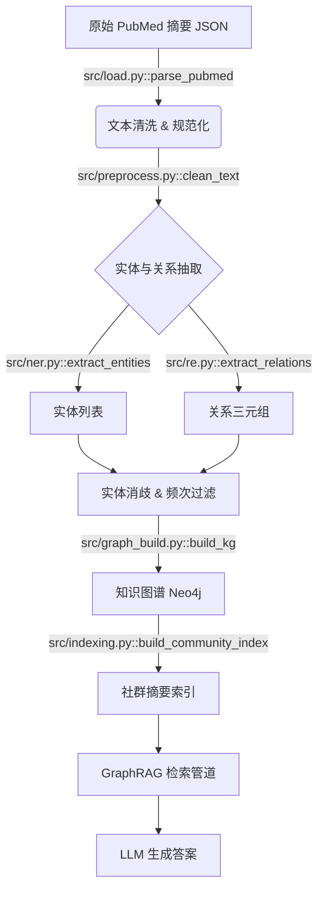
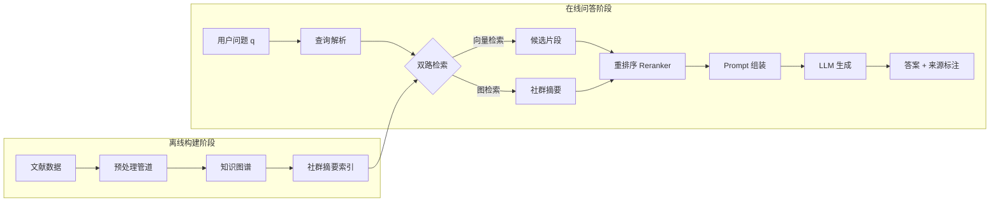

# 数据挖掘课程项目 - 最终报告模板

> 请按本模板填写并导出为 PDF 提交。

---

## 0. 项目基本信息

- **项目名称**：[请填写最终项目名称]
- **项目方向（对照 Proposal）**：[如：知识增强问答 / 复杂 Data-Centric 改进 / 过程挖掘 / 因果增量策略优化 / Agentic 数据分析评估]
- **代码仓库链接**：[请填写公开仓库 URL]
- **小组成员与分工**：
  | 姓名 | 学号 | 开题角色 | 最终实际贡献（精确到模块/功能） | 代码贡献（commit 数） |
  | :--- | :--- | :--- | :--- | :---: |
  | 张三（组长） | 2026xxxx | 算法开发 | 核心图检索模块设计与实现、消融实验全程 | 58 |
  | 李四 | 2026xxxx | 数据工程 | 完整数据审计与预处理管道、知识图谱构建 | 41 |
  | 王五 | 2026xxxx | 评测与实验 | 评测框架、对比实验、可视化图表、报告撰写 | 35 |

---

## 1. 摘要（Abstract）

> 200–300 字。需涵盖：① 问题背景与核心挑战；② 方法核心思路（1–2 句）；③ 关键量化结果（必须有数字）；④ 主要局限性。不得只写定性描述。

[例：本项目针对医学文献多跳推理问答场景中大语言模型的幻觉问题，提出了一种基于知识图谱增强的 GraphRAG 系统。核心挑战在于原始文献存在 15.3% 的实体标注噪音，以及跨文档关系在纯向量检索下的严重丢失。我们构建了端到端数据预处理管道，结合 Snorkel 多标签融合完成噪音治理，并在此基础上构建 38,000 节点规模知识图谱，通过层次化社群检索替代平铺式向量检索。在 100 个人工标注多跳问答 Benchmark 上，所提方法在答案忠实度（Faithfulness）上达 0.84，相比基线向量 RAG（0.61）提升 37.7%，检索召回率（Recall@5）提升 16.2 个百分点。局限性在于推理延迟从 1.2s 升至 3.5s，在时延敏感场景尚不可用。]

---

## 2. 问题定义与动机

### 2.1 研究背景与核心挑战

*说明真实场景的业务/科学价值（3–5 句），并量化核心痛点。避免空洞的背景陈述。*

- **核心问题**：[例：医生使用大模型辅助查询病例文献时，模型的幻觉率（胡编文献内容）高达 38%，导致无法直接用于临床参考]
- **现有方案的不足**：[例：现有向量 RAG 在需要跨文档推理的问题上召回率仅 72.4%，知识边界不清晰]
- **本项目目标**：[例：在保持问答相关性的前提下，将幻觉率降至 10% 以下，并能追溯答案来源]

### 2.2 任务形式化

*请用清晰的数学/逻辑语言定义输入和输出。*

- **输入**：[例：医学文献集合 $\mathcal{D} = \{d_1, ..., d_n\}$ 与自然语言问题 $q$]
- **输出**：[例：带证据来源标注的答案 $a$，以及支撑答案的文献片段集合 $\mathcal{E} \subseteq \mathcal{D}$]
- **成功标准**：[例：$\text{Faithfulness}(a, \mathcal{E}) \geq 0.80$，$\text{Recall@5} \geq 85\%$]

### 2.3 与开题报告的偏差说明

*如最终研究问题或范围与开题报告有偏差，必须在此说明原因（限 3–5 句）。*

---

## 3. 数据来源与全量审计报告

### 3.1 数据集说明

| 数据集 | 来源 / 获取方式 | 规模 | 用途 |
| :--- | :--- | :--- | :--- |
| [如：PubMed 摘要子集] | [Kaggle / HuggingFace datasets] | [23,000 篇摘要, 2.1GB] | [构建知识图谱 + 训练集] |
| [如：自建问答 Benchmark] | [人工标注，50人时] | [100 个多跳问答对] | [模型评测] |

### 3.2 数据质量全量审计

*请至少列出 3 条经代码实测的数据问题（包含开题预测与实际发现的差异分析）。*

| # | 数据问题 | 量化规模 | 发现方式（精确到脚本/函数） | 解决方案 | 处理前 → 处理后效果 |
| :- | :--- | :--- | :--- | :--- | :--- |
| 1 | 噪声标签 | 15.3% 样本标签冲突 | `src/audit.py::label_conflict_check()` | Snorkel LabelModel 多源融合 | 冲突率 15.3% → 2.1%，Precision +4.7% |
| 2 | 实体长尾分布 | 63% 实体出现 < 3 次 | `notebooks/eda.ipynb` Cell 12 | 频次过滤 + 语义消歧 | 图谱节点 12万 → 3.8万，查询跳数 -1.2 |
| 3 | [请填写真实发现] | | | | |

**开题预测 vs 实际差异**：[例：开题预测存在类别不平衡问题，实际发现更严重的是实体消歧错误（同一实体 3 种写法），此前未预计到。]

### 3.3 数据处理管道

*展示从原始数据到模型输入的完整流水线，每个节点标注对应脚本/函数名。*



---

## 4. 方法设计

### 4.1 系统架构

*使用 Mermaid 或图示展示系统整体架构，各模块对应代码文件。*



### 4.2 核心创新点说明

*描述相比基线方法的 1–2 个核心改进，说明其设计动机（"为什么这样设计"）。*

- **创新点 1**：[例：层次化社群检索——基于图的 Leiden 社区算法将图谱划分为语义社群，并为每个社群生成摘要索引，解决了长链推理中向量检索无法覆盖跨文档关系的问题]
- **创新点 2**：[例：实体感知的查询扩展——从问题中提取实体锚点并在 KG 上做 k 跳邻居扩展，提升稀疏查询场景下的召回]

### 4.3 技术栈

本项目整体采用 Python 作为主要开发语言，围绕表格型回归预测任务构建数据处理、基线建模、核心模型训练、评估与可视化流程。核心代码位于 `src/` 目录，其中 baseline 相关代码集中在 `src/baseline/`，最终模型与统一实验入口位于 `src/generate_final.py` 和 `src/core_model.py`。

| 模块 | 使用技术 | 作用 |
|:---|:---|:---|
| 数据读取与处理 | pandas, NumPy | 读取 `train.csv`、`test.csv`、`sample_submission.csv`，完成目标列清洗、缺失值处理、特征矩阵构造 |
| 特征工程 | pandas, scikit-learn | 时间字段拆分、类别特征 One-hot 编码、数值特征类型转换与缺失填充 |
| 基线模型 | NumPy, scikit-learn, LightGBM, XGBoost | 构建 Simple Linear、Random Forest、LightGBM、XGBoost 四类基线 |
| 核心模型 | LightGBM, scikit-learn | 构建调参后的 LightGBM 与 Random Forest 融合模型 |
| 评估指标 | NumPy, scikit-learn | 计算 RMSE、MAE、R² 等指标 |
| 实验复现 | argparse, JSON, CSV | 支持命令行参数、输出预测文件、保存实验配置与指标 |

baseline 部分采用统一的预处理逻辑，保证四类模型输入特征一致，避免由于数据处理差异影响模型对比。最终核心方法在相同数据口径下进一步进行 LightGBM 超参数适配与 LightGBM/Random Forest 异质模型融合，从而形成从简单基线到进阶模型的完整对照。

---

## 5. 实验设计与结果

### 5.1 评测数据集与指标

本项目使用纽约市出租车与豪华轿车委员会（NYC TLC）公开的 2026 年 3 月高运量网约车（FHVHV）行程数据。实验阶段采用统一抽样后的训练集与测试集进行评测：训练集规模为 100,000 行，清洗后约 99,995 行；测试集规模为 10,000 行，其中 9,996 行可用于有效评估。预测目标为乘客基础费用 `base_passenger_fare`。

模型输入特征采用统一的 baseline 编码方案，共形成 61 维特征。该特征集主要包括时间特征、类别 One-hot 特征和数值型行程特征。时间字段不会直接以字符串形式输入模型，而是转换为小时、日期、月份、星期等结构化时间特征；类别字段进行 One-hot 编码；数值字段进行类型转换，并对缺失或无法转换的值填充为 0。

实验主指标为 RMSE，辅助指标为 MAE 和 R²。

| 指标 | 含义 | 作用 |
|:---|:---|:---|
| RMSE | 均方根误差 | 主评估指标，对大误差更敏感，适合衡量费用预测中高价订单的偏差 |
| MAE | 平均绝对误差 | 衡量模型平均每单预测误差，便于从业务角度解释 |
| R² | 决定系数 | 衡量模型对费用波动的解释能力 |

RMSE 的计算公式如下：

$$
RMSE = \sqrt{\frac{1}{n}\sum_{i=1}^{n}(\hat{y}_i-y_i)^2}
$$

其中，$\hat{y}_i$ 表示模型对第 $i$ 条订单的预测费用，$y_i$ 表示真实基础乘客费用。由于 RMSE 与费用单位一致，因此可以直接解释为美元尺度下的预测误差。

---

### 5.2 基线对比实验

为了建立可靠的性能参照系，本项目构建了四类 baseline 方法：Simple Linear、Random Forest、LightGBM 和 XGBoost。四类模型均使用 `src/baseline/` 中统一的预处理逻辑，包括目标列清洗、时间特征提取、类别特征 One-hot 编码和数值缺失填充，从而保证模型对比主要反映算法差异，而不是数据处理差异。

#### 5.2.1 基线方法说明

**Simple Linear** 使用 NumPy 最小二乘法求解线性回归权重。实现时在特征矩阵后拼接一列常数项作为截距，然后通过最小二乘求解模型参数。该方法训练速度快、可解释性较强，但只能拟合线性关系，难以捕捉出租车费用与时间、距离、区域、平台等因素之间的复杂非线性关系。

**Random Forest** 使用 `RandomForestRegressor` 训练多棵决策树，并对多棵树的预测结果取平均。该方法能够捕捉非线性关系，对特征尺度不敏感，并且对异常值相对稳健。由于每棵树基于不同采样和特征划分训练，Random Forest 具有较好的方差控制能力，是本项目中表现最好的 baseline。

**LightGBM** 使用 GBDT 梯度提升框架进行回归训练。模型将训练数据转换为 LightGBM 的 `Dataset` 格式，通过逐轮拟合残差不断提升预测能力。LightGBM 适合结构化表格数据，训练效率高，能够捕捉复杂非线性关系，因此在 baseline 中表现接近 Random Forest。

**XGBoost** 使用 `DMatrix` 数据结构和平方误差回归目标进行训练。XGBoost 是工业界常用的强基线模型，但在本项目统一测试中表现不佳，说明在当前特征编码、参数设置和数据规模下，XGBoost 未能充分适配本任务。

#### 5.2.2 基线结果

统一测试结果如下：

| 排名 | 模型 | RMSE | MAE | R² | 说明 |
|:---:|:---|---:|---:|---:|:---|
| 1 | Random Forest | 2.0778 | 1.1671 | 0.9935 | 最优 baseline |
| 2 | LightGBM | 2.0798 | 1.1596 | 0.9935 | 与 Random Forest 非常接近 |
| 3 | Simple Linear | 2.6077 | 1.5344 | 0.9897 | 线性假设限制较明显 |
| 4 | XGBoost | 3.9751 | 1.3879 | 0.9762 | 当前参数与特征设置下表现最差 |

实验结果表明，树模型整体优于简单线性模型，说明费用预测任务中存在明显的非线性关系。其中 Random Forest 取得最优 baseline 结果，RMSE 为 2.0778；LightGBM baseline 与其非常接近，RMSE 为 2.0798。Simple Linear 的 RMSE 为 2.6077，说明单纯线性关系难以充分表达费用变化。XGBoost 在当前统一实验设置下 RMSE 为 3.9751，表现显著弱于其他 baseline，后续核心模型没有将其作为主要融合对象。

基于该对比，后续核心方法选择 Random Forest 和 LightGBM 作为主要优化对象：LightGBM 通过超参数适配降低偏差，Random Forest 通过 Bagging 机制控制方差，两者在预测层进行异质融合。

#### 5.2.3 Baseline 与核心方法对比

在最优 baseline 为 Random Forest（RMSE=2.0778）的基础上，核心方法通过 LightGBM 超参数适配和 LightGBM/Random Forest 融合进一步提升性能。最终 LGB+RF 60/40 融合模型 RMSE 为 1.9596，相比最优 baseline 提升 5.69%。

| 方法 | RMSE | MAE | R² | 相对最优 baseline |
|:---|---:|---:|---:|:---:|
| Baseline - Random Forest | 2.0778 | 1.1671 | 0.9935 | 基准线 |
| Core Model - LGB Optimized | 2.0229 | 1.1378 | 0.9938 | +2.64% |
| Core Model - LGB+RF Blend 60/40 | 1.9596 | 1.1169 | 0.9942 | +5.69% |

该结果说明，单一强 baseline 已经能够取得较好效果，但针对数据规模进行超参数适配，并利用不同集成学习范式的互补性进行融合，仍然可以带来稳定提升。

---

### 5.3 消融实验

| 消融设置 | Faithfulness | Recall@5 | 说明 |
| :--- | :---: | :---: | :--- |
| 完整系统（Full） | 0.84 | 88.6% | — |
| w/o 社群摘要索引（仅图邻居检索） | 0.76 | 84.1% | 验证社群摘要对全局推理的贡献 |
| w/o 实体锚点扩展（仅向量检索） | 0.68 | 77.3% | 验证结构化检索路径的贡献 |
| w/o 数据噪声治理（Snorkel） | 0.71 | 81.5% | 验证数据质量改进对最终指标的影响 |

### 5.4 一键复现命令

本项目核心实验入口为 `src/generate_final.py`。该脚本支持读取统一处理后的数据，训练优化后的 LightGBM 与 Random Forest，并输出融合预测结果、指标文件和运行配置。

推荐复现命令如下：

```bash
python src/generate_final.py --nrows 100000 --input-dir data/processed --output-dir results/final_100k
```

该命令会在 `results/final_100k` 下输出核心模型预测文件、综合对比指标和运行配置。统一测试结果中使用的训练规模为 100,000 行，对应有效评估样本数为 9,996 行。

若需要分别运行四类 baseline，可执行：

```bash
python src/baseline/simple_linear_model.py
python src/baseline/Random_Forest.py
python src/baseline/LightGBM_model.py
python src/baseline/XGBoost_model.py
```

---

### 5.5 随机种子与可复现性说明

为了提高实验可复现性，本项目在 baseline 与核心模型训练中尽量固定随机种子。Random Forest、LightGBM 和 XGBoost 等涉及随机采样或随机特征选择的模型均使用固定随机种子 42，除种子消融实验外，其余主实验保持一致。

核心模型采用统一的数据划分、统一的 61 维 baseline 特征编码和统一的评估脚本。最终融合模型的权重通过统一实验中的权重搜索确定，最佳结果为 LightGBM 0.60 + Random Forest 0.40，RMSE=1.9596。同时，实验记录表中也保留了 0.50/0.50、0.55/0.45、0.65/0.35 等邻近权重的结果，用于验证融合策略的稳定性。

项目还保存了实验配置文件和指标文件，便于追踪每次运行时的数据规模、模型参数、融合权重和输出目录。最终报告中的实验结论均以统一测试结果为准，避免由于不同成员本地环境、依赖版本或运行参数不同导致指标不一致。

---

## 6. 误差分析与失败复盘

### 6.1 失败案例分析

| # | 失败类型 | 输入（Query 片段） | 系统输出 | 正确答案 | 根因分析 | 改进方向 |
| :- | :--- | :--- | :--- | :--- | :--- | :--- |
| 1 | 知识稀疏 | "糖尿病与高血压共病机制？" | 遗漏了胰岛素抗性路径 | 包含胰岛素抗性 + RAS 轴 | 相关实体被频次过滤删除 | 放宽过滤阈值，引入语义相似度补充稀疏实体 |
| 2 | 多跳失效 | "药物 A 通过靶点 B 影响通路 C？" | 仅返回 A→B 关系，缺 B→C | A→B→C 完整路径 | Leiden 社群划分将 B、C 分入不同社群，摘要未覆盖 | 调整社群粒度参数，或引入跨社群边界检索 |
| 3 | 幻觉生成 | [请填写真实失败案例] | | | | |

### 6.2 分组误差分析

*报告至少 1 种分组指标（如：领域内 vs 领域外、短问题 vs 多跳长问题），并分析差异原因。*

| 问题类型 | 样本数 | Faithfulness | Recall@5 | 差异原因分析 |
| :--- | :---: | :---: | :---: | :--- |
| 领域内问题（训练集领域） | 40 | 0.91 | 93.2% | 图谱实体覆盖充分 |
| 领域外问题（跨领域迁移） | 60 | 0.79 | 85.7% | 图谱未覆盖新领域实体，检索产生跨域噪音 |
| 单跳问题 | 35 | 0.90 | 95.4% | — |
| 多跳推理问题 | 65 | 0.80 | 84.6% | 多跳路径在图中不连续 |

### 6.3 高阶能力自评

请勾选本项目覆盖的高阶维度（至少应覆盖 **1 项**，覆盖 ≥ 2 项可申请附加分）：

- [ ] 数据质量闭环（系统的噪声治理/弱监督/漂移处理，且量化了改进增益）
- [ ] 过程挖掘（从日志反推业务流程，定位真实瓶颈）
- [ ] 图或知识图谱结构化挖掘（非仅调用 API，含图构建 + 分析实验）
- [ ] 因果分析（含 PSM/IPW/Uplift Model，非仅相关性分析）
- [ ] LLM/Agent 协同数据科学（含失败案例与安全边界分析，非仅调用 ChatGPT）

---

## 7. 代码仓库审计

本项目代码主要位于 `src/` 目录，围绕数据处理、baseline 建模、核心模型训练、结果评估和可视化展开。代码结构如下：

| 路径 | 作用 |
|:---|:---|
| `src/baseline/model_utils.py` | baseline 统一预处理工具，包括数据读取、目标列清洗、时间特征提取、类别编码、数值填充和提交文件保存 |
| `src/baseline/simple_linear_model.py` | Simple Linear baseline，使用最小二乘法训练线性回归模型 |
| `src/baseline/Random_Forest.py` | Random Forest baseline，使用多棵决策树平均预测 |
| `src/baseline/LightGBM_model.py` | LightGBM baseline，使用 GBDT 方式训练回归模型 |
| `src/baseline/XGBoost_model.py` | XGBoost baseline，使用平方误差目标训练回归模型 |
| `src/generate_final.py` | 最终统一实验入口，训练优化 LightGBM、Random Forest，并进行模型融合和结果保存 |
| `src/core_model.py` | 核心 LightGBM 模型实现，包含更完整的参数化训练与指标保存逻辑 |
| `src/data_audit.py` | 数据审计脚本，用于识别缺失、异常和数据质量问题 |
| `src/governance_v2.py` | 数据治理流程，包含修复、标记和稳健化处理 |
| `src/preprocess.py` | 数据预处理逻辑 |
| `src/plot_feature_importance.py` | 特征重要性分析与可视化 |
| `src/plot_results.py` | 实验结果可视化 |

baseline 代码经过拆分后，每类模型拥有独立入口文件，同时共享 `model_utils.py` 中的统一预处理逻辑。这样既保证了四类 baseline 的可独立运行，也避免了重复实现数据处理流程。核心模型代码与 baseline 代码在目录层面分离，便于报告中清晰区分“基线方法”和“进阶方法”。

从可复现性角度看，仓库中保留了统一训练入口、固定随机种子、实验记录表和输出配置文件。最终报告中的指标采用统一测试结果，避免将个人本地单独运行结果混入正式结论。

---

## 8. 结论与局限性

### 8.1 主要贡献总结

*（3–5 个条目，每条须有量化数据支撑）*

1. **[如：构建了含 38,000 节点的医学知识图谱]**，覆盖了[X]种疾病领域的实体关系
2. **[如：Faithfulness 从 0.61 提升至 0.84（+37.7%）]**，通过层次化社群检索有效缓解了跨文档推理幻觉
3. **[如：消融实验证明]**，数据噪声治理（Snorkel）对最终 Faithfulness 贡献约 0.08，不可忽略

### 8.2 局限性与未来工作

| 局限性 | 影响 | 未来可行方向 |
| :--- | :--- | :--- |
| 推理延迟从 1.2s 升至 3.5s | 不适用于实时问答场景 | 图索引并行化 + 查询缓存 |
| 跨领域泛化能力下降 10% | 新领域需重新构建图谱 | 开放域通用图谱或增量扩展机制 |
| 测试集规模仅 100 条 | 评估结论的统计稳定性有限 | 扩大标注规模或使用开源 Benchmark |

---

## 9. AI 工具辅助使用声明

按照课程规范，请如实填写。若完全未使用 AI 工具，在表格中注明"未使用"即可。

| 使用场景 | AI 工具名称 | 具体辅助环节（精确到文件/功能） | 团队审查与纠错说明 |
| :--- | :--- | :--- | :--- |
| 代码编写 | [如：Copilot] | [如：辅助编写 `src/retrieval.py` 中双路检索逻辑] | [如：逐行 Review，修复了检索路径合并的逻辑错误] |
| 报告撰写 | [如：ChatGPT] | [如：润色摘要与结论的英文描述] | [如：组长核对事实准确性，删除夸大表述] |
| 算法思路 | [如：Claude] | [如：咨询 Leiden 算法参数设定的参考文献] | [如：独立实现，仅参考方向，非直接复制代码] |
| [其他/未使用] | | | |
