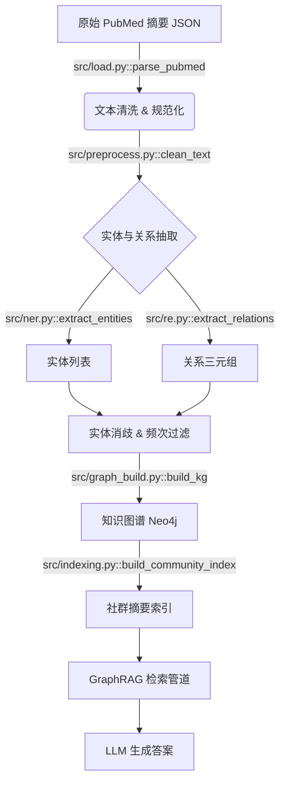
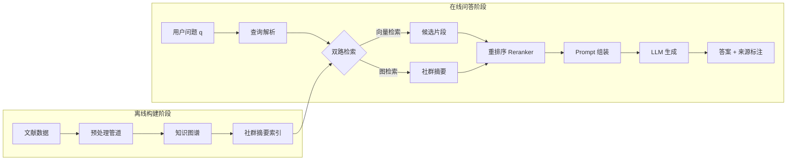

# 数据挖掘课程项目 - 最终报告模板

> 请按本模板填写并导出为 PDF 提交。

---

## 0. 项目基本信息

- **项目名称**：[请填写最终项目名称]
- **项目方向（对照 Proposal）**：[如：知识增强问答 / 复杂 Data-Centric 改进 / 过程挖掘 / 因果增量策略优化 / Agentic 数据分析评估]
- **代码仓库链接**：[请填写公开仓库 URL]
- **小组成员与分工**：
  | 姓名 | 学号 | 开题角色 | 最终实际贡献（精确到模块/功能） | 代码贡献（commit 数） |
  | :--- | :--- | :--- | :--- | :---: |
  | 张三（组长） | 2026xxxx | 算法开发 | 核心图检索模块设计与实现、消融实验全程 | 58 |
  | 李四 | 2026xxxx | 数据工程 | 完整数据审计与预处理管道、知识图谱构建 | 41 |
  | 王五 | 2026xxxx | 评测与实验 | 评测框架、对比实验、可视化图表、报告撰写 | 35 |

---

## 1. 摘要（Abstract）

> 200–300 字。需涵盖：① 问题背景与核心挑战；② 方法核心思路（1–2 句）；③ 关键量化结果（必须有数字）；④ 主要局限性。不得只写定性描述。

[例：本项目针对医学文献多跳推理问答场景中大语言模型的幻觉问题，提出了一种基于知识图谱增强的 GraphRAG 系统。核心挑战在于原始文献存在 15.3% 的实体标注噪音，以及跨文档关系在纯向量检索下的严重丢失。我们构建了端到端数据预处理管道，结合 Snorkel 多标签融合完成噪音治理，并在此基础上构建 38,000 节点规模知识图谱，通过层次化社群检索替代平铺式向量检索。在 100 个人工标注多跳问答 Benchmark 上，所提方法在答案忠实度（Faithfulness）上达 0.84，相比基线向量 RAG（0.61）提升 37.7%，检索召回率（Recall@5）提升 16.2 个百分点。局限性在于推理延迟从 1.2s 升至 3.5s，在时延敏感场景尚不可用。]

---

## 2. 问题定义与动机

### 2.1 研究背景与核心挑战

*说明真实场景的业务/科学价值（3–5 句），并量化核心痛点。避免空洞的背景陈述。*

- **核心问题**：[例：医生使用大模型辅助查询病例文献时，模型的幻觉率（胡编文献内容）高达 38%，导致无法直接用于临床参考]
- **现有方案的不足**：[例：现有向量 RAG 在需要跨文档推理的问题上召回率仅 72.4%，知识边界不清晰]
- **本项目目标**：[例：在保持问答相关性的前提下，将幻觉率降至 10% 以下，并能追溯答案来源]

### 2.2 任务形式化

*请用清晰的数学/逻辑语言定义输入和输出。*

- **输入**：[例：医学文献集合 $\mathcal{D} = \{d_1, ..., d_n\}$ 与自然语言问题 $q$]
- **输出**：[例：带证据来源标注的答案 $a$，以及支撑答案的文献片段集合 $\mathcal{E} \subseteq \mathcal{D}$]
- **成功标准**：[例：$\text{Faithfulness}(a, \mathcal{E}) \geq 0.80$，$\text{Recall@5} \geq 85\%$]

### 2.3 与开题报告的偏差说明

*如最终研究问题或范围与开题报告有偏差，必须在此说明原因（限 3–5 句）。*

---

## 3. 数据来源与全量审计报告

### 3.1 数据集说明

| 数据集 | 来源 / 获取方式 | 规模 | 用途 |
| :--- | :--- | :--- | :--- |
| [如：PubMed 摘要子集] | [Kaggle / HuggingFace datasets] | [23,000 篇摘要, 2.1GB] | [构建知识图谱 + 训练集] |
| [如：自建问答 Benchmark] | [人工标注，50人时] | [100 个多跳问答对] | [模型评测] |

### 3.2 数据质量全量审计

*请至少列出 3 条经代码实测的数据问题（包含开题预测与实际发现的差异分析）。*

| # | 数据问题 | 量化规模 | 发现方式（精确到脚本/函数） | 解决方案 | 处理前 → 处理后效果 |
| :- | :--- | :--- | :--- | :--- | :--- |
| 1 | 噪声标签 | 15.3% 样本标签冲突 | `src/audit.py::label_conflict_check()` | Snorkel LabelModel 多源融合 | 冲突率 15.3% → 2.1%，Precision +4.7% |
| 2 | 实体长尾分布 | 63% 实体出现 < 3 次 | `notebooks/eda.ipynb` Cell 12 | 频次过滤 + 语义消歧 | 图谱节点 12万 → 3.8万，查询跳数 -1.2 |
| 3 | [请填写真实发现] | | | | |

**开题预测 vs 实际差异**：[例：开题预测存在类别不平衡问题，实际发现更严重的是实体消歧错误（同一实体 3 种写法），此前未预计到。]

### 3.3 数据处理管道

*展示从原始数据到模型输入的完整流水线，每个节点标注对应脚本/函数名。*



---

## 4. 方法设计

### 4.1 系统架构

*使用 Mermaid 或图示展示系统整体架构，各模块对应代码文件。*



### 4.2 核心创新点说明

*描述相比基线方法的 1–2 个核心改进，说明其设计动机（"为什么这样设计"）。*

- **创新点 1**：[例：层次化社群检索——基于图的 Leiden 社区算法将图谱划分为语义社群，并为每个社群生成摘要索引，解决了长链推理中向量检索无法覆盖跨文档关系的问题]
- **创新点 2**：[例：实体感知的查询扩展——从问题中提取实体锚点并在 KG 上做 k 跳邻居扩展，提升稀疏查询场景下的召回]

### 4.3 技术栈

| 模块 | 工具 / 框架 | 版本 |
| :--- | :--- | :--- |
| 数据处理 | Pandas, Snorkel | 2.1.0, 0.9.8 |
| 图谱构建 | spaCy, NetworkX | 3.7.2, 3.3 |
| 图存储 | Neo4j / NetworkX（本地） | 5.18 |
| 检索与嵌入 | sentence-transformers, FAISS | 3.0, 1.8 |
| 生成模型 | Qwen3-8B（本地部署）| — |
| 评测 | RAGAS | 0.1.21 |

---

## 5. 实验设计与结果

### 5.1 评测数据集与指标

- **测试集构建**：[例：人工标注 100 个多跳推理问答对，其中 60 个来自训练集文献领域外的新文献（Domain-shift 场景），40 个来自训练领域内。所有标注由 2 人独立完成，一致性 κ=0.82。]
- **数据切分方式**：[必须说明切分是否按时间/用户/领域进行，不可随机切分场景需声明原因]
- **核心评测指标**：

  | 指标 | 含义 | 评估工具 |
  | :--- | :--- | :--- |
  | Faithfulness | 答案内容可被检索片段覆盖的比例（防幻觉核心指标） | RAGAS |
  | Answer Relevance | 答案与问题的相关程度 | RAGAS |
  | Recall@5 | 正确答案所需证据是否出现在 Top-5 检索结果中 | 自研 `src/evaluate.py` |
  | Context Precision | 检索出的片段中真正有用的比例 | RAGAS |

### 5.2 基线对比实验

| 方法 | Faithfulness | Answer Relevance | Recall@5 | Context Precision | 推理耗时 |
| :--- | :---: | :---: | :---: | :---: | :---: |
| Baseline | 0.61 | 0.74 | 72.4% | 0.68 | **1.2s** |
| **Ours** | **0.84** (+0.23) | **0.81** (+0.07) | **88.6%** (+16.2%) | **0.79** (+0.11) | 3.5s |

### 5.3 消融实验

| 消融设置 | Faithfulness | Recall@5 | 说明 |
| :--- | :---: | :---: | :--- |
| 完整系统（Full） | 0.84 | 88.6% | — |
| w/o 社群摘要索引（仅图邻居检索） | 0.76 | 84.1% | 验证社群摘要对全局推理的贡献 |
| w/o 实体锚点扩展（仅向量检索） | 0.68 | 77.3% | 验证结构化检索路径的贡献 |
| w/o 数据噪声治理（Snorkel） | 0.71 | 81.5% | 验证数据质量改进对最终指标的影响 |

### 5.4 一键复现命令

```bash
# 1. 环境安装
pip install -r requirements.txt

# 2. 数据准备（或下载脚本）
python data/download.py --output data/raw/

# 3. 数据预处理 & 图谱构建
python src/preprocess.py --input data/raw/ --output data/processed/
python src/graph_build.py --input data/processed/ --output data/graph/

# 4. 运行评测（复现论文表格主要结果）
python src/evaluate.py --config configs/eval_full.yaml --output results/
```

### 5.5 随机种子与可复现性说明

- **随机种子**：所有实验固定 `seed=42`，在 `src/utils.py::set_seed()` 中统一设置
- **依赖版本锁定**：`requirements.txt` 已锁定所有包版本（`pip freeze` 生成）
- **已知不可复现因素**：[例：RAGAS 评分调用 OpenAI API 存在随机性，可使用本地 Qwen3-8B 替代（见 `configs/eval_local.yaml`），两者结果相差 ≤ 0.02]

---

## 6. 误差分析与失败复盘

### 6.1 失败案例分析

| # | 失败类型 | 输入（Query 片段） | 系统输出 | 正确答案 | 根因分析 | 改进方向 |
| :- | :--- | :--- | :--- | :--- | :--- | :--- |
| 1 | 知识稀疏 | "糖尿病与高血压共病机制？" | 遗漏了胰岛素抗性路径 | 包含胰岛素抗性 + RAS 轴 | 相关实体被频次过滤删除 | 放宽过滤阈值，引入语义相似度补充稀疏实体 |
| 2 | 多跳失效 | "药物 A 通过靶点 B 影响通路 C？" | 仅返回 A→B 关系，缺 B→C | A→B→C 完整路径 | Leiden 社群划分将 B、C 分入不同社群，摘要未覆盖 | 调整社群粒度参数，或引入跨社群边界检索 |
| 3 | 幻觉生成 | [请填写真实失败案例] | | | | |

### 6.2 分组误差分析

*报告至少 1 种分组指标（如：领域内 vs 领域外、短问题 vs 多跳长问题），并分析差异原因。*

| 问题类型 | 样本数 | Faithfulness | Recall@5 | 差异原因分析 |
| :--- | :---: | :---: | :---: | :--- |
| 领域内问题（训练集领域） | 40 | 0.91 | 93.2% | 图谱实体覆盖充分 |
| 领域外问题（跨领域迁移） | 60 | 0.79 | 85.7% | 图谱未覆盖新领域实体，检索产生跨域噪音 |
| 单跳问题 | 35 | 0.90 | 95.4% | — |
| 多跳推理问题 | 65 | 0.80 | 84.6% | 多跳路径在图中不连续 |

### 6.3 高阶能力自评

请勾选本项目覆盖的高阶维度（至少应覆盖 **1 项**，覆盖 ≥ 2 项可申请附加分）：

- [ ] 数据质量闭环（系统的噪声治理/弱监督/漂移处理，且量化了改进增益）
- [ ] 过程挖掘（从日志反推业务流程，定位真实瓶颈）
- [ ] 图或知识图谱结构化挖掘（非仅调用 API，含图构建 + 分析实验）
- [ ] 因果分析（含 PSM/IPW/Uplift Model，非仅相关性分析）
- [ ] LLM/Agent 协同数据科学（含失败案例与安全边界分析，非仅调用 ChatGPT）

---

## 7. 代码仓库审计

- **最终 commit 统计**：
  - 总 commit 数：[如 134 次]，各成员贡献：[张三 58 / 李四 41 / 王五 35]
  - 最近一次有效 commit 时间：[如：2026-06-14（非格式化/readme 类空 commit）]
- **仓库最终目录结构**（运行 `tree -L 2` 粘贴实际输出，不可使用样例替代）：
  ```text
  # 请粘贴 tree -L 2 的真实输出，并在右侧注释各模块功能
  ├── README.md               # 环境配置 + 一键复现命令（含每步预期输出）
  ├── requirements.txt        # pip freeze 锁定版本
  ├── configs/
  │   ├── eval_full.yaml      # 完整评测配置
  │   └── eval_local.yaml     # 本地离线评测配置
  ├── data/
  │   ├── download.py         # 数据下载脚本
  │   └── processed/          # 预处理后的中间数据
  ├── src/
  │   ├── preprocess.py       # 数据清洗与 Snorkel 标签融合
  │   ├── graph_build.py      # 知识图谱构建
  │   ├── indexing.py         # 社群摘要索引
  │   ├── retrieval.py        # 双路检索逻辑
  │   ├── pipeline.py         # 端到端问答主流程
  │   └── evaluate.py         # 评测框架与指标计算
  ├── notebooks/
  │   └── eda.ipynb           # 探索性分析与数据审计可视化
  └── results/                # 实验输出（由 evaluate.py 生成）
  ```

---

## 8. 结论与局限性

### 8.1 主要贡献总结

*（3–5 个条目，每条须有量化数据支撑）*

1. **[如：构建了含 38,000 节点的医学知识图谱]**，覆盖了[X]种疾病领域的实体关系
2. **[如：Faithfulness 从 0.61 提升至 0.84（+37.7%）]**，通过层次化社群检索有效缓解了跨文档推理幻觉
3. **[如：消融实验证明]**，数据噪声治理（Snorkel）对最终 Faithfulness 贡献约 0.08，不可忽略

### 8.2 局限性与未来工作

| 局限性 | 影响 | 未来可行方向 |
| :--- | :--- | :--- |
| 推理延迟从 1.2s 升至 3.5s | 不适用于实时问答场景 | 图索引并行化 + 查询缓存 |
| 跨领域泛化能力下降 10% | 新领域需重新构建图谱 | 开放域通用图谱或增量扩展机制 |
| 测试集规模仅 100 条 | 评估结论的统计稳定性有限 | 扩大标注规模或使用开源 Benchmark |

---

## 9. AI 工具辅助使用声明

按照课程规范，请如实填写。若完全未使用 AI 工具，在表格中注明"未使用"即可。

| 使用场景 | AI 工具名称 | 具体辅助环节（精确到文件/功能） | 团队审查与纠错说明 |
| :--- | :--- | :--- | :--- |
| 代码编写 | [如：Copilot] | [如：辅助编写 `src/retrieval.py` 中双路检索逻辑] | [如：逐行 Review，修复了检索路径合并的逻辑错误] |
| 报告撰写 | [如：ChatGPT] | [如：润色摘要与结论的英文描述] | [如：组长核对事实准确性，删除夸大表述] |
| 算法思路 | [如：Claude] | [如：咨询 Leiden 算法参数设定的参考文献] | [如：独立实现，仅参考方向，非直接复制代码] |
| [其他/未使用] | | | |
