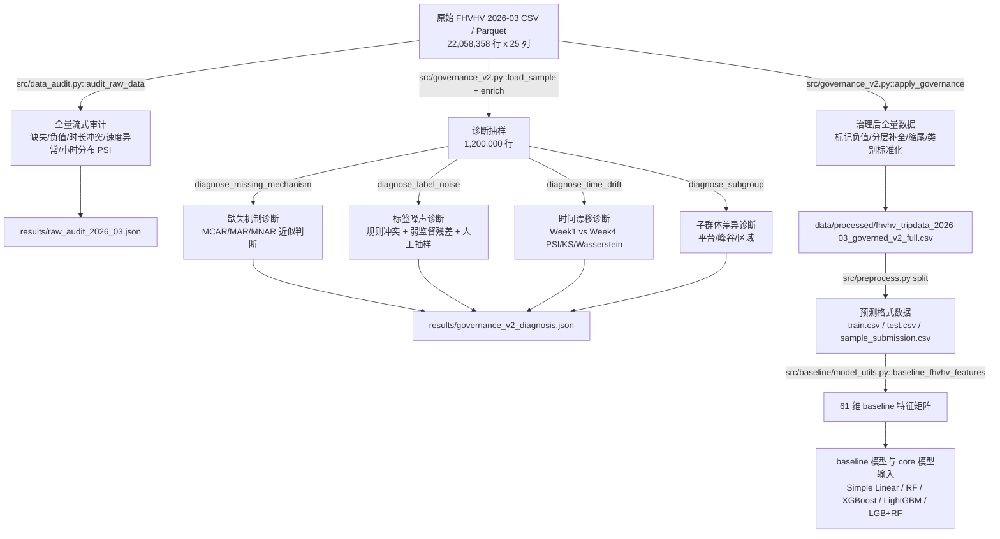

# 数据挖掘课程项目 - 最终报告（cch撰写部分）

> 本文件按照最终报告模板保留章节顺序，重点补全 cch 负责的 `2.1`、`2.3`、`3.1`、`3.2`、`3.3`、`6.2`、`6.3`。数据口径统一为 NYC TLC FHVHV 2026-03，预测目标统一为 `base_passenger_fare`。

---

## 0. 项目基本信息

[由 xwb 统一整合。]

---

## 1. 摘要（Abstract）

[由 xwb 统一整合。cch 提供的数据治理结论：全量数据 22,058,358 行；`originating_base_num` 缺失率 27.5933%；疑似标签噪声率 18.5087%；治理短期精度收益不显著，但提升了可审计性、质量标记和风险控制能力。]

---

## 2. 问题定义与动机

### 2.1 研究背景与核心挑战

纽约市 TLC 高容量网约车（FHVHV）行程数据记录了 Uber/Lyft 等平台在城市交通网络中的真实运营过程，费用预测既可用于行程定价校验，也可用于异常账单识别、平台运营分析和交通需求研究。本项目最终聚焦 2026 年 3 月 FHVHV 全量数据，共 `22,058,358` 条记录、25 个原始字段，预测目标为乘客基础费用 `base_passenger_fare`。

- **核心问题**：原始数据虽然规模大，但并非“可直接建模”的干净表格数据。全量审计发现 `base_passenger_fare` 负值 5,669 条、`driver_pay` 负值 9 条、行程时长不一致 10,123 条、速度异常 3,977 条；抽样诊断还发现 `originating_base_num` 缺失率达到 27.5933%，并呈现明显 MAR 特征（缺失预测 AUC=0.999，KS-p=2.1e-08）。这些问题会让模型在极端费用、短程/长程行程和不同平台子群体上产生不稳定误差。
- **现有方案的不足**：如果只套用常规回归建模流程，通常会把异常样本直接删除或让模型自行吸收噪声；但 FHVHV 数据中的异常既包含真实业务现象，也包含采集/口径问题，粗暴删除会损失业务信息。治理对照实验显示，Delete-only 策略相较 Raw_baseline 的 RMSE 从 8.6181 变为 8.6570，样本损失率为 0.0087%，且差异未达显著（p=0.1417），说明“删异常”并不天然更优。
- **本项目目标**：在预测 `base_passenger_fare` 的同时，建立可复现的数据审计与治理闭环：先量化缺失、标签噪声、速度/时长异常、时间漂移和子群体差异，再通过标记、修复、分层补全和缩尾保留数据可用性，并把质量标记传递给后续 baseline 与核心模型。最终目标不是只追求单次精度提升，而是让费用预测建立在可审计、可解释、可复查的数据基础上。

### 2.2 任务形式化

[由 xwb/zhy 填写。]

### 2.3 与开题报告的偏差说明

开题阶段项目设定为基于 Yellow Taxi 数据进行费用预测，监督学习主标签为 `total_amount`，并保留按实验设置替换为 `fare_amount` 的可能；最终实现阶段调整为 NYC TLC 2026 年 3 月 FHVHV 数据，并统一预测 `base_passenger_fare`。其中，数据集从 Yellow Taxi 调整为 FHVHV，主要是因为 FHVHV 2026-03 数据规模更大（共 22,058,358 行），更适合支撑全量数据审计、数据治理和大规模建模流程；同时，FHVHV 数据包含平台牌照、派单 base、起始 base、共享出行、无障碍车辆等字段，能够支撑平台、时段、区域和服务类型等子群体差异分析，更契合本项目 Data-Centric 的研究主线。

预测目标从 `fare_amount/total_amount` 调整为 `base_passenger_fare`，则是出于标签口径统一和业务含义清晰的考虑。`base_passenger_fare` 表示 FHVHV 场景下的乘客基础车费，不混入小费、税费、拥堵费、机场费等外部附加项；相比 `total_amount` 这类总价字段，它更接近“行程本身价格”的回归目标，也与最终采用的 FHVHV 数据字段体系保持一致。因此，该调整并未改变“出行费用预测 + 数据质量治理”的项目方向，而是将研究对象迁移到字段更丰富、质量审计空间更大的 FHVHV 场景中。

因此，本项目的最终口径统一为：数据集使用 `fhvhv_tripdata_2026-03`，目标字段使用 `base_passenger_fare`，评估指标使用 RMSE/MAE/R²。该调整改变了数据源和标签口径，但没有改变开题报告中“费用预测 + 数据质量治理”的研究主线。

---

## 3. 数据来源与全量审计报告

### 3.1 数据集说明

| 数据集 | 来源 / 获取方式 | 规模 | 用途 |
| :--- | :--- | :--- | :--- |
| FHVHV 原始行程数据（2026-03） | NYC TLC Trip Record Data，文件名 `fhvhv_tripdata_2026-03.csv/parquet`；原始下载源为 `https://d37ci6vzurychx.cloudfront.net/trip-data/fhvhv_tripdata_2026-03.parquet` | 22,058,358 行，25 个原始字段 | 全量审计、数据治理、费用预测建模的原始输入 |
| FHVHV 治理后全量数据 | 由 `src/preprocess.py` 调用 `data_audit.py` 与 `governance_v2.py` 生成；文件为 `data/processed/fhvhv_tripdata_2026-03_governed_v2_full.csv` | 保留 22,058,358 行，并新增质量标记、派生特征和缩尾特征 | 作为可审计建模数据源，支持 baseline/core 输入与子群体分析 |

原始字段覆盖平台、派单 base、请求/到达/上下车时间、上下车区域、行程里程、行程时长、基础车费、税费/附加费、小费、司机收入、拼车与无障碍车辆标记等。最终建模时以 `base_passenger_fare` 作为标签，避免把 `tips`、`sales_tax`、`congestion_surcharge`、`airport_fee` 等外生费用混入主要预测目标。

### 3.2 数据质量全量审计

| # | 数据问题 | 量化规模 | 发现方式（精确到脚本/函数） | 解决方案 | 处理前 -> 处理后效果 |
| :- | :--- | :--- | :--- | :--- | :--- |
| 1 | 关键 base 字段缺失 | `originating_base_num` 缺失率 27.5933%；缺失可被其他特征预测，AUC=0.999，KS-p=2.1e-08 | `src/governance_v2.py::diagnose_missing_mechanism()` | 判定为 MAR_likely，不直接删除；保留缺失语义，并在建模特征中用 `UNK`/分组统计补全策略处理 | 高风险缺失从“未知问题”转为可解释质量信号；保留全量样本，避免 27.6% 行被误删 |
| 2 | 费用标签与业务规则冲突 | 全量 `base_passenger_fare < 0` 共 5,669 条（0.0257%）；抽样诊断疑似标签噪声率 18.5087%，规则冲突率 3.0263% | `src/data_audit.py::audit_raw_data()`；`src/governance_v2.py::diagnose_label_noise()` | 对负费用打 `flag_fare_negative` 并转为缺失；疑似噪声保留审计样本 `results/manual_audit_sample_noise.csv`，不把弱监督异常全部硬删除 | 负费用从模型标签中剥离并可追踪；人工抽检 120 条未发现明显异常，说明弱监督“疑似噪声”需谨慎解释 |
| 3 | 时长一致性异常 | `dropoff_datetime - pickup_datetime` 与 `trip_time` 差异超过 300 秒的记录 10,123 条（0.0459%） | `src/data_audit.py::audit_raw_data()`；`src/governance_v2.py::enrich()` | 新增 `duration_seconds` 与 `flag_duration_inconsistent`；异常不直接删除，供模型或分组分析使用 | 异常时长由隐性风险变为显式质量标记，下游可按标记分析误差 |
| 4 | 速度异常 | `speed_mph < 1` 或 `> 80` 的记录 3,977 条（0.0180%）；`speed_mph` 缺失率约 0.0020% | `src/data_audit.py::audit_raw_data()`；`src/governance_v2.py::enrich()` | 新增 `speed_mph` 与 `flag_speed_outlier`；对可建模数值使用分层中位数补全与 0.1%~99.9% 缩尾 | 极端速度不再直接污染派生特征；模型可以选择使用原始列、缩尾列或质量标记 |
| 5 | 周内时间漂移 | Week1 vs Week4 的 PSI 较小：`trip_miles` 0.0015、`trip_time` 0.0006、`base_passenger_fare` 0.0002、`driver_pay` 0.0003；部分 KS-p 显著 | `src/governance_v2.py::diagnose_time_drift()` | 将漂移结论限定为“单月内分布稳定、统计检验能捕捉小差异”；报告中明确月级漂移因缺少第二个月文件暂不可验证 | 避免把单月结果外推到全年；后续需引入多月数据检验季节性和节假日效应 |

### 3.3 数据处理管道

管道设计上坚持三条原则：第一，**审计先于治理**，所有清洗动作必须有审计证据支撑；第二，**优先标记和修复，必要时再过滤**，对速度异常、时长冲突、负值费用等问题先新增 `flag_*` 字段保留可复查痕迹，对可作为特征使用的缺失或极端值采用分层中位数补全、类别 `UNK` 和缩尾处理；但对于 `base_passenger_fare` 缺失或被判定为无效的样本，由于无法作为监督学习标签，训练和评估阶段仍需过滤；第三，**模型输入口径统一**，baseline 与 core 模型都消费同一套预测格式数据和 `base_passenger_fare` 标签，避免不同实验之间的数据口径漂移。

治理后数据保留了一组审计辅助字段，包括 `flag_fare_negative`、`flag_driver_pay_negative`、`flag_trip_miles_negative`、`flag_trip_time_negative`、`flag_duration_inconsistent`、`flag_speed_outlier`、`duration_seconds`、`speed_mph`、`pickup_hour`、`trip_miles_capped`、`trip_time_capped`、`driver_pay_capped`、`tips_capped` 和 `quality_issue_count`。需要说明的是，这些字段并不都直接进入最终最优模型；其主要作用是记录数据治理痕迹、支持分组误差分析和后续特征消融。当前实验结果也表明，治理字段对短期 RMSE 的直接提升有限，但它们提高了数据处理过程的可追踪性和可复查性。

---

## 4. 方法设计

### 4.1 系统架构

[由 xwb 填写。]

### 4.2 核心创新点说明

[由 xwb 填写。cch 提供 Data-Centric 管道证据：治理主价值是可审计、质量标记和风险控制，短期预测精度收益在当前实验中不显著。]

### 4.3 技术栈

[由 zhy 填写。]

---

## 5. 实验设计与结果

### 5.1 评测数据集与指标

[由 zhy 填写。]

### 5.2 基线对比实验

[由 zhy 填写。]

### 5.3 消融实验

[由 xwb 填写。]

### 5.4 一键复现命令

[由 zhy 填写。]

### 5.5 随机种子与可复现性说明

[由 zhy 填写。]

---

## 6. 误差分析与失败复盘

### 6.1 失败案例分析

[由 xwb 填写。]

### 6.2 分组误差分析

本节从数据质量和治理诊断角度分析误差风险来源。当前已有模型统一评估指标基于 9,996 个有效样本；更细粒度的“模型预测误差按平台/时段/区域分解”需要评估脚本进一步输出逐样本残差。

| 分组维度 | 子群体 | 样本数（诊断抽样） | 质量问题率 | 平均基础车费 | 主要观察 |
| :--- | :--- | ---: | ---: | ---: | :--- |
| 平台 | `HV0003` | 867,602 | 0.1080% | 28.06 | 样本占比高，质量问题率高于 `HV0005`，平均费用也更高；如果模型对平台差异编码不足，可能放大平台侧误差 |
| 平台 | `HV0005` | 332,373 | 0.0599% | 26.37 | 质量问题率低于 `HV0003`，但样本规模较小，需避免模型过度偏向大平台分布 |
| 时段 | 非高峰 | 757,701 | 0.1066% | 28.02 | 非高峰平均费用更高，质量问题率也高于高峰，可能包含更长距离或机场/跨区行程 |
| 时段 | 高峰 | 442,274 | 0.0742% | 26.86 | 高峰期费用均值略低，但交通拥堵可能影响 `trip_time`、`driver_pay` 等特征与车费关系 |
| 区域 | R1 | 254,951 | 0.0828% | 23.78 | 平均费用最低，可能以短途或低价区域为主 |
| 区域 | R2 | 311,760 | 0.1042% | 28.37 | 质量问题率最高，需关注区域编码和路线差异 |
| 区域 | R3 | 316,500 | 0.0926% | 30.20 | 平均费用最高，长距离/高价样本对 RMSE 影响更大 |
| 区域 | R4 | 316,764 | 0.0969% | 27.28 | 质量问题率与费用水平居中 |

治理对照实验进一步给出了子群体误差稳定性指标：Raw_baseline 的 `subgroup_std=0.7139`、`fairness_gap=1.4279`；Delete-only 的 `subgroup_std=0.7185`、`fairness_gap=1.4369`；Governed 的结果与 Raw_baseline 相同，`subgroup_std=0.7139`、`fairness_gap=1.4279`。这说明当前治理策略没有带来可测的分组误差改善，但也避免了 Delete-only 策略造成的轻微恶化。

从业务解释看，平台、时段和区域的差异主要来自三类因素：第一，不同平台的派单策略和服务区域不同，导致 `hvfhs_license_num`、`dispatching_base_num` 与费用分布相关；第二，峰谷时段的出行目的不同，非高峰可能包含更多机场、跨区或长距离行程；第三，区域 bucket 的平均费用差异从 23.78 到 30.20 美元不等，高价区域对 RMSE 更敏感。后续若要进一步降低分组误差，应在评估脚本中输出逐样本残差，并按平台、峰谷、区域、`quality_issue_count` 和 `flag_*` 进行残差切片。

### 6.3 高阶能力自评

- [√] 数据质量闭环（系统的噪声治理/缺失处理/漂移处理，且量化了改进收益）
- [ ] 过程挖掘（从日志反推业务流程，定位真实瓶颈）
- [ ] 图或知识图谱结构化挖掘（非仅调用 API，含图构建 + 分析实验）
- [ ] 因果分析（含 PSM/IPW/Uplift Model，非仅相关性分析）
- [ ] LLM/Agent 协同数据科学（含失败案例与安全边界分析，非仅调用 ChatGPT）

本项目覆盖“数据质量闭环”，证据如下：

1. **审计闭环**：`src/data_audit.py::audit_raw_data()` 对 22,058,358 行原始数据做流式全量审计，输出 `results/raw_audit_2026_03.json`，量化负费用、负司机收入、时长不一致、速度异常和小时分布漂移。
2. **诊断闭环**：`src/governance_v2.py` 在 1,200,000 行抽样上补充缺失机制、标签噪声、时间漂移和子群体差异诊断。例如 `originating_base_num` 被判定为 MAR_likely，缺失率 27.5933%；疑似标签噪声率 18.5087%；Week1 vs Week4 的 PSI 整体小于 0.002。
3. **治理闭环**：治理策略不是简单删除，而是进行负值标记、分层中位数补全、0.1%~99.9% 缩尾、类别标准化，并保留 `flag_*` 与 `quality_issue_count`。治理后全量数据仍保留 22,058,358 行，保证业务信息不被大规模丢弃。
4. **对照闭环**：通过 Raw_baseline、A_delete、B_govern 三种策略在同切分、同模型、同特征、同随机种子下对比。结果为 Raw_baseline RMSE=8.6181、A_delete RMSE=8.6570、B_govern RMSE=8.6181；Raw vs A_delete 的 p-value=0.1417，Raw vs B_govern 的 p-value=1.0000。这一结果诚实地表明：当前治理没有显著提升短期预测精度，但避免了直接删除策略的样本损失，并提供了可审计质量标记。

**结论边界**：本项目可以申请“数据质量闭环”高阶能力，但不应夸大为“治理显著提升模型精度”。当前更可靠的结论是：治理管道建立了可复现、可追踪、可分组分析的数据基础；其预测收益在当前单月、当前目标字段和当前模型设置下尚不显著，需要多月数据、逐样本残差切片和更多治理策略进行后续验证。

---

## 7. 代码仓库审计

[由 zhy 填写。]

---

## 8. 结论与局限性

### 8.1 主要贡献总结

[由 xwb 统一整合。cch 提供：全量审计、治理管道、子群体诊断与治理收益边界。]

### 8.2 局限性与未来工作

[由 xwb 统一整合。cch 建议加入：当前仅单月数据，月级漂移不可验证；人工抽检不是双人盲审；治理收益与 `base_passenger_fare` 目标相关，迁移到 `driver_pay` 或 `total_amount` 需重新评估。]

---

## 9. AI 工具辅助使用声明

[由 xwb 统一整合。]
