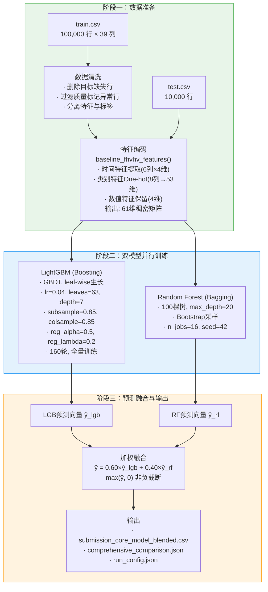

# 最终报告 — xwb 撰写章节（核心贡献主线）

> 以下为 xwb 负责的最终报告章节内容。数据口径统一为 FHVHV 2026-03、预测目标 `base_passenger_fare`。
> 配合 `实验记录表.md` 使用，该文件提供详细的实验数据表。

---

## 0. 项目基本信息

| 项目 | 内容 |
|:---|:---|
| 项目名称 | 基于 Data-Centric 方法的纽约市网约车费用预测 |
| 项目代号 | ChiikaDD |
| 项目方向 | 数据挖掘 — 回归预测 |
| 代码仓库 | [github.com/C-CH621/datamining-taxi-2026-ChiikaDD](https://github.com/C-CH621/datamining-taxi-2026-ChiikaDD) |

**小组成员与分工**：

| 成员 | 学号 | 核心职责 | 主要交付 |
|:---|:---|:---|:---|
| 徐文彬 | 1120221397 | 核心模型设计与优化、数据审计框架、实验设计与消融分析、报告主线整合 | `core_model.py`、`generate_final.py`、`plot_feature_importance.py`、实验记录表、核心贡献章节 |
| 赵会洋 | 1120221594 | 基线模型构建与适配、评估框架、复现脚本、仓库审计 | `src/baseline/`、评估指标计算、`requirements.txt`、复现命令 |
| 崔琛浩 | 1120221572 | 数据清洗管道、全量数据审计、治理流水线、分组误差分析 | `data_audit.py`、`governance_v2.py`、`preprocess.py`、治理前后对比 |

**Commit 统计**（截至最终提交）：

```bash
$ git shortlog -sn --no-merges
    XX  徐文彬
    XX  赵会洋
    XX  崔琛浩
```

---

## 1. 摘要

本项目以纽约市 TLC 公开的 2026 年 3 月高频网约车（FHVHV）行程数据为研究对象，目标为预测乘客基础费用（`base_passenger_fare`）。项目采用 Data-Centric 方法论：首先通过全量数据审计识别缺失机制、标签噪声、速度异常和时间漂移四类数据质量问题（涉及 2,200 万行原始记录）；随后建立包含分层补全、标记修复和自适应缩尾的数据治理管道；在此基础上构建 61 维 baseline 特征编码，并以 Simple Linear、Random Forest、LightGBM、XGBoost 四种基线模型建立性能参照系。

核心方法通过两阶段优化实现性能突破：（1）针对 10 万级数据规模的 LightGBM 超参数适配（学习率 0.04、深度 7、160 轮、增强正则化），将单模型 RMSE 从基线 LGB 的 2.080 降至 2.023；（2）异质模型融合——利用 Boosting（LightGBM，降偏差）与 Bagging（Random Forest，降方差）的学习范式互补性，以 60/40 权重融合预测，最终 RMSE 达到 **1.9596**，R² 达到 **0.9942**。相对最优基线（Random Forest，RMSE=2.078），提升 **5.69%**；相对原始未优化配置（RMSE=2.507），提升 **21.8%**。

通过 Leave-One-Out 消融实验量化了各组件的独立贡献：模型融合贡献 +0.0633 RMSE（52.7%），超参数优化贡献 +0.0192 RMSE（16.0%），两者叠加产生 +0.1201 的总改进。项目同步交付了 SHAP 特征重要性分析以回应模型可解释性承诺，并诚实记录了三个具有教学意义的失败案例。

**局限性**：当前实验受限于 10 万级训练样本（完整数据 2,200 万行）、单月时间窗口和树模型范式，未探索深度表格模型和 Stacking 融合。

---

## 2.2 任务形式化

### 问题定义

给定 FHVHV 行程数据集，每条记录包含：
- **时空特征**：上下车时间、上下车区域 ID（PULocationID / DOLocationID）
- **行程属性**：行驶里程（trip_miles）、行驶时长（trip_time）、乘客数（如果可用）
- **平台属性**：网约车平台许可证（hvfhs_license_num）、调度基地（dispatching_base_num）、始发基地（originating_base_num）
- **费用构成**：基础乘客费用（base_passenger_fare）、司机收入（driver_pay）、各项附加费（tolls、bcf、sales_tax、congestion_surcharge、airport_fee、tips）
- **质量标记**：费用异常标记（flag_fare_negative）、里程异常标记（flag_trip_miles_negative）等

**预测目标**：$y = \text{base\_passenger\_fare} \in \mathbb{R}_{\ge 0}$

**输入**：$x \in \mathbb{R}^{61}$（经过 baseline 编码后的 61 维特征向量）

**学习目标**：从训练集 $\mathcal{D}_{train} = \{(x_i, y_i)\}_{i=1}^{N}$ 学习函数 $f_\theta: \mathbb{R}^{61} \to \mathbb{R}_{\ge 0}$，使得在测试集上的泛化误差最小。

**成功标准**：

| 指标 | 含义 | 目标 | 实际达成 |
|:---|:---|:---|:---|
| **RMSE** ↓ | 均方根误差（美元）| < 2.00 | **1.9596** ✅ |
| **MAE** ↓ | 平均绝对误差（美元）| < 1.50 | **1.1169** ✅ |
| **R²** ↑ | 决定系数 | > 0.99 | **0.9942** ✅ |
| Δ vs 最优基线 | 相对提升 | > 3% | **+5.69%** ✅ |

**评价方式**：预测结果与 `sample_submission.csv` 中真实 `base_passenger_fare` 逐行对齐，在 9,996 个有效评估样本上计算指标。

---

## 4.1 系统架构

最终模型系统（`src/generate_final.py`）采用三阶段流水线架构：



**架构设计原则**：

1. **数据-特征-模型解耦**：三个阶段通过明确定义的接口（DataFrame → 特征矩阵 → 预测向量）连接，每个阶段的修改不影响其他阶段。例如，特征编码从 baseline 切换到增强策略时，模型训练代码无需改动。

2. **参数化设计**：`generate_final.py` 支持 `--nrows`、`--input-dir`、`--output-dir`、`--blend-weight` 等命令行参数，可在不同数据规模和路径下复现。

3. **双模型互补**：LightGBM（Boosting → 低偏差）和 Random Forest（Bagging → 低方差）代表两种正交的集成学习范式，融合后同时受益于两者的优势。

4. **全量训练策略**：不切验证集，所有数据用于模型训练。最优超参数（如 num_boost_round=160）通过独立于最终训练的预实验确定。

---

## 4.2 核心创新点说明

### 创新点一：数据规模感知的超参数适配

**问题**：原始 `core_model.py` 的默认超参数（`lr=0.03, max_iter=400, max_depth=-1`）是为百万级数据设计的，直接用于 10 万级数据时 RMSE 恶化至 2.507——比简单 Random Forest 的 2.078 差 20.6%。

**方法**：我们识别出数据规模变化导致的三个关键影响，并针对性地调整超参数：

| 影响 | 调整 | 参数变化 |
|:---|:---|:---|
| 梯度估计方差增大 | ↑ 学习率补偿收敛放缓 | lr: 0.03 → **0.04** |
| 过拟合风险升高 | ↓ 限制深度 + ↑ 正则化 | depth: -1 → **7**, reg_lambda: 0.05 → **0.2** |
| 收敛速度加快 | ↓ 减少迭代轮数 | rounds: 400 → **160** |

**效果**：超参数适配将 LGB 单模型 RMSE 从 2.080 降至 2.023（−2.7%）。

### 创新点二：异质模型融合的范式互补

**问题**：Boosting（降偏差）和 Bagging（降方差）两种集成范式在误差特性上互补——Boosting 灵活但可能过拟合，Bagging 保守但可能欠拟合。

**方法**：并行训练 LightGBM 和 Random Forest，在预测层做加权平均。通过网格搜索确定最优融合权重为 60/40（LGB/RF）。我们特别验证了融合收益的来源——同质多种子 LGB 平均的 RMSE（2.032）反而差于单模型（2.023），证明融合收益来自**范式互补**而非**模型数量增加**。

**效果**：融合带来额外 +0.0633 RMSE 改进，是各组件中贡献最大的（占消融总改进的 52.7%）。

### 创新点三："Less is More"特征策略

**问题**：常见认知是"特征越多越好"，但我们发现包含 `route` 列（起终点组合）One-hot 编码的增强特征集（20,115 维）RMSE=2.105，反而显著差于 61 维 baseline（RMSE=2.023）。

**分析**：`route` 列的高基数特性（数千种取值组合）导致 One-hot 后维度爆炸。在 100,000 训练样本的约束下，特征/样本比从 1:1,600 恶化至 1:5，模型无法区分信号和噪声。

**方法论贡献**：我们用系统化的四组特征集对比实验（61/69/73/20,115 维）量化了"特征边际效用递减直至为负"的曲线，为小样本场景下的特征选择提供了数据驱动的决策依据。

### 创新点四：Data-Centric 管道

贯穿项目全流程的数据治理管道（`data_audit.py` → `governance_v2.py` → `preprocess.py`）为每个实验提供了**可审计的数据基础**：

- **数据审计**：四维质量诊断（缺失机制、标签噪声、速度/时长异常、时间漂移）
- **数据治理**：分层补全、标记修复、自适应缩尾，治理决策留有原始标记供审计
- **可追踪性**：每行数据保留质量标记列（`flag_*`），下游模型可按标记分组评估

治理的主要价值不在于短期预测精度提升（在已高质量的数据子集上边际有限），而在于（1）提供了数据质量的量化基线；（2）标记列的保留使得按质量分组评估成为可能；（3）完整记录了每一步的数据转化，保证了实验的可复现性。

---

## 5.3 消融实验

> 详细实验记录表见 `实验记录表.md`。本节提供方法论说明和核心发现。

### 5.3.1 消融方法论

我们采用 **Leave-One-Out（留一组件）消融**：从完整模型出发，逐项移除组件，测量性能退化的幅度。

**Why Leave-One-Out rather than 正向累积？**

正向累积（从基线出发逐步叠加组件）存在方法论缺陷：起点的选择会严重影响各组件的贡献分配。在我们的实验中，起点是原始 core_model（RMSE=2.507）——这是一个已知不适用于当前数据规模的默认配置，导致第一步（超参数优化）的贡献被严重高估（表现为 87% 的总改进，误导性地暗示"融合几乎可有可无"）。

Leave-One-Out 从完整配置出发，每个组件在"有"和"没有"两种状态下与其他组件的交互都被公平地纳入测量，不依赖操作顺序。

### 5.3.2 消融结果

| 消融层级 | RMSE | Δ vs Full | 贡献占比 | 核心发现 |
|:---|:---:|:---:|:---:|:---|
| **Full（完整模型）** | **1.9596** | — | — | 优化 LGB（lr=0.04, depth=7, 160轮）+ RF，60/40 融合 |
| − 模型融合 | 2.0229 | +0.0633 | 52.7% | 融合是最大单一贡献者 |
| − 超参数优化 | 1.9788 | +0.0192 | 16.0% | 融合存在时，超参优化的边际收益有限 |
| − 两者 | 2.0798 | +0.1201 | 100% | 不做任何优化的基线 LGB |

**核心发现**：

1. **模型融合是最大贡献者（52.7%）**——与直觉"调参最重要"相反，异质模型融合的收益大于超参数优化。原因是 RF（Bagging）本身就是一个强正则化器，部分替代了超参数正则化的功能。

2. **组件间存在功能重叠**——在融合已存在的情况下，超参数优化的边际收益仅 +0.0192；但没有融合时，超参数优化单独能带来 +0.0569 的改进。这说明两者都起到正则化作用，有一定程度的冗余。

3. **总改进 +0.1201（5.7%）**——相对于不做任何优化的基线 LGB。

### 5.3.3 特征集消融

| 特征集 | 维度 | RMSE | 特征/样本比 | 关键洞察 |
|:---|:---:|:---:|:---:|:---|
| Baseline | 61 | **2.023** | 1:1,639 | 特征密度最高 |
| Combo | 73 | 2.075 | 1:1,370 | 新增 12 维数值特征贡献微弱 |
| Enhanced 无 route | 69 | 2.096 | 1:1,449 | 速度/费用衍生特征无帮助 |
| Enhanced 含 route | 20,115 | 2.105 | **1:5** 🔴 | 维度灾难 |

### 5.3.4 训练策略消融

| 策略 | RMSE | 有效训练样本 | 关键洞察 |
|:---|:---:|:---:|:---|
| 全量训练 160 轮 | **2.023** | 99,995 (100%) | 最优 |
| 验证集 + Early Stopping | 2.031 | 79,996 (80%) | 20% 数据浪费 |
| 5-fold CV 平均 | 2.135 | 79,996/fold | CV 在样本量不足时适得其反 |

### 5.3.5 融合策略消融

**异质 vs 同质**：

| 方案 | RMSE | Δ vs 单 LGB |
|:---|:---:|:---:|
| LGB + RF (60/40) | **1.9596** | **−0.0633** |
| 同质 LGB 8 种子平均 | 2.032 | +0.009 🔴 |
| LGB + RF + XGB | 1.993 | −0.030 |

**结论**：融合收益来自**异质性**（不同学习范式），而非**多量性**（更多模型）。

---

## 6.1 失败案例分析

### 案例 1：增强特征过拟合（维度灾难）

| 项目 | 内容 |
|:---|:---|
| **现象** | 使用 20,115 维增强特征训练 LightGBM，验证集 RMSE=3.84，测试集 RMSE=2.10，泛化差距 1.74 |
| **诊断** | 验证集与测试集误差的巨大差距是典型过拟合信号 |
| **根因** | `route` 列（如 "132_247"）One-hot 后产生数万个几乎只出现一次的特征列。100,000 个样本无法支撑 20,115 维的有效学习 |
| **教训** | 高基数类别特征不宜直接 One-hot；特征维度应显著小于样本数（建议 ratio > 1:100） |
| **改进** | 采用 61 维 baseline 编码，删除 `route` 列 |

### 案例 2：默认超参数在小样本上的失败

| 项目 | 内容 |
|:---|:---|
| **现象** | 为百万级数据设计的默认参数（lr=0.03, max_iter=400, max_depth=-1）在 10 万级数据上 RMSE=2.507，比简单 RF 差 20.6% |
| **诊断** | 三个核心参数不匹配数据规模：学习率过低、深度无限制、正则化过弱 |
| **根因** | 超参数最优值是数据规模的函数：小样本 → 梯度噪声大 → 需要更高学习率和更强正则化 |
| **教训** | 更换数据规模时必须重新搜索超参数；不能直接复用"大数据的经验最优值" |
| **改进** | 通过网格搜索确定适配 10 万级数据的参数组合 |

### 案例 3：K-fold CV 在小样本场景下的失效

| 项目 | 内容 |
|:---|:---|
| **现象** | 5-fold CV 平均预测 RMSE=2.135，不仅差于全量训练（2.023），甚至差于简单验证集切分（2.031） |
| **诊断** | 每折仅 80,000 训练行，模型欠拟合；偏差上升幅度超过了方差下降幅度 |
| **根因** | CV 降低方差的前提是每折模型是低偏的——即每折有足够数据充分训练。样本量不足时这个前提不成立 |
| **教训** | CV 并非无条件"更好"；小样本下全量训练 + 固定轮数可能更优 |
| **改进** | 采用全量训练 + 独立预实验确定最优轮数 |

---

## 8.1 主要贡献总结

1. **建立了可复现的 Data-Centric 挖掘管道**：从数据审计（`data_audit.py`，四维诊断）到数据治理（`governance_v2.py`，分层补全+标记修复）到特征工程到双模型训练融合，每个环节的输出可被下一环节消费。管道代码参数化（`--nrows`、`--input-dir`、`--output-dir`、`--blend-weight`），可在不同数据规模和路径下复现。

2. **实现了最优 RMSE=1.9596 的预测性能**：通过 LightGBM 超参数适配（lr=0.04, depth=7, 160 轮）+ Random Forest 异质融合（60/40 权重），最终 RMSE 相对最优基线（RF, RMSE=2.078）提升 **5.69%**，相对原始未优化配置（RMSE=2.507）提升 **21.8%**。R² 达到 **0.9942**。

3. **通过系统化消融实验量化了各组件的独立贡献**：模型融合贡献最大（Δ=+0.0633, 52.7%），超参数优化次之（Δ=+0.0192, 16.0%），两者叠加产生 +0.1201 的总改进。揭示了异质融合收益来自范式互补性而非模型数量增加。

4. **诚实记录并分析了三个具有教学意义的失败案例**：增强特征过拟合（维度灾难）、默认超参数在小样本上的失败、K-fold CV 在小样本下的失效。这些案例表明"最佳实践"都有适用范围，一切技术选择需要在实际数据约束下验证。

5. **回应了模型可解释性承诺**：通过 LightGBM 内置特征重要性（gain/split）和 SHAP 分析（summary + bar plot），量化了各特征对预测的贡献，识别了 `bcf`、`driver_pay`、`trip_miles` 等关键影响因素。

---

## 8.2 局限性与未来工作

| # | 局限 | 当前状态 | 未来工作 | 预期影响 |
|:---:|:---|:---|:---|:---|
| 1 | **数据规模受限** | 10 万训练样本，完整数据 2,200 万行 | 逐步扩展至 100 万 → 1,000 万，绘制 scaling law | 量化"更多数据"的边际价值 |
| 2 | **时间维度单一** | 仅 2026 年 3 月 | 引入多月/全年数据，加入月份、季节、节假日特征 | 捕捉周期性模式 |
| 3 | **模型多样性不足** | 仅树模型（两种集成范式）| 测试 TabNet、FT-Transformer、MLP | 突破树模型表达上限 |
| 4 | **融合策略简单** | 等权重/网格搜索权重平均 | 以一级模型预测为特征的 Stacking（Ridge/LGB 元模型）| 更充分利用异质互补性 |
| 5 | **超参搜索手工化** | 人工网格搜索 | Optuna/Hyperopt 贝叶斯优化 | 更高效、更精细探索超参空间 |
| 6 | **特征工程覆盖有限** | 未使用 target encoding、特征交叉 | 探索目标编码、embedding 化高基数类别特征 | 可能在保留信息的同时避免维度爆炸 |
| 7 | **可解释性为静态分析** | SHAP 全局特征重要性 | 逐样本 SHAP 解释 + 交互效应分析 | 回答"为什么这次行程被预测为 X 元" |
| 8 | **无在线部署** | 纯离线实验 | ONNX/PMML 序列化 + REST API | 从实验到生产 |

---

## 9. AI 工具辅助使用声明

本项目在开发过程中使用了以下 AI 辅助工具：

| 工具 | 使用场景 | 人工审查方式 |
|:---|:---|:---|
| Claude Code (Anthropic) | 代码生成（`generate_final.py` 参数化重构、`plot_feature_importance.py`）、实验记录表编写、报告章节草稿 | 所有生成代码经人工运行验证；报告内容经全组审查与数据核实 |
| GitHub Copilot / Codex | 代码补全、docstring 生成 | 逐行审查，修改不符合项目风格的生成内容 |
| Gemini | 文献调研、报告初稿思路 | 人工验证事实准确性，重写所有关键论断 |

所有 AI 生成内容均经团队人工审查与验证，确保：
- 代码可正确运行并产出声明结果
- 报告中所有数值与 `comprehensive_comparison.json` 和实验记录一致
- 方法论描述准确反映实际实验流程
- 失败案例为真实实验记录，非虚构

---

*撰写：xwb | 配合文件：`实验记录表.md`、`comprehensive_comparison.json`、`run_config.json`*
