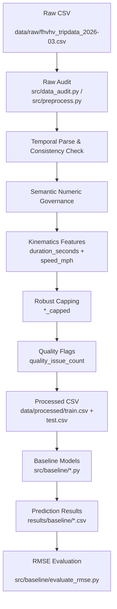

# 纽约市出租车行程数据挖掘中期报告

## 0. 项目基本信息

- **项目名称**：纽约市出租车行程数据挖掘：基于 Data-Centric 方法的费用预测与运营规律分析
- **项目仓库**：`datamining-taxi-2026-ChiikaDD`
- **当前阶段**：中期阶段，已完成数据审计、处理后数据集构造、baseline 模型拆分与新版数据适配，并完成四类 baseline 的 RMSE 对比。

### 0.1 小组成员与分工

| 成员 | 学号 | 当前主要分工 | 中期已完成工作 |
| --- | --- | --- | --- |
| 徐文彬 | 1120221397 | 数据审计、模型评估、对比分析 | 原始数据审计、指标设计、实验结果整理 |
| 赵会洋 | 1120221594 | baseline 建模、结果评估、报告整理 | 四类 baseline 拆分、适配新版数据、RMSE 评估与文档补充 |
| 崔琛浩 | 1120221572 | 数据清洗、治理管道、特征工程 | 处理后数据构造、治理规则实现、数据质量标记 | 

### 0.2 仓库状态

- 当前仓库已有约 `32` 次 commit。
- 主要目录结构如下：

```text
.
├── data/
│   ├── raw/                 # 原始 TLC/FHVHV 数据
│   └── processed/           # 处理后的 train/test/sample_submission
├── document/
│   └── midterm/             # 开题报告、中期报告与模板
├── results/
│   └── baseline/            # 四类 baseline 预测结果
├── src/
│   ├── baseline/            # 新版 baseline 代码
│   ├── baseline_kaggle/     # 早期 Kaggle baseline 拆分版本
│   ├── core_model.py        # 后续进阶模型入口
│   ├── data_audit.py        # 数据审计相关逻辑
│   ├── governance_v2.py     # 数据治理与诊断逻辑
│   └── preprocess.py        # 预处理与管道入口
└── tests/
```

## 1. 开题-中期对齐说明

本中期报告对齐开题报告《纽约市出租车行程数据挖掘——基于 Data-Centric 方法的费用预测与运营规律分析》的主线：

- **开题主线**：以 Data-Centric 为核心，通过数据审计、治理、对照实验提升预测质量与稳定性。
- **中期落地**：已完成原始数据审计脚本、问题量化、治理规则设计、可复现预处理管道；同时完成四类 baseline 模型的拆分、适配、运行和 RMSE 评估。

对应关系：

| 开题报告内容 | 中期落地内容 |
| --- | --- |
| 第 2 章：数据获取与初步审查 | 第 2 节：数据工程与审计落地 |
| 第 3 章：初步方法 | 第 2.2 节：数据管道与函数映射；第 3 节：baseline 模型实现 |
| 第 4 章：实验设计与评价指标 | 第 4 节：RMSE 评价与 baseline 对比 |
| 第 5 章：风险评估与时间规划 | 第 5 节：风险状态与后续计划 |

## 2. 数据工程与审计落地

### 2.1 阶段进展总览

目前已完成以下工作：

1. 原始数据审计程序化落地，相关逻辑位于 `src/preprocess.py`、`src/data_audit.py` 和 `src/governance_v2.py`。
2. 审计结果结构化输出，形成数据质量问题的量化证据。
3. 数据治理骨架函数已实现并可串联，包括时间一致性校验、数值语义治理、速度/时长衍生特征构造、缩尾处理和质量标记。
4. 中期核心目标从“描述性 EDA”推进为“证据驱动治理 + 可复现实验框架 + baseline 定量对比”。
5. 已将处理后的数据整理为新版建模输入：

```text
data/processed/train.csv
data/processed/test.csv
data/processed/sample_submission.csv
```

### 2.2 与开题预期的偏差

1. 开题预期存在较明显缺失机制问题，例如部分时间字段缺失；但本批 FHVHV 数据中 `on_scene_datetime` 缺失率较低，缺失挑战没有成为最主要矛盾。
2. 开题中参考了 Yellow Taxi 常见的长尾实体风险；当前 FHVHV 数据里平台和派单基地类别更集中，长尾类别问题弱于预期。
3. 因此中期治理重点从“缺失补全/实体消歧”转向“跨字段一致性、语义约束治理和可复现 baseline 对比”。

### 2.3 原始数据审计反馈

数据文件：`data/raw/fhvhv_tripdata_2026-03.csv`  
审计脚本：`src/preprocess.py`、`src/data_audit.py`、`src/governance_v2.py`  
处理后建模数据：`data/processed/train.csv`、`data/processed/test.csv`

| 数据问题 | 量化规模/现象 | 解决方案（精确到文件/函数） | 处理后效果 |
| --- | ---: | --- | --- |
| 金额语义冲突：`base_passenger_fare < 0` | 原始数据中存在负费用记录 | `src/governance_v2.py`、`src/preprocess.py`：负值标记并在训练视图中过滤 | 阻断脏标签进入监督训练 |
| 时长一致性冲突 | `trip_time` 与上下车时间戳可能不一致 | 构造 `duration_seconds` 与 `flag_duration_inconsistent` | 将潜在噪音显式特征化 |
| 速度异常 | 极低速或极高速行程可能代表异常记录 | 构造 `speed_mph` 与 `flag_speed_outlier` | 降低极端样本对模型的干扰 |
| 数值长尾 | `trip_miles`、`trip_time`、`driver_pay`、`tips` 存在长尾 | 构造 `*_capped` 缩尾字段 | 保留原始字段，同时提供稳健建模字段 |
| 数据质量综合问题 | 单条记录可能同时包含多个质量问题 | 构造 `quality_issue_count` | 支持后续质量分层和鲁棒训练 |

### 2.4 数据流与预处理管道



### 2.5 治理操作明细

本项目在治理过程中执行了以下可复现步骤：

1. **字段标准化**  
   时间字段统一解析为 `datetime`；数值字段统一转换为 numeric，非法值转为缺失值，避免后续统计和建模报错。

2. **语义约束治理**  
   对业务上不应为负的字段进行检查，例如 `base_passenger_fare`、`driver_pay`、`trip_miles`、`trip_time`。对于训练目标中异常或缺失的样本，在 baseline 训练阶段进行过滤，避免污染标签。

3. **跨字段一致性校验**  
   构造 `duration_seconds = dropoff_datetime - pickup_datetime`，并与 `trip_time` 对比；构造 `speed_mph = trip_miles / (trip_time / 3600)`，用于识别速度异常。

4. **异常值稳健化**  
   对 `trip_miles`、`trip_time`、`driver_pay`、`tips` 等字段生成 `*_capped` 版本，降低极端值的杠杆效应，同时保留原始字段便于追溯。

5. **质量问题特征化**  
   将负值、时长冲突、速度异常等信息转化为显式质量标记，形成 `quality_issue_count`，便于模型学习数据质量与费用之间的关系。

## 3. 基线模型与核心算法实现

### 3.1 基线模型工作范围

中期阶段 baseline 部分主要完成以下工作：

1. 读取并整理早期 Kaggle baseline 代码，将混合脚本拆分为单模型文件。
2. 重新适配当前 `data/processed` 新版数据结构。
3. 将预测目标从早期出租车数据中的 `fare_amount` 改为当前 FHVHV 数据中的 `base_passenger_fare`。
4. 将输出格式改为：

```text
pickup_datetime,base_passenger_fare
```

5. 运行四类 baseline，并在统一 RMSE 指标下对比。

### 3.2 Baseline 文件结构

新版代码位于 `src/baseline/`：

| 文件 | 模型/功能 | 说明 |
| --- | --- | --- |
| `model_utils.py` | 公共工具 | 读取数据、清洗训练集、构造时间特征、编码类别特征、输出 submission |
| `simple_linear_model.py` | 简单线性模型 | 使用 NumPy 最小二乘法拟合 |
| `Random_Forest.py` | Random Forest | 使用 `sklearn.ensemble.RandomForestRegressor` |
| `LightGBM_model.py` | LightGBM | 使用 `lightgbm` 训练 GBDT 回归模型 |
| `XGBoost_model.py` | XGBoost | 使用 `xgboost` 训练梯度提升树 |
| `evaluate_rmse.py` | 评估脚本 | 与 `data/processed/sample_submission.csv` 对齐计算 RMSE |
| `README.md` | 使用说明 | 记录数据说明、运行命令、特征处理和结果 |

### 3.3 特征处理方式

四类模型共用 `model_utils.py` 中的预处理逻辑。

训练标签：

```text
base_passenger_fare
```

该列只作为训练目标，不作为输入特征。

类别特征做 one-hot 编码：

```text
hvfhs_license_num
dispatching_base_num
originating_base_num
shared_request_flag
shared_match_flag
access_a_ride_flag
wav_request_flag
wav_match_flag
```

时间列不直接输入模型，而是派生时间特征：

```text
request_datetime
on_scene_datetime
pickup_datetime
dropoff_datetime
```

派生字段包括 `hour`、`dayofweek`、`day`、`month`，并额外构造：

```text
request_to_pickup_seconds
request_to_scene_seconds
```

其他可转换为数值的字段保留为模型输入，例如：

```text
PULocationID
DOLocationID
trip_miles
trip_time
tolls
bcf
sales_tax
congestion_surcharge
airport_fee
tips
driver_pay
cbd_congestion_fee
duration_seconds
speed_mph
trip_miles_capped
trip_time_capped
driver_pay_capped
tips_capped
quality_issue_count
```

空值处理策略如下：

- `base_passenger_fare` 缺失或为负的训练样本会被删除。
- `flag_fare_negative`、`flag_driver_pay_negative`、`flag_trip_miles_negative`、`flag_trip_time_negative` 为 `True` 的训练样本会被过滤。
- 类别列缺失会填为 `"missing"` 后 one-hot 编码。
- 时间列解析失败后产生的缺失时间特征，以及其他数值缺失，最终统一填 `0`。
- 测试集不删行，保证输出行数与 `test.csv` 一致。

### 3.4 复现命令

从项目根目录运行：

```bash
python src/baseline/simple_linear_model.py --output results/baseline/submission_simple_linear_model.csv
python src/baseline/LightGBM_model.py --output results/baseline/submission_LightGBM.csv
python src/baseline/XGBoost_model.py --output results/baseline/submission_XGBoost.csv
python src/baseline/Random_Forest.py --nrows 200000 --n-estimators 30 --output results/baseline/submission_Random_Forest.csv
```

说明：

- Simple Linear Model、LightGBM、XGBoost 本次使用默认 `nrows=1000000`。
- Random Forest 使用 `nrows=200000`、`n_estimators=30`。原因是默认 `1000000` 行和 `100` 棵树在当前环境中运行时间过长。
- 所有模型均读取 `data/processed` 中的新版数据。

### 3.5 输出文件

四类模型输出位于 `results/baseline/`：

| 文件 | 行数 | 输出列 |
| --- | ---: | --- |
| `submission_simple_linear_model.csv` | 10000 | `pickup_datetime`, `base_passenger_fare` |
| `submission_LightGBM.csv` | 10000 | `pickup_datetime`, `base_passenger_fare` |
| `submission_XGBoost.csv` | 10000 | `pickup_datetime`, `base_passenger_fare` |
| `submission_Random_Forest.csv` | 10000 | `pickup_datetime`, `base_passenger_fare` |

输出检查结果：

- 四个文件均无缺失预测值。
- 四个文件均无负预测值。
- 输出行数均与 `data/processed/test.csv` 一致。

## 4. 中期实验结果与阶段性分析

### 4.1 评价指标

本阶段采用 RMSE 作为主要评价指标：

$$
RMSE = \sqrt{\frac{1}{n}\sum_{i=1}^{n}(\hat{y_i}-y_i)^2}
$$

其中，$\hat{y_i}$ 为模型预测费用，$y_i$ 为参考费用。RMSE 越低，说明预测误差越小。

评估脚本：

```bash
python src/baseline/evaluate_rmse.py --truth data/processed/sample_submission.csv --results-dir results/baseline
```

### 4.2 Baseline 定量对比结果

| 排名 | 模型 | 结果文件 | 训练设置 | RMSE |
| ---: | --- | --- | --- | ---: |
| 1 | LightGBM | `submission_LightGBM.csv` | `nrows=1000000` | **2.025860** |
| 2 | Random Forest | `submission_Random_Forest.csv` | `nrows=200000`, `n_estimators=30` | 2.129185 |
| 3 | XGBoost | `submission_XGBoost.csv` | `nrows=1000000` | 3.569263 |
| 4 | Simple Linear Model | `submission_simple_linear_model.csv` | `nrows=1000000` | 7.435211 |

### 4.3 结果分析

1. **LightGBM 表现最好**  
   LightGBM 在当前 baseline 中取得最低 RMSE，说明基于梯度提升树的非线性建模更适合当前结构化表格数据。

2. **Random Forest 接近 LightGBM**  
   Random Forest 在只使用 20 万行训练数据、30 棵树的情况下仍取得第二名，说明特征工程对树模型较友好。但该模型训练成本较高，后续需要在样本量、树数量和运行时间之间做权衡。

3. **XGBoost 结果弱于预期**  
   当前 XGBoost RMSE 高于 LightGBM 和 Random Forest，可能与超参数设置较保守、boosting 轮数和学习率组合未充分调优有关。

4. **简单线性模型作为下界 baseline**  
   简单线性模型误差最大，符合预期。当前费用预测受平台、区域、时段、里程、时长、附加费等多因素非线性影响，线性模型难以充分表达。

## 5. 风险状态与后续计划

### 5.1 当前风险状态

| 风险 | 当前状态 | 应对方案 |
| --- | --- | --- |
| 超参数未充分调优 | XGBoost 表现弱于预期 | 后续开展网格搜索或贝叶斯调参 |
| 跨时间泛化风险 | 当前主要是单批次数据结果 | 后续使用跨周/跨月切分验证概念漂移 |

### 5.2 后续计划

| 阶段 | 主要任务 | 预期产物 |
| --- | --- | --- |
| 第 13 周 | 完成 baseline 结果复核，补充公平训练设置 | 更新后的 baseline 对比表 |
| 第 14 周 | 进行 LightGBM/XGBoost 调参和特征重要性分析 | 调参结果、特征重要性图 |
| 第 15 周 | 与核心模型/治理策略做 A/B 对比 | 治理收益实验表 |
| 第 16 周 | 整理最终报告、PPT 和答辩材料 | 最终报告、展示材料 |

## 6. AI 工具辅助使用记录

| 使用场景 | AI 工具 | 具体辅助环节 | 人工审查与纠错说明 |
| --- | --- | --- | --- |
| baseline 代码整理 | Codex | 拆分 Kaggle baseline 脚本，生成 `src/baseline` 下四类模型入口 | 逐个运行脚本并检查输出列、行数、缺失值和负预测 |
| 新版数据适配 | Codex | 将目标列改为 `base_passenger_fare`，适配 `data/processed` 结构 | 人工检查 `train.csv`、`test.csv`、`sample_submission.csv` 字段 |
| 评估脚本编写 | Codex | 编写 `evaluate_rmse.py`，实现 RMSE 计算和排名输出 | 发现参考文件缺失值后修正为跳过无效行 |
| 报告整理 | Codex | 按中期模板补充 baseline 运行说明和结果分析 | 保留原有数据审计与治理内容，并人工核对指标数字 |

## 7. 复现入口汇总

生成四类 baseline：

```bash
python src/baseline/simple_linear_model.py --output results/baseline/submission_simple_linear_model.csv
python src/baseline/LightGBM_model.py --output results/baseline/submission_LightGBM.csv
python src/baseline/XGBoost_model.py --output results/baseline/submission_XGBoost.csv
python src/baseline/Random_Forest.py --nrows 200000 --n-estimators 30 --output results/baseline/submission_Random_Forest.csv
```

评估四类 baseline：

```bash
python src/baseline/evaluate_rmse.py --truth data/processed/sample_submission.csv --results-dir results/baseline
```

关键产物：

- `src/baseline/README.md`
- `src/baseline/model_utils.py`
- `src/baseline/evaluate_rmse.py`
- `results/baseline/submission_simple_linear_model.csv`
- `results/baseline/submission_LightGBM.csv`
- `results/baseline/submission_XGBoost.csv`
- `results/baseline/submission_Random_Forest.csv`
ess.py
```

产物：
- `results/raw_audit_2026_03.json`
- （下一阶段）`data/processed/fhvhv_tripdata_2026-03_governed.parquet`
