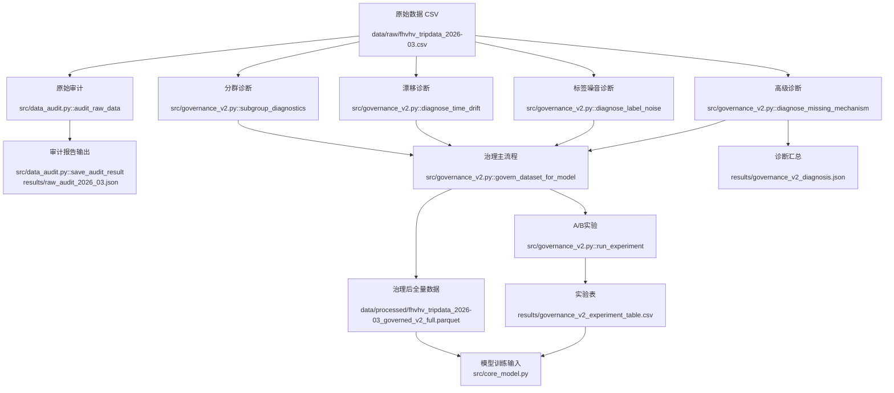
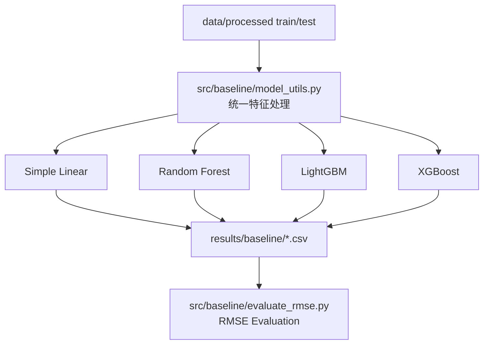

# 数据挖掘课程项目 - 中期进展报告

## 0. 项目基本信息

- **项目名称**：纽约市出租车行程数据挖掘：基于 Data-Centric 方法的费用预测与运营规律分析
- **项目链接**：`https://github.com/C-CH621/datamining-taxi-2026-ChiikaDD`
- **小组成员与分工**：

| 姓名 | 学号 | 组内角色 | 开题以来的核心贡献 | 中期之后的分工规划 |
| :--- | :--- | :--- | :--- | :--- |
| 徐文彬 | 1120221397 | 数据审计与模型评估 | 完成原始数据审计、指标设计、实验结果整理 | 继续完善评估体系，参与核心模型对比分析 |
| 赵会洋 | 1120221594 | 基线模型与结果分析 | 完成四类 baseline 拆分、适配新版数据、生成预测结果并计算 RMSE | 继续推进 baseline 调参与特征重要性分析 |
| 崔琛浩 | 1120221572 | 数据清洗与治理管道 | 完成处理后数据构造、治理规则实现、数据质量标记 | 继续完善数据治理策略与 A/B 对照实验 |

---

## 1. 项目概述与当前状态

### 1.1. 中期里程碑达成情况

- **计划目标**：按照开题报告规划，中期阶段应完成数据审计、预处理管道、基础特征工程、baseline 模型跑通与初步定量评估。
- **实际达成**：项目已完成 `data/processed` 新版训练/测试数据构造，形成数据审计与治理结果；已将 Kaggle 风格 baseline 代码拆分并适配当前 FHVHV 数据，完成 Simple Linear Model、Random Forest、LightGBM、XGBoost 四类 baseline 的预测输出与 RMSE 评估。
- **当前状态**：整体进度按计划推进。数据工程与治理部分已形成可复现管道，baseline 部分已具备统一运行入口和评估脚本；下一阶段重点转向公平训练设置、模型调参、核心模型与治理策略的 A/B 对比。

### 1.2. 代码仓库状态审计

- **提交统计**：
  - 当前仓库约 `32` 次 commit。
  - 主要模块已经按数据、代码、报告、结果分目录组织。
- **分支与协作方式**：
  - 当前以主线仓库持续更新为主，按模块划分工作目录。
  - 数据治理、baseline、报告材料分别在 `src/governance_v2.py`、`src/baseline/`、`document/midterm/` 中维护。
- **当前仓库目录结构**：

```text
.
├── README.md                    # 项目说明与运行入口
├── requirements.txt             # Python 依赖
├── data/
│   ├── raw/                     # 原始数据
│   └── processed/               # 处理后的 train/test/sample_submission
├── document/
│   └── midterm/                 # 开题报告、中期报告与模板
├── results/
│   └── baseline/                # 四类 baseline 预测结果
├── src/
│   ├── baseline/                # 新版 baseline 代码与评估脚本
│   ├── baseline_kaggle/         # 早期 Kaggle baseline 拆分版本
│   ├── core_model.py            # 进阶模型入口
│   ├── data_audit.py            # 数据审计逻辑
│   ├── governance_v2.py         # 数据治理与诊断逻辑
│   ├── preprocess.py            # 预处理管道入口
│   └── evaluate.py              # 评估工具占位/后续扩展
└── tests/                       # 测试目录
```

## 2. 数据工程与审计落地

### 2.1. 原始数据审计反馈
| 数据问题 | 量化规模 | 解决方案（精确到文件/函数） | 处理后效果 |
| :--- | :--- | :--- | :--- |
| 缺失机制（`originating_base_num`） | 缺失率 `27.5933%`；缺失预测 AUC=`0.9993`；目标分布 KS-p=`2.10e-08`（`MAR_likely`） | 缺失机制诊断见 `src/governance_v2.py::diagnose_missing_mechanism`；治理中对高影响特征采用分组中位数+全局中位数补全，见 `src/governance_v2.py::govern_dataset_for_model` | 避免直接删去高影响缺失样本；B 策略样本损失率 `0%`，A 策略样本损失率 `0.0087%` |
| 标签噪音（规则冲突 + 弱监督不一致） | 规则冲突率 `3.0263%`；弱监督不一致率 `17.1704%`；疑似噪音率 `18.5087%` | 规则冲突与弱监督一致性诊断见 `src/governance_v2.py::diagnose_label_noise`；抽检样本见 `results/manual_audit_sample_noise.csv` | 通过“标记+修复+缩尾”降低噪音影响；A/B中 MAE `4.7044 -> 4.6993`，RMSE `8.6570 -> 8.6181` |
| 时间漂移（周内漂移） | Week1 vs Week4：`trip_miles` PSI=`0.00148`、KS-p=`0.0066`；`base_passenger_fare` PSI=`0.00024`、KS-p=`0.00167` | 漂移诊断见 `src/governance_v2.py::diagnose_time_drift`（PSI + KS + Wasserstein） | 当前为“弱漂移”，不触发重训，仅持续监控；避免过度治理导致分布失真 |
| 子群体差异（平台/时段/区域） | 平台质量问题率：HV0003=`0.1080%`、HV0005=`0.0599%`；高峰/低峰质量问题率存在差异（`0.0742%` vs `0.1066%`） | 分群诊断见 `src/governance_v2.py::subgroup_diagnostics` | 训练评估阶段纳入分群稳定性与公平性指标（子群体误差标准差、公平性差距） |
| 开题预测未发生项  | `on_scene_datetime` 缺失率 `0`；`dispatching_base_num` 长尾（freq<3）占比 `0` | 审计统计见 `src/data_audit.py::audit_raw_data` 与 `results/raw_audit_2026_03.json` | 说明原因：本批次 FHVHV 2026-03 数据结构较规整，缺失与长尾风险低于开题预期 |
审计结果如图 

### 2.2. 数据流与预处理管道
#### 2.2.1 数据流与预处理管道

#### 2.2.1 治理操作明细（补充说明）

本项目在治理过程中执行了以下可复现步骤：

（1）. 字段标准化  
- 时间字段统一解析为 `datetime`：`request_datetime`、`on_scene_datetime`、`pickup_datetime`、`dropoff_datetime`。  
- 数值字段统一转为 `numeric`，非法值转为 `NaN`，避免后续统计和建模报错。

（2）. 缺失机制诊断与处理  
- 对缺失字段进行机制判定（MCAR/MAR/MNAR 倾向），对应函数：`src/governance_v2.py::diagnose_missing_mechanism`。  
- 对高影响特征不做粗暴删行，采用“分组中位数（`dispatching_base_num + pickup_hour`）→ 全局中位数”的两级补全策略，见 `src/governance_v2.py::govern_dataset_for_model`。  
- 对低影响且极低占比缺失，在 A 策略中允许删除作为对照。

（3）. 语义约束治理  
- 对业务上不应为负的字段（如 `base_passenger_fare`、`driver_pay`、`trip_miles`、`trip_time`）执行：  
  - 负值置空（不直接删行）；  
  - 同时写入标记字段（如 `flag_fare_negative` 等）保留审计痕迹。

（4）. 跨字段一致性校验  
- 构造 `duration_seconds = dropoff_datetime - pickup_datetime`。  
- 生成 `flag_duration_inconsistent`：当 `|duration_seconds - trip_time| > 300` 秒。  
- 构造 `speed_mph = trip_miles / (trip_time/3600)`，并生成 `flag_speed_outlier`（`speed_mph < 1` 或 `> 80`）。

（5）. 异常值稳健化（非删除）  
- 对 `trip_miles`、`trip_time`、`driver_pay`、`tips` 生成缩尾列：`*_capped`。  
- 使用约 `0.1% ~ 99.9%` 分位缩尾，降低极端值杠杆效应，同时保留原始字段用于追溯。

（6）. 子群体差异审计  
- 按平台（`hvfhs_license_num`）、时段（高峰/低峰）、区域桶进行分层统计。  
- 输出各子群体质量问题率与目标均值偏差，函数：`src/governance_v2.py::subgroup_diagnostics`。  
- 目的：避免某一群体被过度清洗或误差显著偏高。

### 2.3. 对照实验设计与结果（A/B）

**实验设计**
- 策略 A：`A_delete`（只删异常/缺失）
- 策略 B：`B_govern`（标记 + 修复 + 缩尾）
- 固定变量：同切分、同模型（`HistGradientBoostingRegressor`）、同特征、同随机种子
- 实现位置：`src/governance_v2.py::run_experiment`

**实验结果**
| 策略 | RMSE | MAE | 子群体误差标准差 | 公平性差距 | 样本损失率 |
| :--- | ---: | ---: | ---: | ---: | ---: |
| A_delete | 8.6570 | 4.7044 | 0.7185 | 1.4369 | 0.0087% |
| B_govern | **8.6181** | **4.6993** | **0.7139** | **1.4279** | **0.0000%** |

- 显著性检验（配对置换）：p-value=`0.1417`（当前样本条件下统计显著性有限，但方向一致）
- 误差差值（A-B，MAE 方向）：`+0.00515`（正值表示 B 更优）
实验结果证明 

### 2.4. 落地产物与可复现命令

**关键产物**
- 审计报告：`results/raw_audit_2026_03.json`
- 诊断汇总：`results/governance_v2_diagnosis.json`
- 实验表：`results/governance_v2_experiment_table.csv`
- 治理后全量数据：`data/processed/fhvhv_tripdata_2026-03_governed_v2_full.parquet`
- 治理后 CSV：`data/processed/fhvhv_tripdata_2026-03_governed_v2_full.csv`

**可复现命令**
```bash
# 仅审计
python -m src.preprocess audit --input data/raw/fhvhv_tripdata_2026-03.csv --output results/raw_audit_2026_03.json

# 审计 + 治理 + 诊断 + A/B实验（全流程）
python -m src.preprocess pipeline --input data/raw/fhvhv_tripdata_2026-03.csv --output results/raw_audit_2026_03.json
```

## 3. 基线模型与核心算法实现

### 3.1. 基线模型运行情况说明

**所选基线方法**：

中期阶段已实现并运行 4 类费用预测 baseline：

1. Simple Linear Model：简单线性模型，作为最低复杂度的可解释性基线。
2. Random Forest：随机森林回归模型，用于捕捉非线性特征交互。
3. LightGBM：梯度提升树模型，作为当前表现最好的表格数据 baseline。
4. XGBoost：梯度提升树模型，用于与 LightGBM 和 Random Forest 进行横向对比。

**运行环境**：

- Python 3.13
- pandas / NumPy / scikit-learn
- LightGBM
- XGBoost
- Windows PowerShell 本地环境

**一键复现命令**：

```bash
python src/baseline/simple_linear_model.py --output results/baseline/submission_simple_linear_model.csv
python src/baseline/LightGBM_model.py --output results/baseline/submission_LightGBM.csv
python src/baseline/XGBoost_model.py --output results/baseline/submission_XGBoost.csv
python src/baseline/Random_Forest.py --nrows 200000 --n-estimators 30 --output results/baseline/submission_Random_Forest.csv
python src/baseline/evaluate_rmse.py --truth data/processed/sample_submission.csv --results-dir results/baseline
```

**关键输出片段**：


**代码结构**：

| 文件 | 模型/功能 | 说明 |
| :--- | :--- | :--- |
| `src/baseline/model_utils.py` | 公共工具 | 读取数据、清洗训练集、构造时间特征、编码类别特征、输出 submission |
| `src/baseline/simple_linear_model.py` | Simple Linear Model | 使用 NumPy 最小二乘法拟合 |
| `src/baseline/Random_Forest.py` | Random Forest | 使用 `sklearn.ensemble.RandomForestRegressor` |
| `src/baseline/LightGBM_model.py` | LightGBM | 使用 `lightgbm` 训练 GBDT 回归模型 |
| `src/baseline/XGBoost_model.py` | XGBoost | 使用 `xgboost` 训练梯度提升树 |
| `src/baseline/evaluate_rmse.py` | 评估脚本 | 与 `data/processed/sample_submission.csv` 对齐计算 RMSE |

**输入输出适配**：

- 输入：`data/processed/train.csv`、`data/processed/test.csv`、`data/processed/sample_submission.csv`
- 预测目标：`base_passenger_fare`
- 输出列：`pickup_datetime,base_passenger_fare`
- 输出目录：`results/baseline/`

**特征处理**：

- 类别特征（如 `hvfhs_license_num`、`dispatching_base_num`、`shared_request_flag` 等）使用 one-hot 编码。
- 时间字段（`request_datetime`、`on_scene_datetime`、`pickup_datetime`、`dropoff_datetime`）不直接输入模型，而是派生 `hour`、`dayofweek`、`day`、`month` 等特征。
- 额外构造 `request_to_pickup_seconds`、`request_to_scene_seconds`。
- 数值特征包括 `PULocationID`、`DOLocationID`、`trip_miles`、`trip_time`、`tolls`、`bcf`、`sales_tax`、`driver_pay`、`duration_seconds`、`speed_mph`、`*_capped` 和 `quality_issue_count` 等。
- 训练集中 `base_passenger_fare` 缺失或为负的样本会被过滤；测试集不删行；类别缺失填为 `"missing"`，其他缺失最终填 `0`。

### 3.2. 核心进阶算法开发进度

当前项目的核心进阶方向为“数据治理 + 表格回归模型”的组合路线：先通过数据审计和治理标记提升数据质量，再比较不同模型在同一处理后数据上的表现。现阶段重点已完成 baseline，可支撑后续核心模型和治理策略对照实验。

**核心模块设计**：



**开发进度核查表**：

| 模块 | 对应文件 | 状态 | 备注 |
| :--- | :--- | :---: | :--- |
| 数据预处理管道 | `src/preprocess.py`、`src/governance_v2.py` | 完成 | 已形成处理后 `data/processed` 输入 |
| 基线模型 | `src/baseline/*.py` | 完成 | 四类 baseline 均可运行并输出结果 |
| 核心进阶算法 | `src/core_model.py` | 进行中 | 后续将与 baseline 进行统一指标对比 |
| 评测框架 | `src/baseline/evaluate_rmse.py`、`src/evaluate.py` | 部分完成 | baseline RMSE 已完成，通用评估入口待整合 |
| 单元测试 / 集成测试 | `tests/` | 进行中 | 后续补充训练与评估入口测试 |

---

## 4. 中期实验结果与阶段性分析

### 4.1. 评估指标与测试集构建

- **评估数据集规模**：使用 `data/processed/test.csv` 生成 10000 行预测结果，并以 `data/processed/sample_submission.csv` 中的 `base_passenger_fare` 作为阶段性参考标签。
- **有效评估样本数**：`sample_submission.csv` 中有 4 行 `base_passenger_fare` 缺失，因此评估脚本跳过缺失行，最终在 9996 行上计算 RMSE。
- **核心评估指标**：RMSE（Root Mean Squared Error，均方根误差）。

$$
RMSE = \sqrt{\frac{1}{n}\sum_{i=1}^{n}(\hat{y_i}-y_i)^2}
$$

其中，$\hat{y_i}$ 表示模型预测费用，$y_i$ 表示参考费用。RMSE 越低，说明模型预测误差越小。

### 4.2. 定量对比实验结果

| 模型方法 (Method) | 结果文件 | 训练设置 | 有效评估行数 | RMSE |
| :--- | :--- | :--- | ---: | ---: |
| Simple Linear Model | `submission_simple_linear_model.csv` | `nrows=1000000` | 9996 | 7.435211 |
| Random Forest | `submission_Random_Forest.csv` | `nrows=200000`, `n_estimators=30` | 9996 | 2.129185 |
| LightGBM | `submission_LightGBM.csv` | `nrows=1000000` | 9996 | **2.025860** |
| XGBoost | `submission_XGBoost.csv` | `nrows=1000000` | 9996 | 3.569263 |

**结果排序**：

1. LightGBM：RMSE = `2.025860`
2. Random Forest：RMSE = `2.129185`
3. XGBoost：RMSE = `3.569263`
4. Simple Linear Model：RMSE = `7.435211`

### 4.3. 实验结果初步诊断与分析

**具体失败案例**：

| # | 输入（样本片段） | 模型输出 | 正确答案 | 失败原因 | 改进方向 |
| :- | :--- | :--- | :--- | :--- | :--- |
| 1 | `pickup_datetime=2026-03-25 11:40:49` | LightGBM 预测 `119.2161` | `87.14` | 高费用样本附近存在非线性附加费和区域/时段组合影响，模型发生高估 | 引入更细粒度区域交叉特征，分析 `PULocationID-DOLocationID` 组合 |
| 2 | `pickup_datetime=2026-03-13 14:59:29` | XGBoost 预测 `204.0179` | `355.29` | 极高费用样本数量少，当前 XGBoost 参数对长尾费用拟合不足 | 对高费用样本分层评估，调高 boosting 轮数并加入 log-target 或分位损失实验 |

**总体优缺点小结**：

LightGBM 在当前阶段取得最低 RMSE，说明梯度提升树较适合该类结构化出行数据。Random Forest 在较小训练规模下仍接近 LightGBM，但训练耗时较高。XGBoost 当前结果弱于预期，主要原因可能是超参数未充分调优。简单线性模型误差最大，但作为最低复杂度 baseline，仍为后续非线性模型提供了清晰下界。

---

## 5. 后续风险评估与冲刺排期

### 5.1. 风险清单动态调整

| 风险 | 当前状态 | 影响 | 应对方案 |
| :--- | :--- | :--- | :--- |
| Random Forest 训练耗时过长 | 已发生 | 中 | 使用抽样训练作为中期结果；后续尝试并行、列裁剪和参数压缩 |
| `sample_submission.csv` 存在缺失标签 | 已发现 | 中 | 评估时显式跳过 4 行缺失；后续构造更规范验证集 |
| 模型对比训练规模不完全一致 | 已发现 | 中 | 报告中明确训练设置；终期补充统一规模实验 |
| XGBoost 超参数未充分调优 | 已发现 | 中 | 后续开展 learning rate、max_depth、num_boost_round 调参 |
| 跨时间泛化尚未验证 | 持续风险 | 中 | 采用按周/按月时间切分验证概念漂移 |

### 5.2. 终期冲刺详细排期（第 13 周 - 第 16 周）

| 周次 | 核心任务目标 | 责任人 | 预期交付物 / 验收标准 |
| :--- | :--- | :--- | :--- |
| 第 13 周 | 复核 baseline 结果，补充统一训练规模设置，完善 README 与复现命令 | 全体成员 | 可复现 baseline 结果表；四类模型输出稳定 |
| 第 14 周 | 进行 LightGBM/XGBoost 调参与特征重要性分析 | baseline 与模型成员 | 调参结果表、特征重要性图、误差分层分析 |
| 第 15 周 | 将核心模型与数据治理策略进行 A/B 对比 | 数据治理与模型成员 | 治理收益实验表、RMSE/MAE 对比 |
| 第 16 周 | 整理最终报告、PPT、答辩材料和仓库发布版本 | 全体成员 | 最终报告、展示 PPT、完整复现说明 |

---

## 6. AI 工具辅助使用记录

| 使用场景 | AI 工具名称 | 具体辅助环节（精确到文件/功能） | 团队审查与纠错说明 |
| :--- | :--- | :--- | :--- |
| baseline 代码整理 | Codex | 拆分 Kaggle baseline 脚本，生成 `src/baseline` 下四类模型入口 | 逐个运行脚本，检查输出列、行数、缺失值和负预测 |
| 新版数据适配 | Codex | 将目标列改为 `base_passenger_fare`，适配 `data/processed` 结构 | 人工检查 `train.csv`、`test.csv`、`sample_submission.csv` 字段 |
| 评估脚本编写 | Codex | 编写 `src/baseline/evaluate_rmse.py`，实现 RMSE 计算和排名输出 | 发现参考文件缺失值后修正为跳过无效行 |
| 报告整理 | Codex | 按中期模板补充 baseline 运行说明和结果分析 | 团队保留数据工程原内容，并人工核对指标数字 |
