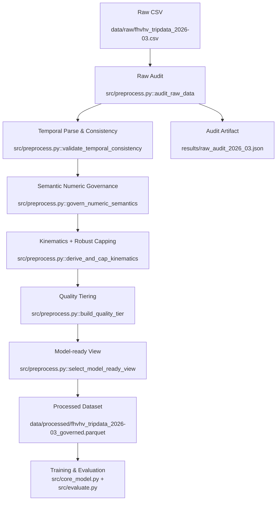

# 纽约市出租车行程数据挖掘中期报告（对齐开题报告）

## 0. 开题-中期对齐说明

本中期报告严格对齐开题报告《纽约市出租车行程数据挖掘——基于Data-Centric方法的费用预测与运营规律分析》的主线：
- 开题主线：以 Data-Centric 为核心，通过数据审计、治理、对照实验提升预测质量与稳定性。
- 中期落地：已完成原始数据审计脚本、问题量化、治理规则设计与可复现管道；模型大规模对照实验进入下一阶段。

对应关系：
- 开题第 2 章（数据获取与初步审查） -> 中期第 2.1 节（代码审计证据）
- 开题第 3 章（初步方法） -> 中期第 2.2 节（数据管道与函数映射）
- 开题第 4 章（实验设计） -> 中期第 3 节（A/B 实验方案与评价框架）
- 开题第 5 章（风险评估） -> 中期第 4 节（风险状态与缓解）

## 1. 阶段进展总览（对应开题 1/3/4 章）

### 1.1 已完成

1. 原始数据审计程序化落地（`src/preprocess.py::audit_raw_data`）。
2. 审计结果结构化输出（`results/raw_audit_2026_03.json`）。
3. 数据治理骨架函数已实现并可串联：
- `validate_temporal_consistency`
- `govern_numeric_semantics`
- `derive_and_cap_kinematics`
- `build_quality_tier`
- `select_model_ready_view`
4. 中期核心目标从“描述性EDA”升级为“证据驱动治理 + 可复现实验框架”。

### 1.2 与开题预期的偏差

1. 开题预期存在较明显缺失机制问题（例如某些时间字段缺失），但本批 `fhvhv_tripdata_2026-03` 中 `on_scene_datetime` 缺失率为 0，缺失挑战未显著出现。
2. 开题中参考了 Yellow Taxi 常见长尾实体风险；本批 FHVHV 数据里 `dispatching_base_num` 实体仅 2 个，`freq < 3` 占比为 0，未形成该维度长尾问题。
3. 因此中期治理重点从“缺失补全/实体消歧”转向“跨字段一致性与语义约束治理”。

## 2. 数据工程与审计落地

### 2.1 原始数据审计反馈（代码验证）

数据文件：`data/raw/fhvhv_tripdata_2026-03.csv`  
审计脚本：`src/preprocess.py::audit_raw_data()`  
审计输出：`results/raw_audit_2026_03.json`

| 数据问题 | 量化规模 | 解决方案（精确到文件/函数） | 处理后效果（目标） |
|---|---:|---|---|
| 金额语义冲突：`base_passenger_fare < 0` | 5,669 / 22,058,358（0.0257%） | `src/preprocess.py::govern_numeric_semantics`：负值置空+打标，不删行 | 保留样本同时阻断脏标签进入监督目标 |
| 时长标签冲突：`abs((dropoff-pickup)-trip_time)>300s` | 10,123 / 22,058,358（0.0459%） | `src/preprocess.py::validate_temporal_consistency`：生成 `flag_duration_inconsistent` | 显式识别标签噪音，便于训练阶段过滤或降权 |
| 速度异常（`speed_mph>80` 或 `<1`） | 3,977 / 22,058,358（0.0180%） | `src/preprocess.py::derive_and_cap_kinematics`：打标+缩尾辅助列 | 降低极端值对模型参数的杠杆影响 |
| 时间漂移检查（上半月 vs 下半月小时分布） | PSI=0.00115（弱漂移） | `src/preprocess.py::audit_raw_data`：持续监控，阈值触发策略 | 当前无需时间重加权，保持统一训练窗口 |

说明（按作业要求必填）：
- 开题预测的“明显缺失机制挑战”在本批数据中未发生：`on_scene_datetime` 缺失率为 0。
- 开题预测的“dispatch base 长尾”在本批数据中未发生：`dispatching_base_num` 仅 2 类且 `freq<3` 占比为 0。

### 2.2 数据流与预处理管道（Mermaid）



## 3. 治理与实验设计（对应开题 4 章）

### 3.1 数据治理方案（优秀版）

治理原则：
1. 不把“删异常”当治理。优先“标记、修复、降权、分层”。
2. 同时保留原始值与治理值（如 `_capped`），确保可回溯。
3. 把数据质量显式特征化（`quality_issue_count` / `quality_tier`）。

分层策略：
1. 语义约束层：金额非负、时间先后关系。
2. 统计稳健层：0.1%/99.9% 分位缩尾，抑制重尾。
3. 一致性校验层：时长一致性、速度可行性。
4. 训练适配层：构造 `model_ready_view`，仅在训练视图排除重冲突样本。

### 3.2 对照实验 A/B 设计

- A（基线）：类型转换 + 简单缺失删除。
- B（治理）：语义置空 + 一致性标记 + 缩尾 + 质量分层（本方案）。

固定变量：
1. 时间切分方案一致。
2. 模型结构与超参一致。
3. 特征集合一致（除治理新增特征的单独增益实验）。
4. 评估脚本一致（`src/evaluate.py`）。

评估指标：
1. 主指标：MAE、RMSE。
2. 稳定性：分时段/分区域误差方差。
3. 副作用：样本保留率、训练耗时、分群公平性差异。

## 4. 风险状态与后续计划（对应开题 5 章）

### 4.1 当前风险状态

1. 概念漂移风险：当前 PSI 低，但需滚动监控跨月漂移。
2. 标签定义噪音：`trip_time` 与时间戳冲突仍存在，需要下游鲁棒训练。
3. 数据规模风险：全量 CSV 运算成本高，需继续优化分块与列裁剪策略。

### 4.2 下一阶段（两周）

1. 完成治理前后 A/B 模型对照并出显著性检验。
2. 增加子群体公平性评估（高峰/低峰、核心区/非核心区）。
3. 形成最终“治理收益报告”：精度收益、稳定性收益、代价评估。

## 5. 复现方式

```bash
python src/preprocess.py
```

产物：
- `results/raw_audit_2026_03.json`
- （下一阶段）`data/processed/fhvhv_tripdata_2026-03_governed.parquet`
