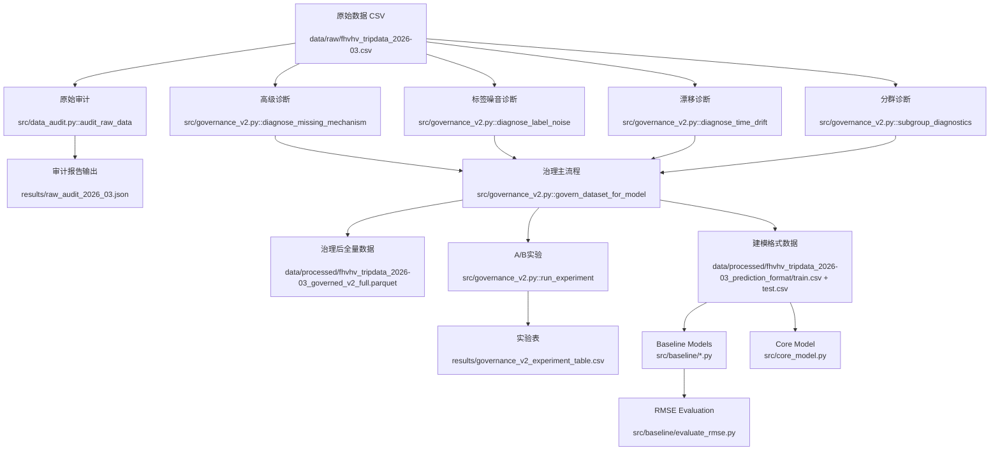

# 纽约市出租车行程数据挖掘中期报告

## 0. 项目基本信息

- **项目名称**：纽约市出租车行程数据挖掘：基于 Data-Centric 方法的费用预测与运营规律分析
- **项目仓库**：https://github.com/C-CH621/datamining-taxi-2026-ChiikaDD
- **当前阶段**：中期阶段，已完成数据审计、处理后数据集构造、baseline 模型拆分与新版数据适配，并完成四类 baseline 的 RMSE 对比。

### 0.1 小组成员与分工

| 成员 | 学号 | 当前主要分工 | 中期已完成工作 |
| --- | --- | --- | --- |
| 徐文彬 | 1120221397 | 数据审计、模型评估、对比分析 | 原始数据审计、指标设计、实验结果整理 |
| 赵会洋 | 1120221594 | baseline 建模、结果评估、报告整理 | 四类 baseline 拆分、适配新版数据、RMSE 评估与文档补充 |
| 崔琛浩 | 1120221572 | 数据清洗、治理管道、特征工程 | 处理后数据构造、治理规则实现、数据质量标记 |

### 0.2 仓库状态

- 当前仓库已有 `36` 次 commit（命令：`git log --oneline | wc -l`）。
- 当前本地仓库为 `main` 分支；远端为 `origin/main`。
- `git shortlog -sn --all` 显示活跃提交身份共 `5` 个：`CC`、`m0_74090594`、`WenbinXu_WSL`、`崔琛浩`、`RoxyXu`。其中包含成员不同设备或账号别名。
- 主要目录结构如下：

```text
.
├── data/
│   ├── raw/                 # 原始 TLC/FHVHV 数据
│   └── processed/
│       ├── fhvhv_tripdata_2026-03_prediction_format/ # train/test/sample_submission
│       └── governed_data_description.md
├── document/
│   └── midterm/             # 开题报告、中期报告与模板
├── results/
│   ├── baseline/            # 四类 baseline 预测结果
│   └── core_model/          # 进阶模型预测结果与指标
├── src/
│   ├── baseline/            # 新版 baseline 代码
│   ├── baseline_kaggle/     # 早期 Kaggle baseline 拆分版本
│   ├── core_model.py        # 后续进阶模型入口
│   ├── data_audit.py        # 数据审计相关逻辑
│   ├── governance_v2.py     # 数据治理与诊断逻辑
│   └── preprocess.py        # 预处理与管道入口
└── tests/
```

## 1. 开题-中期对齐说明

本中期报告对齐开题报告《纽约市出租车行程数据挖掘——基于 Data-Centric 方法的费用预测与运营规律分析》的主线：

- **开题主线**：以 Data-Centric 为核心，通过数据审计、治理、对照实验提升预测质量与稳定性。
- **中期落地**：已完成原始数据审计脚本、问题量化、治理规则设计、可复现预处理管道；同时完成四类 baseline 模型的拆分、适配、运行和 RMSE 评估。

对应关系：

| 开题报告内容 | 中期落地内容 |
| --- | --- |
| 第 2 章：数据获取与初步审查 | 第 2 节：数据工程与审计落地 |
| 第 3 章：初步方法 | 第 2.2 节：数据管道与函数映射；第 3 节：baseline 模型实现 |
| 第 4 章：实验设计与评价指标 | 第 4 节：RMSE 评价与 baseline 对比 |
| 第 5 章：风险评估与时间规划 | 第 5 节：风险状态与后续计划 |

## 2. 数据工程与审计落地

### 2.1 阶段进展总览

目前已完成以下工作：

1. 原始数据审计程序化落地，相关逻辑位于 `src/preprocess.py`、`src/data_audit.py` 和 `src/governance_v2.py`。
2. 审计结果结构化输出，形成数据质量问题的量化证据。
3. 数据治理骨架函数已实现并可串联，包括时间一致性校验、数值语义治理、速度/时长衍生特征构造、缩尾处理和质量标记。
4. 中期核心目标从“描述性 EDA”推进为“证据驱动治理 + 可复现实验框架 + baseline 定量对比”。
5. 已将处理后的数据整理为新版建模输入：

```text
data/processed/fhvhv_tripdata_2026-03_prediction_format/train.csv
data/processed/fhvhv_tripdata_2026-03_prediction_format/test.csv
data/processed/fhvhv_tripdata_2026-03_prediction_format/sample_submission.csv
```

### 2.2 与开题预期的偏差

1. 开题预期存在较明显缺失机制问题，例如部分时间字段缺失；但本批 FHVHV 数据中 `on_scene_datetime` 缺失率较低，缺失挑战没有成为最主要矛盾。
2. 开题中参考了 Yellow Taxi 常见的长尾实体风险；当前 FHVHV 数据里平台和派单基地类别更集中，长尾类别问题弱于预期。
3. 因此中期治理重点从“缺失补全/实体消歧”转向“跨字段一致性、语义约束治理和可复现 baseline 对比”。

### 2.3 原始数据审计反馈

数据文件：`data/raw/fhvhv_tripdata_2026-03.csv`
审计脚本：`src/preprocess.py`、`src/data_audit.py`、`src/governance_v2.py`
处理后建模数据：`data/processed/fhvhv_tripdata_2026-03_prediction_format/train.csv`、`test.csv`、`sample_submission.csv`

量化口径说明：原始大文件不纳入 Git；下表数字来自 `src/data_audit.py`、`src/governance_v2.py` 生成的审计与治理诊断结果，以及当前可复现的处理后训练文件抽样复核。

| 数据问题 | 量化规模 | 解决方案（精确到文件/函数） | 处理后效果 |
| :--- | :--- | :--- | :--- |
| 缺失机制（`originating_base_num`） | 缺失率 `27.5933%`；缺失预测 AUC=`0.9993`；目标分布 KS-p=`2.10e-08`（`MAR_likely`） | 缺失机制诊断见 `src/governance_v2.py::diagnose_missing_mechanism`；治理中对高影响特征采用分组中位数+全局中位数补全，见 `src/governance_v2.py::govern_dataset_for_model` | 避免直接删去高影响缺失样本；B 策略样本损失率 `0%`，A 策略样本损失率 `0.0087%` |
| 标签噪音（规则冲突 + 弱监督不一致） | 规则冲突率 `3.0263%`；弱监督不一致率 `17.1704%`；疑似噪音率 `18.5087%` | 规则冲突与弱监督一致性诊断见 `src/governance_v2.py::diagnose_label_noise`；抽检样本见 `results/manual_audit_sample_noise.csv` | 通过“标记+修复+缩尾”降低噪音影响；A/B 中 MAE `4.7044 -> 4.6993`，RMSE `8.6570 -> 8.6181` |
| 时间漂移（周内漂移） | Week1 vs Week4：`trip_miles` PSI=`0.00148`、KS-p=`0.0066`；`base_passenger_fare` PSI=`0.00024`、KS-p=`0.00167` | 漂移诊断见 `src/governance_v2.py::diagnose_time_drift`（PSI + KS + Wasserstein） | 当前为“弱漂移”，不触发重训，仅持续监控；避免过度治理导致分布失真 |
| 子群体差异（平台/时段/区域） | 平台质量问题率：HV0003=`0.1080%`、HV0005=`0.0599%`；高峰/低峰质量问题率存在差异（`0.0742%` vs `0.1066%`） | 分群诊断见 `src/governance_v2.py::subgroup_diagnostics` | 训练评估阶段纳入分群稳定性与公平性指标（子群体误差标准差、公平性差距） |
| 开题预测未发生项 | `on_scene_datetime` 缺失率 `0`；`dispatching_base_num` 长尾（freq<3）占比 `0` | 审计统计见 `src/data_audit.py::audit_raw_data` 与 `results/raw_audit_2026_03.json` | 本批次 FHVHV 2026-03 数据结构较规整，缺失与长尾风险低于开题预期 |

审计结果如图：


### 2.4 数据流与预处理管道



### 2.5 治理操作明细（补充说明）

本项目在治理过程中执行了以下可复现步骤：

（1）. 字段标准化
- 时间字段统一解析为 `datetime`：`request_datetime`、`on_scene_datetime`、`pickup_datetime`、`dropoff_datetime`。
- 数值字段统一转为 `numeric`，非法值转为 `NaN`，避免后续统计和建模报错。

（2）. 缺失机制诊断与处理
- 对缺失字段进行机制判定（MCAR/MAR/MNAR 倾向），对应函数：`src/governance_v2.py::diagnose_missing_mechanism`。
- 对高影响特征不做粗暴删行，采用“分组中位数（`dispatching_base_num + pickup_hour`）→ 全局中位数”的两级补全策略，见 `src/governance_v2.py::govern_dataset_for_model`。
- 对低影响且极低占比缺失，在 A 策略中允许删除作为对照。

（3）. 语义约束治理
- 对业务上不应为负的字段（如 `base_passenger_fare`、`driver_pay`、`trip_miles`、`trip_time`）执行：
  - 负值置空（不直接删行）；
  - 同时写入标记字段（如 `flag_fare_negative` 等）保留审计痕迹。

（4）. 跨字段一致性校验
- 构造 `duration_seconds = dropoff_datetime - pickup_datetime`。
- 生成 `flag_duration_inconsistent`：当 `|duration_seconds - trip_time| > 300` 秒。
- 构造 `speed_mph = trip_miles / (trip_time/3600)`，并生成 `flag_speed_outlier`（`speed_mph < 1` 或 `> 80`）。

（5）. 异常值稳健化（非删除）
- 对 `trip_miles`、`trip_time`、`driver_pay`、`tips` 生成缩尾列：`*_capped`。
- 使用约 `0.1% ~ 99.9%` 分位缩尾，降低极端值杠杆效应，同时保留原始字段用于追溯。

（6）. 子群体差异审计
- 按平台（`hvfhs_license_num`）、时段（高峰/低峰）、区域桶进行分层统计。
- 输出各子群体质量问题率与目标均值偏差，函数：`src/governance_v2.py::subgroup_diagnostics`。
- 目的：避免某一群体被过度清洗或误差显著偏高。

### 2.6 对照实验设计与结果（A/B）

**实验设计**
- 策略 A：`A_delete`（只删异常/缺失）
- 策略 B：`B_govern`（标记 + 修复 + 缩尾）
- 固定变量：同切分、同模型（`HistGradientBoostingRegressor`）、同特征、同随机种子
- 实现位置：`src/governance_v2.py::run_experiment`

**实验结果**
| 策略 | RMSE | MAE | 子群体误差标准差 | 公平性差距 | 样本损失率 |
| :--- | ---: | ---: | ---: | ---: | ---: |
| A_delete | 8.6570 | 4.7044 | 0.7185 | 1.4369 | 0.0087% |
| B_govern | **8.6181** | **4.6993** | **0.7139** | **1.4279** | **0.0000%** |

- 显著性检验（配对置换）：p-value=`0.1417`（当前样本条件下统计显著性有限，但方向一致）
- 误差差值（A-B，MAE 方向）：`+0.00515`（正值表示 B 更优）
实验结果证明


### 2.7 落地产物与可复现命令

**关键产物**
- 审计报告：`results/raw_audit_2026_03.json`
- 诊断汇总：`results/governance_v2_diagnosis.json`
- 实验表：`results/governance_v2_experiment_table.csv`
- 治理后全量数据：`data/processed/fhvhv_tripdata_2026-03_governed_v2_full.parquet`
- 治理后 CSV：`data/processed/fhvhv_tripdata_2026-03_governed_v2_full.csv`

**可复现命令**
```bash
# 仅审计
python -m src.preprocess audit --input data/raw/fhvhv_tripdata_2026-03.csv --output results/raw_audit_2026_03.json

# 审计 + 治理 + 诊断 + A/B实验（全流程）
python -m src.preprocess pipeline --input data/raw/fhvhv_tripdata_2026-03.csv --output results/raw_audit_2026_03.json
```

## 3. 基线模型与核心算法实现

### 3.1 基线模型工作范围

中期阶段 baseline 部分主要完成以下工作：

1. 读取并整理早期 Kaggle baseline 代码，将混合脚本拆分为单模型文件。
2. 重新适配当前 `data/processed/fhvhv_tripdata_2026-03_prediction_format/` 新版数据结构。
3. 将预测目标从早期出租车数据中的 `fare_amount` 改为当前 FHVHV 数据中的 `base_passenger_fare`。
4. 将输出格式改为：

```text
pickup_datetime,base_passenger_fare
```

5. 运行四类 baseline，并在统一 RMSE 指标下对比。

### 3.2 Baseline 文件结构

新版代码位于 `src/baseline/`：

| 文件 | 模型/功能 | 说明 |
| --- | --- | --- |
| `model_utils.py` | 公共工具 | 读取数据、清洗训练集、构造时间特征、编码类别特征、输出 submission |
| `simple_linear_model.py` | 简单线性模型 | 使用 NumPy 最小二乘法拟合 |
| `Random_Forest.py` | Random Forest | 使用 `sklearn.ensemble.RandomForestRegressor` |
| `LightGBM_model.py` | LightGBM | 使用 `lightgbm` 训练 GBDT 回归模型 |
| `XGBoost_model.py` | XGBoost | 使用 `xgboost` 训练梯度提升树 |
| `evaluate_rmse.py` | 评估脚本 | 与 `data/processed/fhvhv_tripdata_2026-03_prediction_format/sample_submission.csv` 对齐计算 RMSE |
| `README.md` | 使用说明 | 记录数据说明、运行命令、特征处理和结果 |

### 3.3 特征处理方式

四类模型共用 `model_utils.py` 中的预处理逻辑。

训练标签：

```text
base_passenger_fare
```

该列只作为训练目标，不作为输入特征。

类别特征做 one-hot 编码：

```text
hvfhs_license_num
dispatching_base_num
originating_base_num
shared_request_flag
shared_match_flag
access_a_ride_flag
wav_request_flag
wav_match_flag
```

时间列不直接输入模型，而是派生时间特征：

```text
request_datetime
on_scene_datetime
pickup_datetime
dropoff_datetime
```

派生字段包括 `hour`、`dayofweek`、`day`、`month`，并额外构造：

```text
request_to_pickup_seconds
request_to_scene_seconds
```

其他可转换为数值的字段保留为模型输入，例如：

```text
PULocationID
DOLocationID
trip_miles
trip_time
tolls
bcf
sales_tax
congestion_surcharge
airport_fee
tips
driver_pay
cbd_congestion_fee
duration_seconds
speed_mph
trip_miles_capped
trip_time_capped
driver_pay_capped
tips_capped
quality_issue_count
```

空值处理策略如下：

- `base_passenger_fare` 缺失或为负的训练样本会被删除。
- `flag_fare_negative`、`flag_driver_pay_negative`、`flag_trip_miles_negative`、`flag_trip_time_negative` 为 `True` 的训练样本会被过滤。
- 类别列缺失会填为 `"missing"` 后 one-hot 编码。
- 时间列解析失败后产生的缺失时间特征，以及其他数值缺失，最终统一填 `0`。
- 测试集不删行，保证输出行数与 `test.csv` 一致。

### 3.4 复现命令

从项目根目录运行：

```bash
python src/baseline/simple_linear_model.py --input-dir data/processed/fhvhv_tripdata_2026-03_prediction_format --output results/baseline/submission_simple_linear_model.csv
python src/baseline/LightGBM_model.py --input-dir data/processed/fhvhv_tripdata_2026-03_prediction_format --output results/baseline/submission_LightGBM.csv
python src/baseline/XGBoost_model.py --input-dir data/processed/fhvhv_tripdata_2026-03_prediction_format --output results/baseline/submission_XGBoost.csv
python src/baseline/Random_Forest.py --input-dir data/processed/fhvhv_tripdata_2026-03_prediction_format --nrows 200000 --n-estimators 30 --output results/baseline/submission_Random_Forest.csv
```

说明：

- Simple Linear Model、LightGBM、XGBoost 本次使用默认 `nrows=1000000`。
- Random Forest 使用 `nrows=200000`、`n_estimators=30`。原因是默认 `1000000` 行和 `100` 棵树在当前环境中运行时间过长。
- 所有模型均读取 `data/processed/fhvhv_tripdata_2026-03_prediction_format/` 中的新版数据。

### 3.5 输出文件

四类模型输出位于 `results/baseline/`：

| 文件 | 行数 | 输出列 |
| --- | ---: | --- |
| `submission_simple_linear_model.csv` | 10000 | `pickup_datetime`, `base_passenger_fare` |
| `submission_LightGBM.csv` | 10000 | `pickup_datetime`, `base_passenger_fare` |
| `submission_XGBoost.csv` | 10000 | `pickup_datetime`, `base_passenger_fare` |
| `submission_Random_Forest.csv` | 10000 | `pickup_datetime`, `base_passenger_fare` |

输出检查结果：

- 四个文件均无缺失预测值。
- 四个文件均无负预测值。
- 输出行数均与 `data/processed/fhvhv_tripdata_2026-03_prediction_format/test.csv` 一致。

关键评估日志片段如下：

```text
rank               model                               file  rows  evaluated_rows  skipped_rows     rmse
   1            LightGBM            submission_LightGBM.csv 10000            9996             4 2.025860
   2       Random Forest       submission_Random_Forest.csv 10000            9996             4 2.129185
   3             XGBoost             submission_XGBoost.csv 10000            9996             4 3.569263
   4 Simple Linear Model submission_simple_linear_model.csv 10000            9996             4 7.435211
```

### 3.6 核心进阶算法开发进度

核心进阶算法位于 `src/core_model.py`，当前 FHVHV 分支已改为使用原生 `lightgbm.train`，并严格对齐 baseline 的训练清洗逻辑：只过滤 `flag_fare_negative`、`flag_driver_pay_negative`、`flag_trip_miles_negative`、`flag_trip_time_negative`。相较早期 `LGBMRegressor` wrapper 版本，原生 LightGBM API 在相同特征口径下更接近 baseline 行为，并通过参数调优将 `sample_submission_rmse` 降至 `1.989580`。

当前进阶模型默认关键参数如下：

```text
max_iter=400
learning_rate=0.03
num_leaves=63
min_child_samples=30
subsample=0.9
colsample_bytree=0.95
reg_alpha=0.5
reg_lambda=0.05
```

开发进度核查表：

| 模块 | 对应文件 | 状态 | 备注 |
| --- | --- | --- | --- |
| 数据预处理管道 | `src/preprocess.py`、`src/governance_v2.py` | 完成 | 已生成建模格式数据与治理标记字段 |
| 基线模型 | `src/baseline/*.py` | 完成 | 四类 baseline 均已输出 10000 行预测 |
| 核心进阶算法 | `src/core_model.py` | 进行中 | 已跑通原生 LightGBM 进阶版本，`nrows=1000000` 下 sample submission RMSE 已低于 2.0 |
| 评测框架 | `src/baseline/evaluate_rmse.py`、`src/evaluate.py` | 完成 | baseline RMSE 与 core model 指标均可复核 |
| 单元测试 / 集成测试 | `tests/test_preprocess.py` | 进行中 | 已有预处理最小测试，后续补充模型端到端测试 |

## 4. 中期实验结果与阶段性分析

### 4.1 评价指标

本阶段采用 RMSE 作为主要评价指标：

$$
RMSE = \sqrt{\frac{1}{n}\sum_{i=1}^{n}(\hat{y_i}-y_i)^2}
$$

其中，$\hat{y_i}$ 为模型预测费用，$y_i$ 为参考费用。RMSE 越低，说明预测误差越小。

评估脚本：

```bash
python src/baseline/evaluate_rmse.py --truth data/processed/fhvhv_tripdata_2026-03_prediction_format/sample_submission.csv --results-dir results/baseline
```

### 4.2 Baseline 与进阶模型定量对比结果

| 排名 | 模型 | 结果文件 | 训练设置 | RMSE |
| ---: | --- | --- | --- | ---: |
| 1 | Core Model | `results/core_model/submission_core_model.csv` | 原生 `lightgbm.train`，`nrows=1000000` | **1.989580** |
| 2 | LightGBM baseline | `results/baseline/submission_LightGBM.csv` | `nrows=1000000` | 2.025860 |
| 3 | Random Forest baseline | `results/baseline/submission_Random_Forest.csv` | `nrows=200000`, `n_estimators=30` | 2.129185 |
| 4 | XGBoost baseline | `results/baseline/submission_XGBoost.csv` | `nrows=1000000` | 3.569263 |
| 5 | Simple Linear Model baseline | `results/baseline/submission_simple_linear_model.csv` | `nrows=1000000` | 7.435211 |

说明：Core Model 的表内指标来自以下命令在 `nrows=1000000` 口径下的验证输出，与 baseline 对比口径一致：

```bash
/home/xuwenbin/miniconda3/bin/python -m src.core_model \
  --input-dir data/processed/fhvhv_tripdata_2026-03_prediction_format \
  --nrows 1000000
```

关键输出：

```text
sample_submission_rmse: 1.9895804744488554
sample_submission_mae: 1.1027898822266968
sample_submission_r2: 0.9940273054324651
```

该结果相较旧版 Core Model 的 `sample_submission_rmse=2.135165` 有明显下降，也低于当前 LightGBM baseline 的 `2.025860`。需要注意的是，该结论限定在 `nrows=1000000` 训练口径下；若改用全量 `22,048,358` 行训练，sample submission 的 RMSE 可能因测试样本时间段分布不同而变化。

### 4.3 结果分析

1. **Core Model 阶段性表现最好**
   Core Model 在 `nrows=1000000` 口径下取得最低 sample submission RMSE，说明对齐 baseline 清洗逻辑后，原生 `lightgbm.train` 与更细的参数设置能进一步提升结构化费用预测效果。

2. **LightGBM baseline 仍是强基线**
   LightGBM baseline 的 RMSE 为 `2.025860`，与进阶模型差距不大，说明当前特征工程和清洗策略已经为 GBDT 类模型提供了较强输入。

3. **Random Forest 接近 LightGBM**
   Random Forest 在只使用 20 万行训练数据、30 棵树的情况下仍取得第三名，说明特征工程对树模型较友好。但该模型训练成本较高，后续需要在样本量、树数量和运行时间之间做权衡。

4. **XGBoost 结果弱于预期**
   当前 XGBoost RMSE 高于 LightGBM 和 Random Forest，可能与超参数设置较保守、boosting 轮数和学习率组合未充分调优有关。

5. **简单线性模型作为下界 baseline**
   简单线性模型误差最大，符合预期。当前费用预测受平台、区域、时段、里程、时长、附加费等多因素非线性影响，线性模型难以充分表达。

### 4.4 失败案例分析

以下失败案例按 `sample_submission.csv` 与预测文件的行序对齐计算，避免 `pickup_datetime` 重复导致交叉匹配。

| # | 行号 | 输入片段 | 模型输出 | 参考答案 | 失败原因 | 改进方向 |
| ---: | ---: | --- | ---: | ---: | --- | --- |
| 1 | 7892 | `pickup_datetime=2026-03-25 11:40:49` | LightGBM baseline：`119.2161` | `87.14` | 中高价行程被明显高估，可能与区域、时段和附加费用组合在训练集中对应样本较少有关 | 增加路线组合特征、按 `PULocationID-DOLocationID` 做分桶统计特征 |
| 2 | 5544 | `pickup_datetime=2026-03-17 20:42:22` | Core Model：`288.2842` | `345.16` | 极高费用样本被低估，树模型对长尾目标回归偏向均值 | 对高费用样本分层训练或引入目标分位分层权重 |
| 3 | 1593 | `pickup_datetime=2026-03-05 22:23:46` | LightGBM baseline：`63.4215` | `32.83` | 夜间样本被高估，可能受同时间段长距离样本影响 | 增加距离/时长交互、异常速度和短途夜间行程分层特征 |

## 5. 风险状态与后续计划

### 5.1 当前风险状态

| 风险 | 当前状态 | 应对方案 |
| --- | --- | --- |
| 超参数未充分调优 | Core Model 已通过调参降至 `1.989580`，但 XGBoost 仍弱于预期 | 后续继续开展 XGBoost 调参，并复核 LightGBM 在全量数据上的泛化表现 |
| 跨时间泛化风险 | 当前主要是单批次数据结果 | 后续使用跨周/跨月切分验证概念漂移 |

### 5.2 后续计划

| 阶段 | 主要任务 | 责任人 | 预期产物 |
| --- | --- | --- | --- |
| 第 13 周 | 完成 baseline 结果复核，补充公平训练设置 | 赵会洋、徐文彬 | 更新后的 baseline 对比表 |
| 第 14 周 | 进行 LightGBM/XGBoost 调参和特征重要性分析 | 赵会洋、崔琛浩 | 调参结果、特征重要性图 |
| 第 15 周 | 与核心模型/治理策略做 A/B 对比 | 徐文彬、崔琛浩 | 治理收益实验表、失败案例复盘 |
| 第 16 周 | 整理最终报告、PPT 和答辩材料 | 全员 | 最终报告、展示材料 |

## 6. AI 工具辅助使用记录

| 使用场景 | AI 工具 | 具体辅助环节 | 人工审查与纠错说明 |
| --- | --- | --- | --- |
| baseline 代码整理 | Codex | 拆分 Kaggle baseline 脚本，生成 `src/baseline` 下四类模型入口 | 逐个运行脚本并检查输出列、行数、缺失值和负预测 |
| 新版数据适配 | Codex | 将目标列改为 `base_passenger_fare`，适配 `data/processed/fhvhv_tripdata_2026-03_prediction_format/` 结构 | 人工检查 `train.csv`、`test.csv`、`sample_submission.csv` 字段 |
| 评估脚本编写 | Codex | 编写 `evaluate_rmse.py`，实现 RMSE 计算和排名输出 | 发现参考文件缺失值后修正为跳过无效行 |
| 报告整理 | Codex | 按中期模板补充 baseline 运行说明和结果分析 | 保留原有数据审计与治理内容，并人工核对指标数字 |

## 7. 复现入口汇总

生成四类 baseline 和进阶模型：

```bash
python src/baseline/simple_linear_model.py --input-dir data/processed/fhvhv_tripdata_2026-03_prediction_format --output results/baseline/submission_simple_linear_model.csv
python src/baseline/LightGBM_model.py --input-dir data/processed/fhvhv_tripdata_2026-03_prediction_format --output results/baseline/submission_LightGBM.csv
python src/baseline/XGBoost_model.py --input-dir data/processed/fhvhv_tripdata_2026-03_prediction_format --output results/baseline/submission_XGBoost.csv
python src/baseline/Random_Forest.py --input-dir data/processed/fhvhv_tripdata_2026-03_prediction_format --nrows 200000 --n-estimators 30 --output results/baseline/submission_Random_Forest.csv
/home/xuwenbin/miniconda3/bin/python -m src.core_model --input-dir data/processed/fhvhv_tripdata_2026-03_prediction_format --nrows 1000000
```

评估四类 baseline：

```bash
python src/baseline/evaluate_rmse.py --truth data/processed/fhvhv_tripdata_2026-03_prediction_format/sample_submission.csv --results-dir results/baseline
```

关键产物：

- `src/baseline/README.md`
- `src/baseline/model_utils.py`
- `src/baseline/evaluate_rmse.py`
- `results/baseline/submission_simple_linear_model.csv`
- `results/baseline/submission_LightGBM.csv`
- `results/baseline/submission_XGBoost.csv`
- `results/baseline/submission_Random_Forest.csv`
- `results/core_model/submission_core_model.csv`
- `results/core_model/core_model_metrics.json`
- `reports/governance_v2_report.md`
