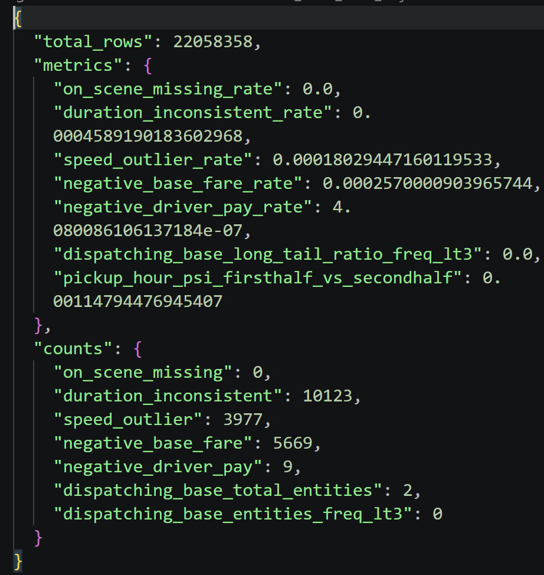
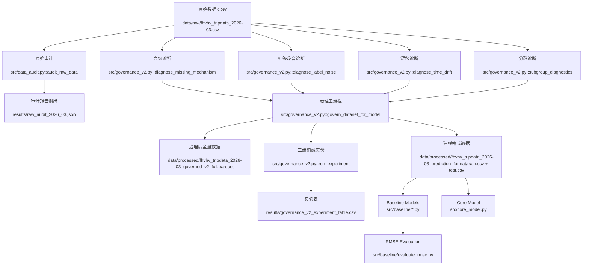
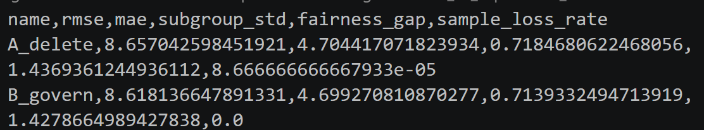
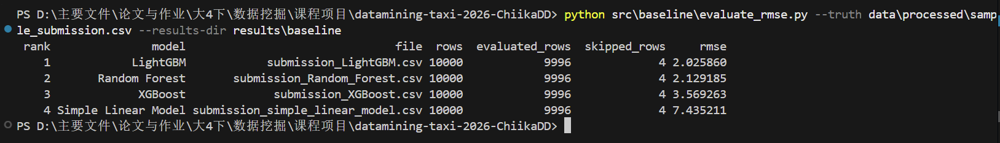
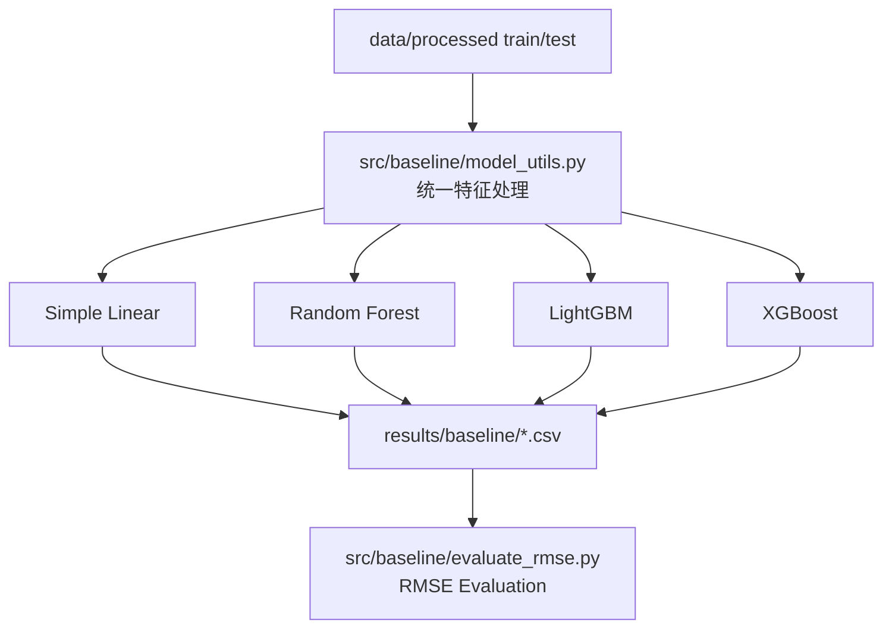

# 数据挖掘课程项目 - 中期进展报告

## 0. 项目基本信息

- **项目名称**：纽约市出租车行程数据挖掘：基于 Data-Centric 方法的费用预测与运营规律分析
- **项目仓库**：https://github.com/C-CH621/datamining-taxi-2026-ChiikaDD
- **当前阶段**：中期阶段，已完成数据审计、处理后数据集构造、baseline 模型拆分与新版数据适配，并完成四类 baseline 的 RMSE 对比。

### 0.1 小组成员与分工

| 成员 | 学号 | 当前主要分工 | 中期已完成工作 |
| --- | --- | --- | --- |
| 徐文彬 | 1120221397 | 数据审计、模型评估、对比分析 | 原始数据审计、指标设计、实验结果整理 |
| 赵会洋 | 1120221594 | baseline 建模、结果评估、报告整理 | 四类 baseline 拆分、适配新版数据、RMSE 评估与文档补充 |
| 崔琛浩 | 1120221572 | 数据清洗、治理管道、特征工程 | 处理后数据构造、治理规则实现、数据质量标记 |

### 0.2 仓库状态

- 当前仓库已有 `36` 次 commit（命令：`git log --oneline | wc -l`）。
- 当前本地仓库为 `main` 分支；远端为 `origin/main`。
- `git shortlog -sn --all` 显示活跃提交身份共 `5` 个：`CC`、`m0_74090594`、`WenbinXu_WSL`、`崔琛浩`、`RoxyXu`。其中包含成员不同设备或账号别名。
- 主要目录结构如下：

```text
.
├── README.md                    # 项目说明与运行入口
├── requirements.txt             # Python 依赖
├── data/
│   ├── raw/                 # 原始 TLC/FHVHV 数据
│   └── processed/
│       ├── fhvhv_tripdata_2026-03_prediction_format/ # train/test/sample_submission
│       └── governed_data_description.md
├── document/
│   └── midterm/                 # 开题报告、中期报告与模板
├── results/
│   ├── baseline/            # 四类 baseline 预测结果
│   └── core_model/          # 进阶模型预测结果与指标
├── src/
│   ├── baseline/                # 新版 baseline 代码与评估脚本
│   ├── baseline_kaggle/         # 早期 Kaggle baseline 拆分版本
│   ├── core_model.py            # 进阶模型入口
│   ├── data_audit.py            # 数据审计逻辑
│   ├── governance_v2.py         # 数据治理与诊断逻辑
│   ├── preprocess.py            # 预处理管道入口
│   └── evaluate.py              # 评估工具占位/后续扩展
└── tests/                       # 测试目录
```

## 2. 数据工程与审计落地

### 2.1 原始数据审计反馈

数据文件：`data/raw/fhvhv_tripdata_2026-03.csv`
审计脚本：`src/preprocess.py`、`src/data_audit.py`、`src/governance_v2.py`
处理后建模数据：`data/processed/fhvhv_tripdata_2026-03_prediction_format/train.csv`、`test.csv`、`sample_submission.csv`

量化口径说明：原始大文件不纳入 Git；下表数字来自 `src/data_audit.py`、`src/governance_v2.py` 生成的审计与治理诊断结果，以及当前可复现的处理后训练文件抽样复核。

| 数据问题 | 量化规模 | 解决方案（精确到文件/函数） | 处理后效果 |
| :--- | :--- | :--- | :--- |
| 缺失机制（`originating_base_num`） | 缺失率 `27.5933%`；缺失预测 AUC=`0.9993`；目标分布 KS-p=`2.10e-08`（`MAR_likely`） | 缺失机制诊断见 `src/governance_v2.py::diagnose_missing_mechanism`；治理中对高影响特征采用分组中位数+全局中位数补全，见 `src/governance_v2.py::govern_dataset_for_model` | 避免直接删去高影响缺失样本；B 策略样本损失率 `0%`，A 策略样本损失率 `0.0087%` |
| 标签噪音（规则冲突 + 弱监督不一致） | 规则冲突率 `3.0263%`；弱监督不一致率 `17.1704%`；疑似噪音率 `18.5087%` | 规则冲突与弱监督一致性诊断见 `src/governance_v2.py::diagnose_label_noise`；抽检样本见 `results/manual_audit_sample_noise.csv` | 三组实验中治理策略与原始基准结果相同，尚未观察到额外预测收益 |
| 时间漂移（周内漂移） | Week1 vs Week4：`trip_miles` PSI=`0.00148`、KS-p=`0.0066`；`base_passenger_fare` PSI=`0.00024`、KS-p=`0.00167` | 漂移诊断见 `src/governance_v2.py::diagnose_time_drift`（PSI + KS + Wasserstein） | 当前为“弱漂移”，不触发重训，仅持续监控；避免过度治理导致分布失真 |
| 子群体差异（平台/时段/区域） | 平台质量问题率：HV0003=`0.1080%`、HV0005=`0.0599%`；高峰/低峰质量问题率存在差异（`0.0742%` vs `0.1066%`） | 分群诊断见 `src/governance_v2.py::subgroup_diagnostics` | 训练评估阶段纳入分群稳定性与公平性指标（子群体误差标准差、公平性差距） |
| 开题预测未发生项 | `on_scene_datetime` 缺失率 `0`；`dispatching_base_num` 长尾（freq<3）占比 `0` | 审计统计见 `src/data_audit.py::audit_raw_data` 与 `results/raw_audit_2026_03.json` | 本批次 FHVHV 2026-03 数据结构较规整，缺失与长尾风险低于开题预期 |

审计结果如图：



### 2.2 数据流与预处理管道



### 2.3 治理操作明细（补充说明）

本项目在治理过程中执行了以下可复现步骤：

（1）. 字段标准化
- 时间字段统一解析为 `datetime`：`request_datetime`、`on_scene_datetime`、`pickup_datetime`、`dropoff_datetime`。
- 数值字段统一转为 `numeric`，非法值转为 `NaN`，避免后续统计和建模报错。

（2）. 缺失机制诊断与处理
- 对缺失字段进行机制判定（MCAR/MAR/MNAR 倾向），对应函数：`src/governance_v2.py::diagnose_missing_mechanism`。
- 对高影响特征不做粗暴删行，采用“分组中位数（`dispatching_base_num + pickup_hour`）→ 全局中位数”的两级补全策略，见 `src/governance_v2.py::govern_dataset_for_model`。
- 对低影响且极低占比缺失，在 A 策略中允许删除作为对照。

（3）. 语义约束治理
- 对业务上不应为负的字段（如 `base_passenger_fare`、`driver_pay`、`trip_miles`、`trip_time`）执行：
  - 负值置空（不直接删行）；
  - 同时写入标记字段（如 `flag_fare_negative` 等）保留审计痕迹。

（4）. 跨字段一致性校验
- 构造 `duration_seconds = dropoff_datetime - pickup_datetime`。
- 生成 `flag_duration_inconsistent`：当 `|duration_seconds - trip_time| > 300` 秒。
- 构造 `speed_mph = trip_miles / (trip_time/3600)`，并生成 `flag_speed_outlier`（`speed_mph < 1` 或 `> 80`）。

（5）. 异常值稳健化（非删除）
- 对 `trip_miles`、`trip_time`、`driver_pay`、`tips` 生成缩尾列：`*_capped`。
- 使用约 `0.1% ~ 99.9%` 分位缩尾，降低极端值杠杆效应，同时保留原始字段用于追溯。

（6）. 子群体差异审计
- 按平台（`hvfhs_license_num`）、时段（高峰/低峰）、区域桶进行分层统计。
- 输出各子群体质量问题率与目标均值偏差，函数：`src/governance_v2.py::subgroup_diagnostics`。
- 目的：避免某一群体被过度清洗或误差显著偏高。

### 2.4 对照实验设计与结果（三组消融实验）

**实验设计**
- 原始基准：`Raw_baseline`（仅进行模型运行必需的处理）
- 策略 A：`A_delete`（只删异常/缺失）
- 策略 B：`B_govern`（标记 + 修复 + 缩尾）
- 固定变量：同切分、同模型（`HistGradientBoostingRegressor`）、同特征、同随机种子
- 实现位置：`src/governance_v2.py::run_experiment`

**实验结果**
| 策略 | RMSE | MAE | 子群体误差标准差 | 公平性差距 | 样本损失率 |
| :--- | ---: | ---: | ---: | ---: | ---: |
| Raw_baseline | **8.6181** | **4.6993** | **0.7139** | **1.4279** | **0.0000%** |
| A_delete | 8.6570 | 4.7044 | 0.7185 | 1.4369 | 0.0087% |
| B_govern | **8.6181** | **4.6993** | **0.7139** | **1.4279** | **0.0000%** |

- 原始基准与治理策略结果完全一致：p-value=`1.0000`。
- 直接删除策略误差略高，但与原始基准及治理策略的差异均未达到统计显著：p-value=`0.1417`。
- 当前结果说明直接删除可能损失有效信息，但尚不能证明现有治理策略优于原始数据基准。

实验结果


### 2.5 落地产物与可复现命令

**关键产物**
- 审计报告：`results/raw_audit_2026_03.json`
- 诊断汇总：`results/governance_v2_diagnosis.json`
- 实验表：`results/governance_v2_experiment_table.csv`
- 治理后全量数据：`data/processed/fhvhv_tripdata_2026-03_governed_v2_full.parquet`
- 治理后 CSV：`data/processed/fhvhv_tripdata_2026-03_governed_v2_full.csv`

**可复现命令**
```bash
# 仅审计
python -m src.preprocess audit --input data/raw/fhvhv_tripdata_2026-03.csv --output results/raw_audit_2026_03.json

# 审计 + 治理 + 诊断 + 三组消融实验（全流程）
python -m src.preprocess pipeline --input data/raw/fhvhv_tripdata_2026-03.csv --output results/raw_audit_2026_03.json
```

## 3. 基线模型与核心算法实现

### 3.1. 基线模型运行情况说明

**所选基线方法**：

中期阶段已实现并运行 4 类费用预测 baseline：

1. Simple Linear Model：简单线性模型，作为最低复杂度的可解释性基线。
2. Random Forest：随机森林回归模型，用于捕捉非线性特征交互。
3. LightGBM：梯度提升树模型，作为当前表现最好的表格数据 baseline。
4. XGBoost：梯度提升树模型，用于与 LightGBM 和 Random Forest 进行横向对比。

**运行环境**：

- Python 3.13
- pandas / NumPy / scikit-learn
- LightGBM
- XGBoost
- Windows PowerShell 本地环境

**一键复现命令**：

```bash
python src/baseline/simple_linear_model.py --output results/baseline/submission_simple_linear_model.csv
python src/baseline/LightGBM_model.py --output results/baseline/submission_LightGBM.csv
python src/baseline/XGBoost_model.py --output results/baseline/submission_XGBoost.csv
python src/baseline/Random_Forest.py --nrows 200000 --n-estimators 30 --output results/baseline/submission_Random_Forest.csv
python src/baseline/evaluate_rmse.py --truth data/processed/sample_submission.csv --results-dir results/baseline
```

**关键输出片段**：



**代码结构**：

| 文件 | 模型/功能 | 说明 |
| :--- | :--- | :--- |
| `src/baseline/model_utils.py` | 公共工具 | 读取数据、清洗训练集、构造时间特征、编码类别特征、输出 submission |
| `src/baseline/simple_linear_model.py` | Simple Linear Model | 使用 NumPy 最小二乘法拟合 |
| `src/baseline/Random_Forest.py` | Random Forest | 使用 `sklearn.ensemble.RandomForestRegressor` |
| `src/baseline/LightGBM_model.py` | LightGBM | 使用 `lightgbm` 训练 GBDT 回归模型 |
| `src/baseline/XGBoost_model.py` | XGBoost | 使用 `xgboost` 训练梯度提升树 |
| `src/baseline/evaluate_rmse.py` | 评估脚本 | 与 `data/processed/sample_submission.csv` 对齐计算 RMSE |

**输入输出适配**：

- 输入：`data/processed/train.csv`、`data/processed/test.csv`、`data/processed/sample_submission.csv`
- 预测目标：`base_passenger_fare`
- 输出列：`pickup_datetime,base_passenger_fare`
- 输出目录：`results/baseline/`

**特征处理**：

- 类别特征（如 `hvfhs_license_num`、`dispatching_base_num`、`shared_request_flag` 等）使用 one-hot 编码。
- 时间字段（`request_datetime`、`on_scene_datetime`、`pickup_datetime`、`dropoff_datetime`）不直接输入模型，而是派生 `hour`、`dayofweek`、`day`、`month` 等特征。
- 额外构造 `request_to_pickup_seconds`、`request_to_scene_seconds`。
- 数值特征包括 `PULocationID`、`DOLocationID`、`trip_miles`、`trip_time`、`tolls`、`bcf`、`sales_tax`、`driver_pay`、`duration_seconds`、`speed_mph`、`*_capped` 和 `quality_issue_count` 等。
- 训练集中 `base_passenger_fare` 缺失或为负的样本会被过滤；测试集不删行；类别缺失填为 `"missing"`，其他缺失最终填 `0`。

### 3.2. 核心进阶算法开发进度

当前项目的核心进阶方向为“数据治理 + 表格回归模型”的组合路线：先通过数据审计和治理标记提升数据质量，再比较不同模型在同一处理后数据上的表现。现阶段重点已完成 baseline，可支撑后续核心模型和治理策略对照实验。

**核心模块设计**：



**开发进度核查表**：

| 模块 | 对应文件 | 状态 | 备注 |
| :--- | :--- | :---: | :--- |
| 数据预处理管道 | `src/preprocess.py`、`src/governance_v2.py` | 完成 | 已形成处理后 `data/processed` 输入 |
| 基线模型 | `src/baseline/*.py` | 完成 | 四类 baseline 均可运行并输出结果 |
| 核心进阶算法 | `src/core_model.py` | 进行中 | 后续将与 baseline 进行统一指标对比 |
| 评测框架 | `src/baseline/evaluate_rmse.py`、`src/evaluate.py` | 部分完成 | baseline RMSE 已完成，通用评估入口待整合 |
| 单元测试 / 集成测试 | `tests/` | 进行中 | 后续补充训练与评估入口测试 |

---

## 4. 中期实验结果与阶段性分析

### 4.1. 评估指标与测试集构建

- **评估数据集规模**：使用 `data/processed/test.csv` 生成 10000 行预测结果，并以 `data/processed/sample_submission.csv` 中的 `base_passenger_fare` 作为阶段性参考标签。
- **有效评估样本数**：`sample_submission.csv` 中有 4 行 `base_passenger_fare` 缺失，因此评估脚本跳过缺失行，最终在 9996 行上计算 RMSE。
- **核心评估指标**：RMSE（Root Mean Squared Error，均方根误差）。

$$
RMSE = \sqrt{\frac{1}{n}\sum_{i=1}^{n}(\hat{y_i}-y_i)^2}
$$

其中，$\hat{y_i}$ 为模型预测费用，$y_i$ 为参考费用。RMSE 越低，说明预测误差越小。

评估脚本：

```bash
python src/baseline/evaluate_rmse.py --truth data/processed/fhvhv_tripdata_2026-03_prediction_format/sample_submission.csv --results-dir results/baseline
```

### 4.2 Baseline 与进阶模型定量对比结果

| 排名 | 模型 | 结果文件 | 训练设置 | RMSE |
| ---: | --- | --- | --- | ---: |
| 1 | Core Model | `results/core_model/submission_core_model.csv` | 原生 `lightgbm.train`，`nrows=1000000` | **1.989580** |
| 2 | LightGBM baseline | `results/baseline/submission_LightGBM.csv` | `nrows=1000000` | 2.025860 |
| 3 | Random Forest baseline | `results/baseline/submission_Random_Forest.csv` | `nrows=200000`, `n_estimators=30` | 2.129185 |
| 4 | XGBoost baseline | `results/baseline/submission_XGBoost.csv` | `nrows=1000000` | 3.569263 |
| 5 | Simple Linear Model baseline | `results/baseline/submission_simple_linear_model.csv` | `nrows=1000000` | 7.435211 |

说明：Core Model 的表内指标来自以下命令在 `nrows=1000000` 口径下的验证输出，与 baseline 对比口径一致：

```bash
/home/xuwenbin/miniconda3/bin/python -m src.core_model \
  --input-dir data/processed/fhvhv_tripdata_2026-03_prediction_format \
  --nrows 1000000
```

关键输出：

```text
sample_submission_rmse: 1.9895804744488554
sample_submission_mae: 1.1027898822266968
sample_submission_r2: 0.9940273054324651
```

该结果相较旧版 Core Model 的 `sample_submission_rmse=2.135165` 有明显下降，也低于当前 LightGBM baseline 的 `2.025860`。需要注意的是，该结论限定在 `nrows=1000000` 训练口径下；若改用全量 `22,048,358` 行训练，sample submission 的 RMSE 可能因测试样本时间段分布不同而变化。

### 4.3 结果分析

1. **Core Model 阶段性表现最好**
   Core Model 在 `nrows=1000000` 口径下取得最低 sample submission RMSE，说明对齐 baseline 清洗逻辑后，原生 `lightgbm.train` 与更细的参数设置能进一步提升结构化费用预测效果。

2. **LightGBM baseline 仍是强基线**
   LightGBM baseline 的 RMSE 为 `2.025860`，与进阶模型差距不大，说明当前特征工程和清洗策略已经为 GBDT 类模型提供了较强输入。

3. **Random Forest 接近 LightGBM**
   Random Forest 在只使用 20 万行训练数据、30 棵树的情况下仍取得第三名，说明特征工程对树模型较友好。但该模型训练成本较高，后续需要在样本量、树数量和运行时间之间做权衡。

4. **XGBoost 结果弱于预期**
   当前 XGBoost RMSE 高于 LightGBM 和 Random Forest，可能与超参数设置较保守、boosting 轮数和学习率组合未充分调优有关。

5. **简单线性模型作为下界 baseline**
   简单线性模型误差最大，符合预期。当前费用预测受平台、区域、时段、里程、时长、附加费等多因素非线性影响，线性模型难以充分表达。

### 4.4 失败案例分析

以下失败案例按 `sample_submission.csv` 与预测文件的行序对齐计算，避免 `pickup_datetime` 重复导致交叉匹配。

| # | 行号 | 输入片段 | 模型输出 | 参考答案 | 失败原因 | 改进方向 |
| ---: | ---: | --- | ---: | ---: | --- | --- |
| 1 | 7892 | `pickup_datetime=2026-03-25 11:40:49` | LightGBM baseline：`119.2161` | `87.14` | 中高价行程被明显高估，可能与区域、时段和附加费用组合在训练集中对应样本较少有关 | 增加路线组合特征、按 `PULocationID-DOLocationID` 做分桶统计特征 |
| 2 | 5544 | `pickup_datetime=2026-03-17 20:42:22` | Core Model：`288.2842` | `345.16` | 极高费用样本被低估，树模型对长尾目标回归偏向均值 | 对高费用样本分层训练或引入目标分位分层权重 |
| 3 | 1593 | `pickup_datetime=2026-03-05 22:23:46` | LightGBM baseline：`63.4215` | `32.83` | 夜间样本被高估，可能受同时间段长距离样本影响 | 增加距离/时长交互、异常速度和短途夜间行程分层特征 |

## 5. 风险状态与后续计划

### 5.1 当前风险状态

| 风险 | 当前状态 | 应对方案 |
| --- | --- | --- |
| 超参数未充分调优 | Core Model 已通过调参降至 `1.989580`，但 XGBoost 仍弱于预期 | 后续继续开展 XGBoost 调参，并复核 LightGBM 在全量数据上的泛化表现 |
| 跨时间泛化风险 | 当前主要是单批次数据结果 | 后续使用跨周/跨月切分验证概念漂移 |

### 5.2. 终期冲刺详细排期（第 13 周 - 第 16 周）

| 阶段 | 主要任务 | 责任人 | 预期产物 |
| --- | --- | --- | --- |
| 第 13 周 | 完成 baseline 结果复核，补充公平训练设置 | 赵会洋、徐文彬 | 更新后的 baseline 对比表 |
| 第 14 周 | 进行 LightGBM/XGBoost 调参和特征重要性分析 | 赵会洋、崔琛浩 | 调参结果、特征重要性图 |
| 第 15 周 | 完成原始、删除与治理策略三组对比 | 徐文彬、崔琛浩 | 治理消融实验表、失败案例复盘 |
| 第 16 周 | 整理最终报告、PPT 和答辩材料 | 全员 | 最终报告、展示材料 |

## 6. AI 工具辅助使用记录

| 使用场景 | AI 工具 | 具体辅助环节 | 人工审查与纠错说明 |
| --- | --- | --- | --- |
| baseline 代码整理 | Codex | 拆分 Kaggle baseline 脚本，生成 `src/baseline` 下四类模型入口 | 逐个运行脚本并检查输出列、行数、缺失值和负预测 |
| 新版数据适配 | Codex | 将目标列改为 `base_passenger_fare`，适配 `data/processed/fhvhv_tripdata_2026-03_prediction_format/` 结构 | 人工检查 `train.csv`、`test.csv`、`sample_submission.csv` 字段 |
| 评估脚本编写 | Codex | 编写 `evaluate_rmse.py`，实现 RMSE 计算和排名输出 | 发现参考文件缺失值后修正为跳过无效行 |
| 报告整理 | Codex | 按中期模板补充 baseline 运行说明和结果分析 | 保留原有数据审计与治理内容，并人工核对指标数字 |
