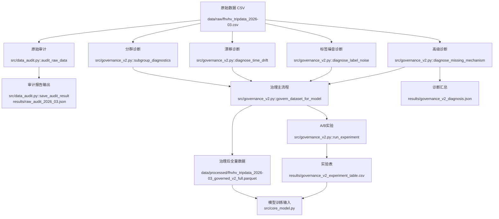

# 数据挖掘课程项目 - 中期进展报告模板

> 本阶段重点考核：**数据预处理与审计的落地情况**、**基线模型的跑通与评测**、**核心算法的开发进度**以及**后续关键里程碑的规划**。请各小组在 **第 13 周** 提交本报告。
> 
> **提交要求**：
> 1. 一份格式规范的 **PDF 中期进展报告**（建议控制在 5-8 页以内，重点突出，附带必要的定量实验图表）。
> 2. 持续更新的 **代码仓库链接**（将检查代码提交历史、模块划分与运行说明）。

---

## 0. 项目基本信息

- **项目名称**：[请填写你的项目名称，如：基于 GraphRAG 的医学文献抗幻觉问答系统]
- **项目链接**：[请填写公开的代码仓库 URL] 
- **小组成员与分工**：
  | 姓名 | 学号 | 组内角色 | 开题以来的核心贡献 | 中期之后的分工规划 |
  | :--- | :--- | :--- | :--- | :--- |
  | 张三（组长） | 2026xxxx | 算法开发 | 完成基线模型搭建与核心图检索模块实现 | 调优进阶模型，撰写最终报告 |
  | 李四 | 2026xxxx | 数据工程 | 负责医学文献清洗、实体关系提取与图谱构建 | 配合消融实验，丰富测试集 |
  | 崔琛浩 | 1120221572 | 数据工程 | 原始数据集选择、数据审计与数据治理、撰写文档 | 配合基线实验和核心算法对比 |

---

## 1. 项目概述与当前状态

### 1.1. 中期里程碑达成情况
*对比开题时制定的里程碑，目前项目处于什么阶段？（如：按计划进行 / 进度提前 / 进度滞后，并说明原因）。*
- **计划目标**：[如：在第11周跑通基线模型并完成数据图谱化]
- **实际达成**：[如：已成功跑通 baseline 并完成 80% 数据清洗，图谱构建因实体对齐问题延迟了 3 天，但目前已解决]

### 1.2. 代码仓库状态审计
- **提交统计**（必填，可通过 `git log --oneline | wc -l` 获取）：
  - 总 commit 数：[如 47 次]，开题后新增 commit 数：[如 32 次]
  - 活跃贡献人数：[如 3/3 人均有提交]（GitHub Insights 截图可附在附录）
- **分支与协作方式**：[例：使用 3 个 Feature Branch（`feature/preprocess`、`feature/graph-build`、`feature/evaluate`），通过 PR 合并，共完成 8 次 PR review]
- **当前仓库目录结构**（运行 `tree -L 2` 并粘贴实际输出，不可使用示例结构替代）：
  ```text
  # 请在此处粘贴你的仓库实际目录结构，并在右侧注释说明各模块的功能
  ├── README.md               # 运行说明与环境配置（含一键复现命令）
  ├── data/
  │   ├── raw/                # 原始数据（或提供下载脚本 data/download.sh）
  │   └── processed/          # 清洗后的中间数据
  ├── src/
  │   ├── preprocess.py       # [说明：实现了哪些清洗步骤]
  │   ├── baseline.py         # [说明：基线方法及评测入口]
  │   ├── core_model.py       # [说明：进阶算法的核心逻辑]
  │   └── evaluate.py         # [说明：评测指标计算逻辑]
  ├── notebooks/
  └── requirements.txt
  ```

---


## 2. 数据工程与审计落地

### 2.1. 原始数据审计反馈
| 数据问题 | 量化规模 | 解决方案（精确到文件/函数） | 处理后效果 |
| :--- | :--- | :--- | :--- |
| 缺失机制（`originating_base_num`） | 缺失率 `27.5933%`；缺失预测 AUC=`0.9993`；目标分布 KS-p=`2.10e-08`（`MAR_likely`） | 缺失机制诊断见 `src/governance_v2.py::diagnose_missing_mechanism`；治理中对高影响特征采用分组中位数+全局中位数补全，见 `src/governance_v2.py::govern_dataset_for_model` | 避免直接删去高影响缺失样本；B 策略样本损失率 `0%`，A 策略样本损失率 `0.0087%` |
| 标签噪音（规则冲突 + 弱监督不一致） | 规则冲突率 `3.0263%`；弱监督不一致率 `17.1704%`；疑似噪音率 `18.5087%` | 规则冲突与弱监督一致性诊断见 `src/governance_v2.py::diagnose_label_noise`；抽检样本见 `results/manual_audit_sample_noise.csv` | 通过“标记+修复+缩尾”降低噪音影响；A/B中 MAE `4.7044 -> 4.6993`，RMSE `8.6570 -> 8.6181` |
| 时间漂移（周内漂移） | Week1 vs Week4：`trip_miles` PSI=`0.00148`、KS-p=`0.0066`；`base_passenger_fare` PSI=`0.00024`、KS-p=`0.00167` | 漂移诊断见 `src/governance_v2.py::diagnose_time_drift`（PSI + KS + Wasserstein） | 当前为“弱漂移”，不触发重训，仅持续监控；避免过度治理导致分布失真 |
| 子群体差异（平台/时段/区域） | 平台质量问题率：HV0003=`0.1080%`、HV0005=`0.0599%`；高峰/低峰质量问题率存在差异（`0.0742%` vs `0.1066%`） | 分群诊断见 `src/governance_v2.py::subgroup_diagnostics` | 训练评估阶段纳入分群稳定性与公平性指标（子群体误差标准差、公平性差距） |
| 开题预测未发生项  | `on_scene_datetime` 缺失率 `0`；`dispatching_base_num` 长尾（freq<3）占比 `0` | 审计统计见 `src/data_audit.py::audit_raw_data` 与 `results/raw_audit_2026_03.json` | 说明原因：本批次 FHVHV 2026-03 数据结构较规整，缺失与长尾风险低于开题预期 |

### 2.2. 数据流与预处理管道
#### 2.2.1 数据流与预处理管道

#### 2.2.1 治理操作明细（补充说明）

本项目在治理过程中执行了以下可复现步骤：

（1）. 字段标准化  
- 时间字段统一解析为 `datetime`：`request_datetime`、`on_scene_datetime`、`pickup_datetime`、`dropoff_datetime`。  
- 数值字段统一转为 `numeric`，非法值转为 `NaN`，避免后续统计和建模报错。

（2）. 缺失机制诊断与处理  
- 对缺失字段进行机制判定（MCAR/MAR/MNAR 倾向），对应函数：`src/governance_v2.py::diagnose_missing_mechanism`。  
- 对高影响特征不做粗暴删行，采用“分组中位数（`dispatching_base_num + pickup_hour`）→ 全局中位数”的两级补全策略，见 `src/governance_v2.py::govern_dataset_for_model`。  
- 对低影响且极低占比缺失，在 A 策略中允许删除作为对照。

（3）. 语义约束治理  
- 对业务上不应为负的字段（如 `base_passenger_fare`、`driver_pay`、`trip_miles`、`trip_time`）执行：  
  - 负值置空（不直接删行）；  
  - 同时写入标记字段（如 `flag_fare_negative` 等）保留审计痕迹。

（4）. 跨字段一致性校验  
- 构造 `duration_seconds = dropoff_datetime - pickup_datetime`。  
- 生成 `flag_duration_inconsistent`：当 `|duration_seconds - trip_time| > 300` 秒。  
- 构造 `speed_mph = trip_miles / (trip_time/3600)`，并生成 `flag_speed_outlier`（`speed_mph < 1` 或 `> 80`）。

（5）. 异常值稳健化（非删除）  
- 对 `trip_miles`、`trip_time`、`driver_pay`、`tips` 生成缩尾列：`*_capped`。  
- 使用约 `0.1% ~ 99.9%` 分位缩尾，降低极端值杠杆效应，同时保留原始字段用于追溯。

（6）. 子群体差异审计  
- 按平台（`hvfhs_license_num`）、时段（高峰/低峰）、区域桶进行分层统计。  
- 输出各子群体质量问题率与目标均值偏差，函数：`src/governance_v2.py::subgroup_diagnostics`。  
- 目的：避免某一群体被过度清洗或误差显著偏高。

### 2.3. 对照实验设计与结果（A/B）

**实验设计**
- 策略 A：`A_delete`（只删异常/缺失）
- 策略 B：`B_govern`（标记 + 修复 + 缩尾）
- 固定变量：同切分、同模型（`HistGradientBoostingRegressor`）、同特征、同随机种子
- 实现位置：`src/governance_v2.py::run_experiment`

**实验结果**

| 策略 | RMSE | MAE | 子群体误差标准差 | 公平性差距 | 样本损失率 |
| :--- | ---: | ---: | ---: | ---: | ---: |
| A_delete | 8.6570 | 4.7044 | 0.7185 | 1.4369 | 0.0087% |
| B_govern | **8.6181** | **4.6993** | **0.7139** | **1.4279** | **0.0000%** |

- 显著性检验（配对置换）：p-value=`0.1417`（当前样本条件下统计显著性有限，但方向一致）
- 误差差值（A-B，MAE 方向）：`+0.00515`（正值表示 B 更优）

### 2.4. 落地产物与可复现命令

**关键产物**
- 审计报告：`results/raw_audit_2026_03.json`
- 诊断汇总：`results/governance_v2_diagnosis.json`
- 实验表：`results/governance_v2_experiment_table.csv`
- 治理后全量数据：`data/processed/fhvhv_tripdata_2026-03_governed_v2_full.parquet`
- 治理后 CSV：`data/processed/fhvhv_tripdata_2026-03_governed_v2_full.csv`

**可复现命令**
```bash
# 仅审计
python -m src.preprocess audit --input data/raw/fhvhv_tripdata_2026-03.csv --output results/raw_audit_2026_03.json

# 审计 + 治理 + 诊断 + A/B实验（全流程）
python -m src.preprocess pipeline --input data/raw/fhvhv_tripdata_2026-03.csv --output results/raw_audit_2026_03.json
```

## 3. 基线模型与核心算法实现

### 3.1. 基线模型运行情况说明
**必填**：中期阶段基线模型必须已可完整运行并输出评测结果。

- **所选基线方法**：[例如：Vector-based RAG，BGE-M3 向量检索 + Qwen3.5-9B]
- **运行环境**：[例如：单张 RTX 3090 24G，Python 3.11，推理耗时约1.2s/query]
- **一键复现命令**（必填，评审会实际执行验证）：
  ```bash
  # 示例，请替换为你的实际命令
  python src/baseline.py --data data/processed/test.jsonl --output results/baseline.json
  ```
- **关键输出截图或日志片段**：[在此粘贴运行成功的终端输出关键行，或附图于附录]

### 3.2. 核心进阶算法开发进度
*介绍你们针对开题问题设计的进阶算法或创新模块。*
- **核心模块设计**：请用系统架构图（Mermaid）或文字，阐述进阶方法的设计原理（如：在 GraphRAG 中引入层次化社群检索 Community Summary）

- **开发进度核查表**（必填，逐项如实勾选）：

  | 模块 | 对应文件 | 状态 | 备注 |
  | :--- | :--- | :---: | :--- |
  | 数据预处理管道 | `src/preprocess.py` | 完成 / 进行中 / 未开始 | |
  | 基线模型 | `src/baseline.py` | 完成 / 进行中 / 未开始 | |
  | 核心进阶算法 | `src/core_model.py` | 完成 / 进行中 / 未开始 | |
  | 评测框架 | `src/evaluate.py` | 完成 / 进行中 / 未开始 | |
  | 单元测试 / 集成测试 | `tests/` | 完成 / 进行中 / 未开始 | |

---

## 4. 中期实验结果与阶段性分析

### 4.1. 评估指标与测试集构建
- **评测数据集规模**：[例如：人工标注了 50 个复杂的多跳推理问答对作为 Benchmark 测试集]
- **核心评测指标 (Metrics)**：[如：准确率 Accuracy、幻觉率 Hallucination Rate (基于 RAGAS 评估框架)、检索召回率 Recall@K]

### 4.2. 定量对比实验结果
*请给出基线模型与当前进阶模型（即使是初代版本）的定量对比表格。*

| 模型方法 (Method) | 检索召回率 (Recall@5) | 答案忠实度 (Faithfulness) | 答案相关性 (Answer Relevance) | 平均推理耗时 (Latency) |
| :--- | :---: | :---: | :---: | :---: |
| Baseline (Vector RAG) | 72.4% | 0.61 | 0.74 | **1.2s** |
| **Proposed (GraphRAG - Midterm Ver.)** | **88.6% (+16.2%)** | **0.84 (+0.23)** | **0.81 (+0.07)** | 3.5s (-2.3s) |

### 4.3. 实验结果初步诊断与分析
**必填**：至少列出 **2 个**具体的失败案例。

| # | 输入（Query 片段） | 模型输出 | 正确答案 | 失败原因 | 改进方向 |
| :- | :--- | :--- | :--- | :--- | :--- |
| 1 | 糖尿病与高血压的共病机制？ | 答案遗漏了胰岛素抗性路径 | 包含胰岛素抗性 + RAS 轴 | 相关实体在图谱中被孤立节点过滤掉 | 放宽频次过滤阈値，或引入语义相似度补充稀疏实体 |
| 2 | [请填写真实失败案例] | | | | |

- **总体优缺点小结**（2-4 句话）：[例如：多跳推理召回率显著提升，但推理延迟从 1.2s 升至 3.5s，下一步需优化图索引并引入并行查询]

---

## 5. 后续风险评估与冲刺排期

### 5.1. 风险清单动态调整
*开题报告中提到的风险是否发生？是否出现了新的非技术/技术风险？*
- **风险 1 状态评估**：[例如：开题提到的算力不足风险未发生，我们成功申请到了实验室的 A100 资源]
- **新增风险与应对预案**：[例如：实体提取的 API 调用费用超出预算。预案：切换为开源的本地部署 Qwen-2-7B-Instruct 提取实体，并设计 Few-shot Prompt 保持准确率]

### 5.2. 终期冲刺详细排期（第 13 周 - 第 16 周）
*请给出精确到周的后续工作计划，确保项目能够按时、高质量地交付。*

| 周次 | 核心任务目标 | 责任人 | 预期交付物 / 验收标准 |
| :--- | :--- | :--- | :--- |
| **第 13 周** | 解决中期暴露的 Latency 问题，优化图查询性能，跑通消融实验 | 张三、王五 | 图检索模块优化版代码、消融实验初步数据 |
| **第 14 周** | 进行大规模测试，收集消融实验与对比实验的完整数据，完成图表绘制 | 王五 | 实验结果可视化图表、详细的指标分析报告 |
| **第 15 周** | 整理代码仓库，撰写最终项目报告（规范学术论文格式），录制 Demo 视频 | 全员 | GitHub 规范化 Release、演示视频、论文初稿 |
| **第 16 周** | 制作答辩 PPT，进行组内试讲，准备最终的项目答辩与成果展示 | 全员 | 最终答辩 PPT、系统演示 Demo |

---

## 6. AI 工具辅助使用记录

按照课程规范，请如实填写。若完全未使用 AI 工具，在表格中注明“未使用”即可。

| 使用场景 | AI 工具名称 | 具体辅助环节（精确到文件/功能） | 团队审查与纠错说明 |
| :--- | :--- | :--- | :--- |
| 代码编写 | DeepSeek | 辅助编写 `src/preprocess.py` 中的正则匹配逻辑 | 逐行 Review，修复了空值处理的 Bug |
| 报告撰写 | 豆包 | 润色系统架构部分的文字描述 | 组长人工核对，删除空泛词汇，确保与代码一致 |
| 算法思路 | Claude 3.5 | 咨询图检索延迟优化的并行方案 | 方案经组内讨论后独立实现，非直接复制 |
| [其他/未使用] | | | |

---

> **中期自查清单 (Self-Check List)**（提交前逐项确认）：
>
> **代码仓库**
> - [ ] GitHub 仓库已设为公开，且近两周内有真实的 commit 记录？
> - [ ] 仓库 README.md 包含环境配置说明和一键复现命令，他人可独立运行？
> - [ ] 所有组员至少有 1 次 commit？
>
> **数据与实验**
> - [ ] 数据审计表已填写，每条问题都给出了量化规模（百分比/数量）？
> - [ ] 基线模型已完整跑通，报告中有实际的终端输出或截图为证？
> - [ ] 进阶模型与基线已进行定量对比（有数字，不只是文字描述）？
> - [ ] 误差分析部分包含至少 2 个具体的失败案例？
>
> **报告完整性**
> - [ ] 所有成员的分工和开题后的具体贡献都明确写入了成员分工表？
> - [ ] 后续冲刺排期精确到周，责任人明确，且与当前进度匹配？
> - [ ] AI 工具使用情况已如实填写（未使用也须注明）？
